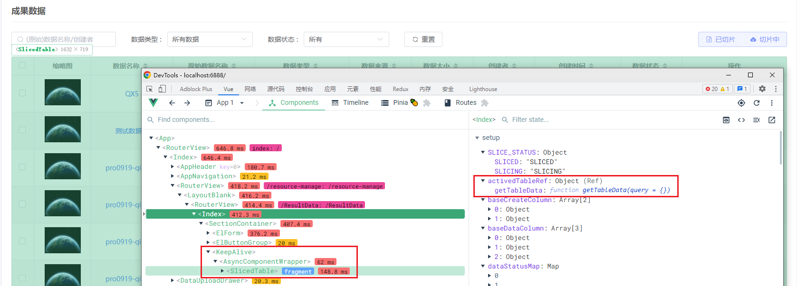
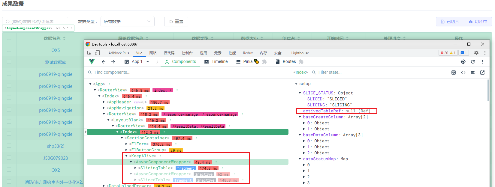

### 动态ref [#](https://cn.vuejs.org/api/built-in-special-attributes.html#ref)

```html
<keep-alive>
    <component
               :is="sliceStatus? SlicedTable : SlicingTable"
               ref="activedTableRef"
               :main-container-ref="mainContainerRef"
               />
</keep-alive>

const activedTableRef = ref(); 
```

切换后 activedTableRef 会变为null





使用组合式 API，引用将存储在与名字匹配的 ref 里

如果用于普通 DOM 元素，引用将是元素本身；如果用于子组件，引用将是子组件的实例。

`ref` 可以**接收一个函数值**，用于对存储引用位置的完全控制：

```
<ChildComponent :ref="(el) => child = el" />
```

关于 ref 注册时机的重要说明：因为 ref 本身是作为渲染函数的结果来创建的，必须等待组件挂载后才能对它进行访问。
