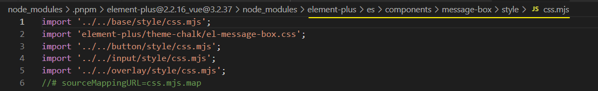

### [unjs/nitro: ⚗️ Build and deploy universal JavaScript servers (github.com)](https://github.com/unjs/nitro)

## Why using Nitro?

Nitro provides a powerful toolchain and a runtime framework from the [UnJS](https://github.com/unjs) ecosystem to build and deploy **any JavaScript server, anywhere!**

❯ 🐇 **Rapid development** experience with hot module replacement
❯ 😌 **Multi-provider** deployments with a single codebase and zero-configuration
❯ 💼 **Portable and compact** deployments without `node_modules` dependency
❯ 📁 **Directory structure** aware to register API routes and more with zero configuration
❯ 🤏 **Minimal Design** to fit into any solution with minimum overhead
❯ 🚀 **Code-splitting** and async chunk loading for fast server startup time
❯ 👕 **TypeScript** fully supported
❯ 💾 **Multi-driver storage** and caching layer
❯ 💰 **Route caching** and static **pre-rendering** with built-in crawler
❯ 🐱 **Hackable** to extend almost any part of nitro using options
❯ ✨ **Auto imports** for lazy folks and a tidy minimal codebase
❯ 🏛️ **Best-effort compatibility** for using legacy npm packages and mocking Node.js modules

Nitro提供了一个强大的工具链和来自[UnJS](https://github.com/unjs)生态系统的运行时框架，以构建和部署**任何JavaScript服务器，任何地方！**

🐇 **快速开发的**经验与热模块替换
😌 **多供应商的**部署，只需一个代码库和零配置。
💼 **便携和紧凑的**部署，没有`node_modules`依赖性
📁 **目录结构**意识到以零配置的方式注册API路由和更多。
🤏 **最小化设计**，以最小的开销适应任何解决方案
🚀 **代码拆分**和异步分块加载，实现快速的服务器启动时间
👕 **TypeScript**完全支持
💾 **多驱动存储**和缓存层
💰 **路线缓存**和静态**预渲染**，内置爬行器
🐱 **可以使用选项来扩展nitro的几乎任何部分的Hackable**。
✨ **自动导入**给懒人和一个整洁的最小代码库
🏛️ **最佳的兼容性**，用于使用传统的npm包和模拟Node.js模块

### [Lottie (airbnb.design)](https://airbnb.design/lottie/) 动画交互

Lottie is a mobile library for Web, and iOS that parses [Adobe After Effects](http://www.adobe.com/products/aftereffects.html) animations exported as json with [Bodymovin](https://github.com/airbnb/lottie-web) and renders them natively on mobile!

github: https://github.com/airbnb/lottie-web

### 自动导入不支持的组件 

[[Bug Report\] [Style] [message] ElMessage按需导入缺少css了 · Issue #6501 · element-plus/element-plus (github.com)](https://github.com/element-plus/element-plus/issues/6501)

自动导入`message` `messagebox` `alert` 等服务组件，目前还不支持自动导入样式，请手动导入样式.

导入message的样式

`import 'element-plus/es/components/message-box/style/css';`

实际import的是一个js
