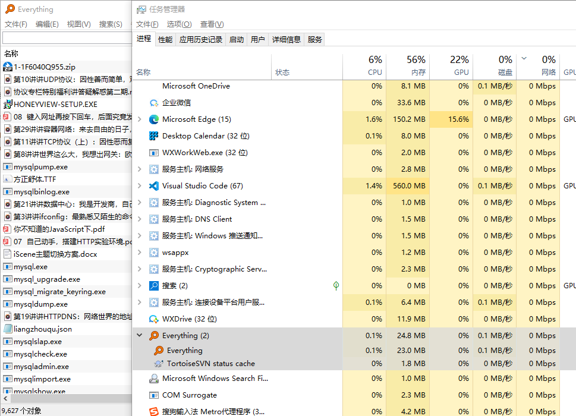

### [How to use highlight.js (highlightjs.org)](https://highlightjs.org/usage/)

浏览器中高亮代码

### highlightjs/vue-plugin 

代码高亮

### everything 排除文件夹减少内存

**(文件数从了几十万到7万)**

**内存从500M+ 到60M** 

- node_modules

- npm-cache

- yarn/Cache

- .github/.git/.gitlab

- .vscode

- .npminstall_tarball

- .pnpm-store

- .rustup

  

1. c:\windows
2. c:\Program Profiles & c:\Program Profiles(x86)
3. jh_c/base & work
4. jh_d/githubdemos
5. c:\python38

(系统文件夹 与 代码文件夹)

(数据文件夹)

(svn有5w+文件...)

一些软件 (or 软件文件夹)

- ....

- unity

- wechat 下载路径

- WXChat 下载路径(企微)

- Tencent Files

  ​	 (搜不出有效内容) 

- Windows Kits

- powerToys

- ChromeGo

排除部分代码文件

`*.svg;*.js;*.ts;*.css;*.BMP;*.html;*.gltf`

最终检索文件只有<u>10000-</u>

### 谷佣兵

