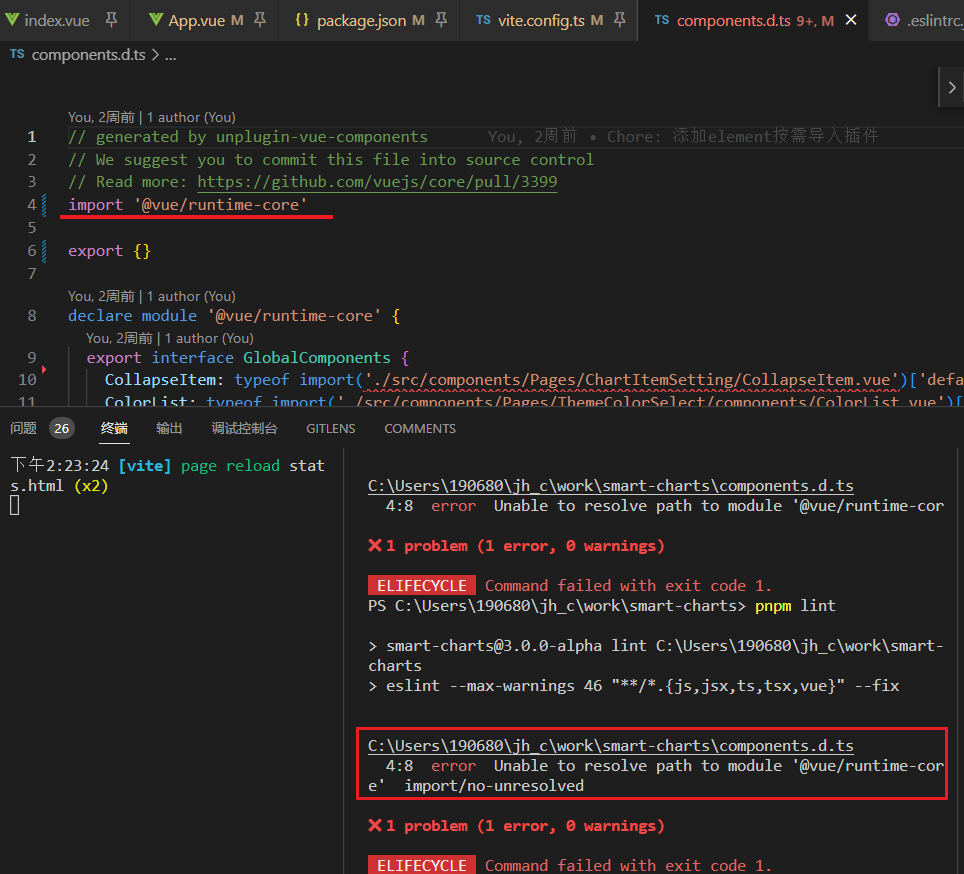
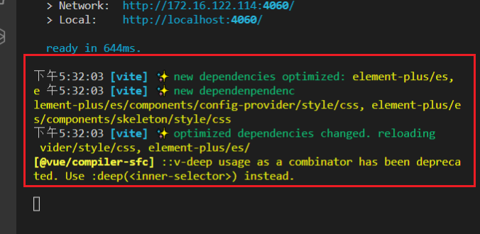

### eslint 检测到动态生成的 d.ts 文件

报错...

### 自动导入组件

[unplugin-vue-components] component “xx“ has naming conflicts with other components, ignored.

添加 `directoryAsNamespace:true`

[unplugin-vue-components-Configuration](https://github.com/antfu/unplugin-vue-components/blob/main/README.md#configuration)

### 异步组件导致页面刷新

监测到依赖更新.. 导致页面刷新..

但是ui库肯定没有更新啊

