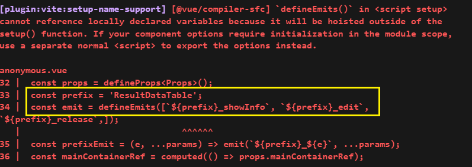

### vite 打包组件库不能有异步组件

不然 umd 报error


### defineEmits 不能传动态的变量名(or 映射的结果

```
@vue/compiler-sfc] `defineEmits()` in <script setup> cannot reference locally declared variables because it will be hoisted outside of the setup() function. If your component options require initialization in the module scope, use a separate normal <script> to export the options instead.
```

`<script setup>`中的`defineEmits()`不能引用本地声明的变量，因为它将被提升到setup()函数之外



