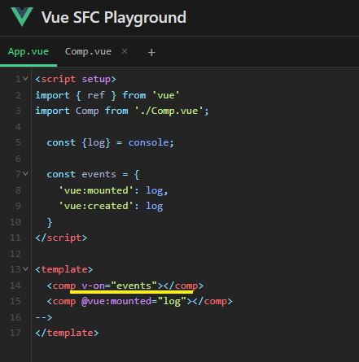
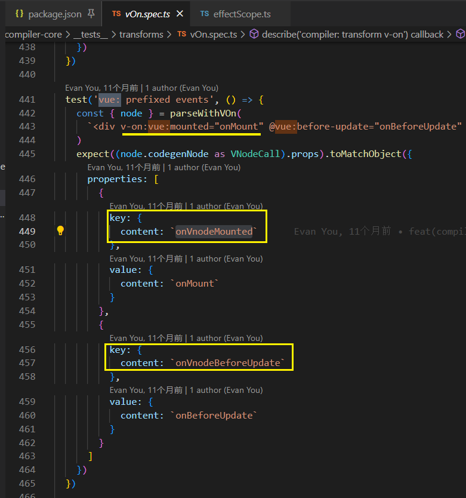
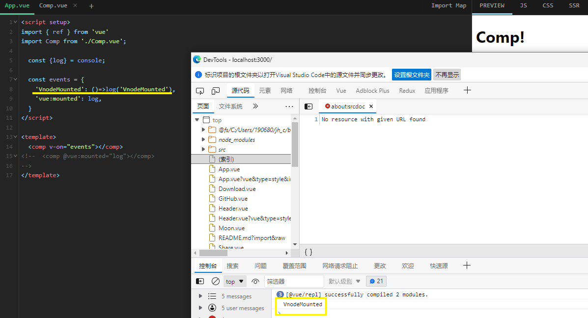
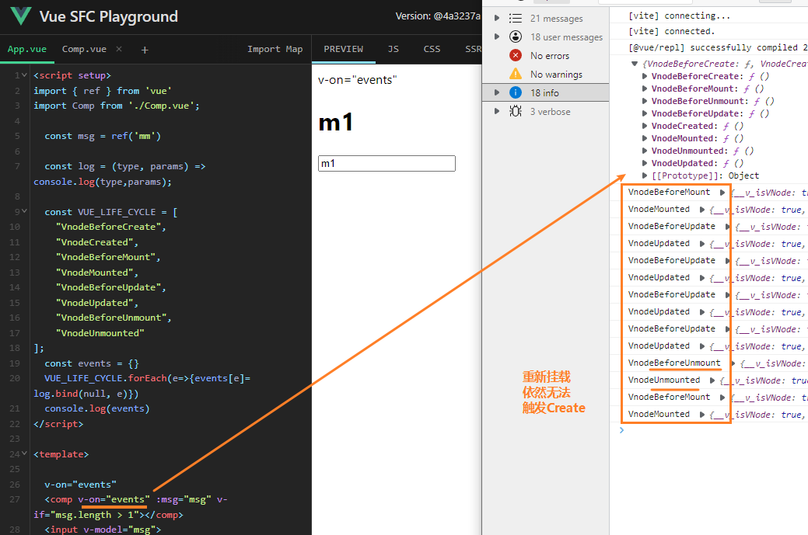

### 如何批量监听子组件的生命周期事件



黄色不生效

`@vue:mounted` 正常触发

Vue3-core中搜索关键词 `vue:`



```vue
<comp v-on="{
	'VnodeMounted': log            
}"></comp>
```





直接在组件中监听也是一样.


- 监听组件生命周期钩子的回调函数接收到的参数为 VNode, **虚拟节点**

- 只有一个触发的原因, 跟组件挂载顺序相关

- 示例地址: [[#]](https://sfc.vuejs.org/#eNp9VNtq20AQ/ZWpXmyDV3LomyqLtsaFQgqFkkCJQpClka2gvbC7VhuE/j2zWsuOjZMHG+acmbNzVRd8Uyps9xjEQWIKXSsLBu1epZmouZLaQgcaK+ih0pLDhFwnR2oluTrgYeQMpzT5kgkA9yukMBa42cLSaUwnnE9m52QjHTm1LwrnoHKdczODZTqwssGQeE8eONI+Bd/frZ9uf/5YP63+rm7XpPPgOJIP7oUs8TtWUuNKY24xC+ZnnEfLS9iH/JJ7YS+pAXwv4k6VVx7x6Hshgl975gC7qEw8Dq30xWKLwhoqsusdeF57SIrrvNhNcZl23vMBH5euveGmFuVU7JtmDjjrh/6/7a73JjiJ/Pxp8mRY5Kqh7Mny82qZFMss8O4uOYCkcPO/ICCmgZNN/2S0rK68ETYotnYHKdxkQZpELnYQT2qh9pY8OZXfjJFEJZ8YGx+Br7RZceGnRj6UOal79NCwC3RzGuXIjK8CY6O8V78mc0rRe0fHjgTzwO8/47kKn40UdDzd0KcDQW2IYUAcRuLOzoKdtSqOokYWebOTxsafF4tFZHQRkQsrsWVKy/8vb1aC8MigblEzjaJEjfokZUjLVIW7uWcTSr29dA3RcLbR8h/hlKcfGm1PTxWM13rl7kusaoG/tVRmOhRBAzmW444xhj9W12I7yn28PMnuJu264TPQ90lE1nk3+1cYh4KL)

- 

  

  create 被当做 attrs 了, 因为没有预设的 event 与之匹配
  
  | 属性名              | 详情 | 参数 |
| ------------------- | ---- | ---- |
| chart:beforeMount       |      |   `Vnode`   |
| chart:mounted    |      |        `Vnode`     |
| chart:beforeUpdate       |      |  `Vnode`    |
| chart:updated    |      |          `Vnode`    |
| chart:beforeUnmount       |      |  `Vnode`    |
| chart:unmounted    |            |   `Vnode`     |
