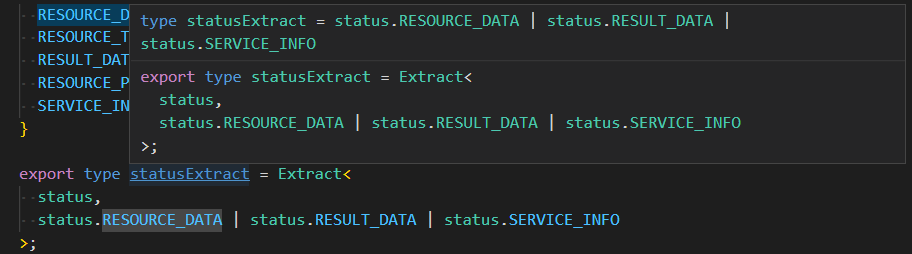

### 效率低下原因

1. 个人原因
2. 后台接口经常性的调整
3. 用户登录问题, 10min后就需要清缓存登录
4. 


### 从枚举类型中提取

```ts
export enum status {
  RESOURCE_DATA,
  RESOURCE_TILES,
  RESULT_DATA,
  RESOURCE_PUBLISH,
  SERVICE_INFO,
}

export type statusExtract = Extract<
  status,
  status.RESOURCE_DATA | status.RESULT_DATA | status.SERVICE_INFO
>;

export type statusExclude = Exclude<
  status,
  status.RESOURCE_DATA | status.RESULT_DATA | status.SERVICE_INFO
>;
```

#### 内置方法

```ts
/**
 * Exclude from T those types that are assignable to U
 */
type Exclude<T, U> = T extends U ? never : T;

/**
 * Extract from T those types that are assignable to U
 */
type Extract<T, U> = T extends U ? T : never;

```



Extract 提取


Exclude 排除


使用type作为键的类型

```ts
const labelsMap: {
  [K in BloodJobOperateType]: label[];
} = {
  [BloodJobType.RESOURCE_TILES]: resourceTiles,
  [BloodJobType.RESOURCE_PUBLISH]: resourcePublish,
};
```

