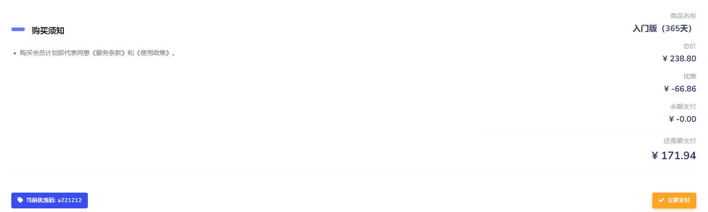
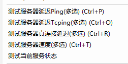

# VMess 协议

VMess 是一个加密传输协议，可以作为 Xray 客户端和服务器之间的桥梁。

VMess 是一个基于 TCP 的协议，所有数据使用 TCP 传输。

VMess 是一个无状态协议，即客户端和服务器之间不需要握手即可直接传输数据，每一次数据传输对之前和之后的其它数据传输没有影响。

VMess 的客户端发起一次请求，服务器判断该请求是否来自一个合法的客户端。如验证通过，则转发该请求，并把获得的响应发回给客户端。

VMess 使用非对称格式，即客户端发出的请求和服务器端的响应使用了不同的格式。

[免费V2Ray节点丨免费V2Ray帐号丨付费节点购买丨V2Ray免费机场-『白云居丨baiyunju.cc』](https://baiyunju.cc/tag/free-v2ray)

[付费SSR、V2Ray节点网站购买过程丨使用体验-『白云居』 (baiyunju.cc)](https://baiyunju.cc/7766)

[商店 — 极客云 (jike591.com)](https://jike591.com/user/shop#)

xx-net 入门版0.5年 ￥166

xx-net 入门版1年 ￥250

xx-net 入门版2年 ￥333

### 测试 Vmess 协议

这么多测试方法，分别是什么意思，有什么区别？日常科学上网需要测试节点服务器延迟和网速时，应该使用哪一种方式测试？

## 一、对V2RayN节点服务器延迟/速度五种测试方法的说明

### 1、测试服务器延迟Ping（可多选），快捷键Ctrl+P

Ping是ICMP协议包延迟测试，用来测试节点服务器延迟状态及是否被墙。

使用Ping的测试结果，只是你的电脑到中转节点的延迟，并不是连接网站的延迟。

有的节点为了防止被攻击禁止了Ping，那么只能使用下面的真连接延迟进行测试。

### 2、测试服务器延迟Tcping（可多选），快捷键Ctrl+O

Tcping是TCP协议连接延迟测试，用来检测端口开放情况和服务端软件状态。

### 3、测试服务器真连接延迟（可多选），快捷键Ctrl+R

当前节点服务器连接访问www.google.com网址的真实延迟时间，用来测试谷歌网页的打开速度。

这只是真实连接谷歌的延迟，不代表访问其他网站的延迟。不过，平时上网不可能对每一个网站进行连接测试，也只能选择谷歌了。

### 4、测试服务器速度（可多选），快捷键Ctrl+T

测试所选节点服务器的下载速度，用来查看视频加载、文件下载的网速。

这里的测试结果是网速，单位是M/S（兆/秒），而延迟测试结果单位是ms（毫秒）。

### 5、测试当前服务器状态

其实就是上面的“测试服务器真连接延迟”，而且测试结果并不会显示在节点一行的“测试结果”内，而是显示在V2RayN界面底部的信息栏内。

## 二、怎么测试和选择最快的节点？

如果只是用来**访问网页，查找资料，可以使用“测试服务器真连接延迟”来测试延迟，选择延迟低的节点**。

延迟低，并不代表网速就快，因此，白云居丨baiyunju.cc建议您如果是在YouTube**看视频，或者下载大文件，还需要进一步执行“测试服务器速度”**来测试节点的网速。

### github 关键词

gfw / vmess

sort Recently Updated

[订阅链接 | Paimon Node](https://paimon.gq/guide/subs.html)
