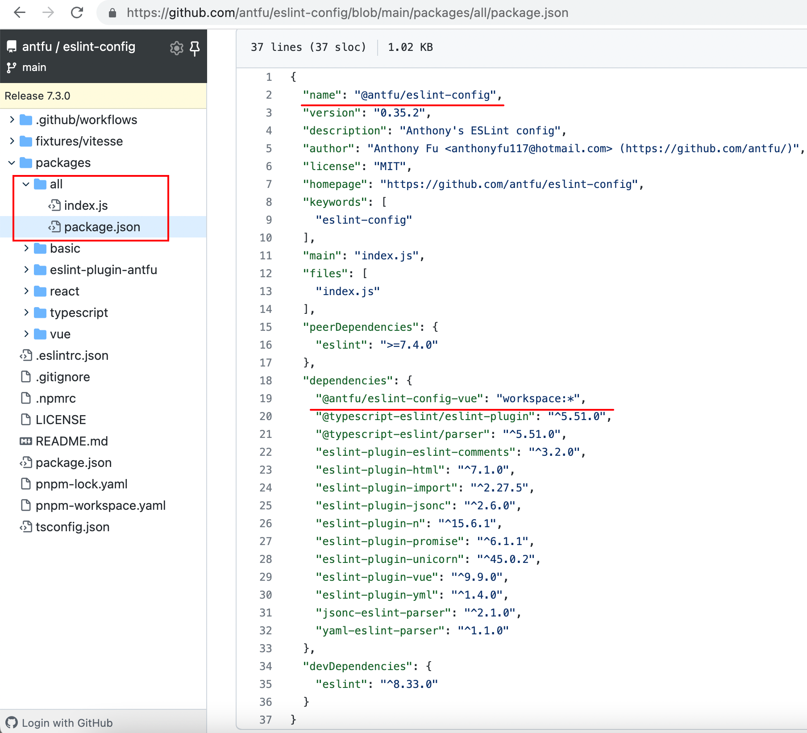
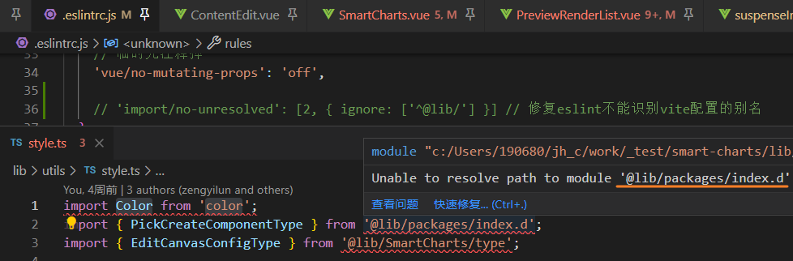
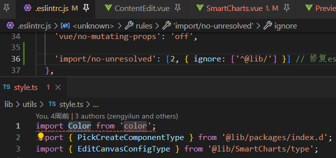
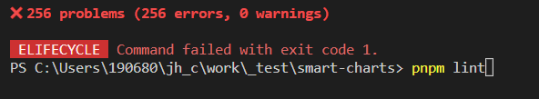
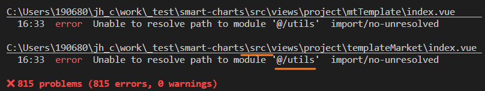

[toc]

# [eslint github doc](https://github.com/eslint/eslint)

ESLint is a tool for identifying and reporting on patterns found in ECMAScript/JavaScript code, with the goal of making code more consistent and avoiding bugs. 

In many ways, it is similar to JSLint and JSHint with a few exceptions:

- ESLint uses [Espree](https://github.com/eslint/espree) for JavaScript parsing.
- ESLint uses an AST to evaluate patterns in code.
- ESLint is completely pluggable, every single rule is a plugin and you can add more at runtime.

ESLint是一种用于识别和报告在ECMAScript/JavaScript代码中发现的模式的工具，其目标是使代码更加一致并避免错误。

在很多方面，它与JSLint和JSHint相似，但有一些例外:

- ESLint使用Espree进行JavaScript解析。

- ESLint使用AST来计算代码中的模式。

- ESLint是完全可插入的，每一条规则都是一个插件，你可以在运行时添加更多。


## Frequently Asked Questions

### Does Prettier replace ESLint?

No, ESLint does both

- traditional linting (looking for problematic patterns) 
- style checking (enforcement of conventions). 

You can use ESLint for everything, or you can combine both using Prettier to format your code and ESLint to catch possible errors.

 --[Why I don't use Prettier](https://antfu.me/posts/why-not-prettier) [为什么我不使用 Prettier](https://antfu.me/posts/why-not-prettier-zh)

> Prettier 作为代码格式化程序，只关心代码风格而完全不关心逻辑。因此，我们常常能看到使用了 Prettier 的项目也使用 ESLint 来检查逻辑。
>
> 但如果你曾经配置过它们的话，您可能会注意到它们之间有一些功能重叠 - ESLint 也可以 lint 代码风格。
>
> 通常的做法是使用 [`eslint-config-prettier`](https://github.com/prettier/eslint-config-prettier) 来在 ESLint 中使用禁用这些重叠规则（以及[一些其他解决方案](https://prettier.io/docs/en/integrating-with-linters.html)）。

> 我的观点如下：
>
> 1. 只单纯使用 Prettier 十分合理 - 开箱即用是个很棒的功能
> 2. 如果你需要使用 ESLint，它也可以像 Prettier 一样格式化代码 - 而且更加可配置
> 3. Prettier + ESLint 仍然需要大量的配置 - 它并没有让你的生活变得更简单
> 4. 你可以在 ESLint 中完全控制代码风格，但在 Prettier 中却无法做到，这两者混合在一起感觉很奇怪
> 5. 我不认为 Parse 两次代码会更快
> 6. [ESLint 的自动修复](https://developer.ibm.com/articles/auto-fix-and-format-your-javascript-with-eslint/) 也可以像 Prettier 一样进行格式化 - 还有更自由的选择。

从结果来看，使用 ESLint 其实也可以非常简单：

```bash
npm i -D @antfu/eslint-config
```
```
// .eslintrc
{
  "extends": "@antfu"
}
```

### Antfu/eslint-config

目录结构

根目录的``package.json`

```json
"scripts": {
    "lint": "eslint .",
    "test": "pnpm -r run test",
    "prepare": "pnpm -r run stub",
    "release": "bumpp package.json packages/*/package.json --commit --push --tag && pnpm -r publish --access public"
  },
```

[`packages/all/package.json`](https://github.com/antfu/eslint-config/blob/main/packages/all/package.json#L2) 为发布的npm库



`workspace：*`: https://github.com/antfu/eslint-config/blob/main/pnpm-workspace.yaml

```yaml
packages:
  - 'packages/*'
```

[pnpm workspace](https://pnpm.io/zh/workspaces)


### Why can't ESLint find my plugins?

- Make sure your plugins (and ESLint) are both in your project's `package.json` as devDependencies (or dependencies, if your project uses ESLint at runtime).
- Make sure you have run `npm install` and all your dependencies are installed.
- Make sure your plugins' peerDependencies have been installed as well. You can use `npm view eslint-plugin-myplugin peerDependencies` to see what peer dependencies `eslint-plugin-myplugin` has.


# eslint 无法识别到vite配置的别名

#### import/no-unresolved

Ensures an imported module can be resolved to a module on the local filesystem, as defined by standard Node `require.resolve` behavior.

`'import/no-unresolved': [2, { ignore: ['^@lib/'] }] // 修复eslint不能识别vite配置的别名`









怎么还变多了, 看到 src 目录下的文件使用 `@` 也影响到了eslint

扩大忽略范围 

> 修改为`'import/no-unresolved': [2, { ignore: ['^@'] }] ` 


# vue-router跳转携带参数

## RouteLocationRaw[#](https://router.vuejs.org/zh/api/#routelocationraw)

用户级的路由地址，可以传递给 `router.push()`，`redirect`，并在[导航守卫](https://router.vuejs.org/zh/guide/advanced/navigation-guards.html)中返回。

原始位置可以是一个 `字符串`，比如 `/users/posva#bio`，也可以是一个对象：

```ts
// 这三种形式是等价的
router.push('/users/posva#bio')
router.push({ path: '/users/posva', hash: '#bio' })
router.push({ 
    name: 'users', 
    params: { username: 'posva' }, 
    hash: '#bio' 
})
// 只改变 hash
router.push({ hash: '#bio' })
// 只改变 query
router.push({ query: { page: '2' } })
// 只改变 param
router.push({ params: { username: 'jolyne' } })
```

### query[#](https://router.vuejs.org/zh/api/#query)

- **类型**：`Record<string, string | string[]>`

- **详细内容**：

  从 URL 的 `search` 部分提取的已解码查询参数的字典。

### params[#](https://router.vuejs.org/zh/api/#params)

- **类型**：`Record<string, string | string[]>`

- **详细内容**：

  从 `path` 中提取的已解码参数字典。


### params VS query

[导航到不同的位置](https://router.vuejs.org/zh/guide/essentials/navigation.html#%E5%AF%BC%E8%88%AA%E5%88%B0%E4%B8%8D%E5%90%8C%E7%9A%84%E4%BD%8D%E7%BD%AE)

```ts
// 命名的路由，并加上参数，让路由建立 url
router.push({ 
    name: 'user', 
	params: { username: 'eduardo' } 
})

// 带查询参数，结果是 /register?plan=private
router.push({ 
    path: '/register', 
    query: { plan: 'private' } 
})
```

