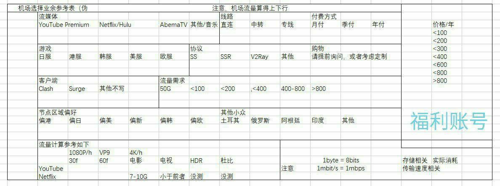
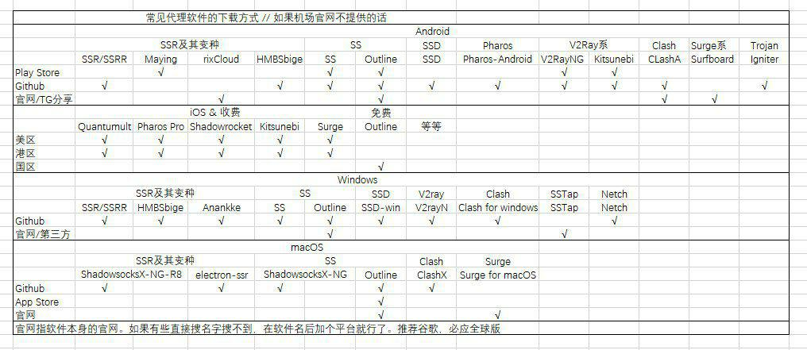

[TOC]

### dns

[盘点国内外优秀公共DNS - 知乎 (zhihu.com)](https://zhuanlan.zhihu.com/p/53958870)

看看评论

windows可以添加无数个,但会按循序尝试,在"控制面板->网络和Internet->查看网络状态和任务->更改适配器设置(左上角)->WLAN(右键)->属性->Internet协议版本4->属性->高级->DNS(选项卡)"

尝试了一下使用 google dns, 感觉没什么变化

### [判断VPN是否正规的方法](https://github.com/vpncn/vpncn.github.io/issues/231)

补下判断VPN是否安全的方法：

1. 在官网查看其服务条款和隐私政策。 这是最重要也是最容易被人忽视的一条，一个好的VPN厂商的服务条款用词应该正式而严谨，不应该出现含糊不清，权责不明的条款。而它的隐私政策则应该尽可能地少收集用户的个人信息。

2. 查阅相关评测，如果一个产品有大量外国人评测，则可认为其至少不是专门针对中国的产品。如果有中文测评则更好。也可以在youtube上看是否有老外的评价。但应到警惕是否只有中文测评而缺少英文测评。如果是的话就很可疑了。

3. 检查ip地址，测试是否出现Dns泄露、webRTC泄露。正规厂家（除了Astrill这个奇葩）是不会允许有这种重大问题出现的。

4. 看名字。名字里带中文的（如快连）或有中国特色的（如Panda)一律不用。原因很简单，老外看不懂中文，所以正规全球厂家不可能取个中文名字。所以这些产品是面向谁的呢？

5. 看连接协议 正规版一般都用 wireguard ikev2 OpenVPN三种，比较靠谱的基本都抛弃PPTP了。其中OpenVPN最普遍，几乎所有正规产品都支持，并且会提供手动配置文件和教程。非正规产品不会告诉你协议和教程，只会告诉你点按钮连接。

6. 看语言 正规产品面相全球，必然以英语为主，有些会支持多语种，可能会有中午繁体或简体，有简体可能代表厂商关注中国市场，值得尝试。 非正规产品都是中文界面，明显面向中国人

7. 看出现问题的反馈方式。正规产品全都是靠给公司专门的邮箱发邮件等客服回复的方式，好点的会支持在线客服回复。非正规产品会用微信QQ或电报群等渠道反馈。

8. 看支付手段。正规产品为银行卡 paypal 加密货币等等，对中国支付的支持最多能有银联卡和Allipay。非正规产品基本靠国内支付手段。

9. 看主页描述。正规产品以保护隐私为核心， 如果产品一直以突破GFW封锁为主题，不怎么提隐私的话，有问题。

10. 看成立历史。目前的国际大厂至少都运营多年了。若是发现你的产品成立时间很短，就有跑路风险。

    总结就是正规产品面向全球市场，**有余力的会尝试啃一啃中国这个难啃的大蛋糕**，但不会把精力全扎进去。非正规产品专门面向中国人。所以一个如果服务感觉太方便了，就像是为中国人量身打造的，九成把握有问题。如果想看使用这个方法判断的实例的话，可以看我下面发的文章： https://playbeasts.com/article/210

- 博客上推荐fastestvpn终身（才不到120元）
- 1$每月 (初始) 续订价格在 5$/月 or 34$/年

关于VPN厂家选择的话，本身推荐厂家这件事就有点得罪人的。因为这个特殊原因，没有人能保证推荐的厂家能让所有人满意。因此个人还是建议以别人的推荐作为参考（当然还是感谢真心愿意推荐的人），更主要还是需要亲自测试为准： 说一下个人认为比较好的VPN厂家选择流程： 

- 第一步，先看看reddit及其他国外测评，并看看厂家的隐私政策等信息，确认厂家是可信任的产品。如果不行（如panda）直接pass； 
- 第二步，查询国内外关于该厂家是否中国可用的评论，并询问客服是否可用。如果官网能直接看到服务器列表或搞到ovpn文件的话可以拿ping info view初步测测，看看DNS污染和IP封锁是否严重。这一步能pass掉一下中国地区明显不合格的厂家（如**nord**）； 
- 第三步，**查询价格及套餐，看看退款政策**，查查国外有**无评论不给退款**的，也可以找客服核实退款政策，顺便测试**客服支持**的效果。如果客服压根没回复或评论说退款政策糟糕，建议放弃。因为没有人能保证这个产品你一定能在中国好用到压根不需要退款。这一步可以排除客服系统拉胯及退款政策糟糕的厂家（如vpnshazam，一个冷门厂家，客服压根不回复信息，申请月付退款也压根不理会。还好只是月付）； 
- 第四步，确认可以尝试后，先买个最便宜的套餐测试。不要觉得月付测试价格不划算，真等到充了年付后不好用还退款捉急时，你就知道月付的好处了。这里点名表扬mullvad，不管怎么买价格都是5欧每月； 
- 第五步，进行多客户端及手配测试，确保产品的稳定性。只有测试结果足够满意再考虑买年费等套餐； 
- 第六步，买了年费后，客户端有问题就用手配试试，还不行就多联系客服。如果确实无法解决，或者体验糟糕，之后就避开该厂家吧。 关于具体选择那些厂家，除了博主推荐外目前还有一些别的能选则。至于是哪些就需要自行测试了。

V2EX 提供的机场 https://www.v2ex.com/t/899911

[EFCloud](https://www.efcloud.cc/#/dashboard) 低至2元月付 200G

[八方云 (bafang.vip)](https://user.bafang.vip/#/plan)

	- 一元月付套餐 100G, 年付12 每月1t
	- 包流量 2元100G 6/500g 20/2t

[垃圾场加速器](https://sub.198466.xyz/index.php#/dashboard)

​	- 稍贵 没怎么了解

自用 3 年稳定, 价格适中，可以包月，包年流量和时间可叠加，只要不过期流量不清零，aHR0cHM6Ly93d3cuY29yZGMubmV0L2F1dGgvcmVnaXN0ZXI/Y29kZT00S3dW

(https://www.cordc.net/auth/register?code=4KwV) 邀请码已不能使用

[奈云 (v2ny.com)](https://v2ny.com/#/plan)

​	- 稍贵 没怎么了解

[XFLTD养鸡场 - HTTPS://XFLTD.TOP (xftld.org)](https://xftld.org/#/register?code=yVx5w5FY)

- 120G10 元，250G20 元
  关掉翻墙，国内 IP 才能访问这个网站。

[虎云 (huyun.cf)](https://go.huyun.cf/#/dashboard)

- 稍贵, 支持流媒体, 不支持macos

如果 VMESS + TLS + WS 被墙了, 可以尝试使用其他协议来绕过墙, 比如:  

- Shadowsocks: 使用 Shadowsocks 协议可以更好地通过墙壁, 并且支持多种加密方式, 可以更好地保护隐私和安全.  
- V2Ray: V2Ray 是一种新型协议, 支持多种传输方式, 可以更好地绕过墙壁.  
- Trojan: Trojan 是一种新型的网络协议, 可以更好地隐藏真实的传输内容, 更难被墙壁检测到.

# (vpn vps 锚点)

### [DuyaoSS-机场测速和简介 SS/SSR/V2Ray ](https://www.duyaoss.com/archives/3/)

- 备用网址: [DuyaoSS-机场测速和简介 SS/SSR/V2Ray【联通】更新中 (387099.blogspot.com)](http://387099.blogspot.com/2018/03/ssssr.html?m=1)

- 机场概念: [一份不负责任的机场使用手册（转载） - DuyaoSS-机场测速和简介](https://www.duyaoss.com/archives/1086/)
- [什么是中继/中转节点？以及中继节点的架构特点和作用 - DuyaoSS-机场测速和简介](https://www.duyaoss.com/archives/2741/)
- [SS机场常用服务器线路微普及--慢慢填充 - DuyaoSS-机场测速和简介](https://www.duyaoss.com/archives/57/)
- [关于机场的一些选择 - DuyaoSS-机场测速和简介](https://www.duyaoss.com/archives/2934/)

### 大致确定需求

> 详细概念请阅读第五部分：扩展模块。
>
> 简单来说，直连就看你脸，你的流量直接出国，过墙。
>
> 中转使得出国相对更稳定一点，
>
> ​	BGP 是中转的一种方式，有的过墙有的不过。
>
> IPLC（也称专线）不过墙，目前机场语境下的 IPLC 主要的是指阿里云内网。如深港即深圳阿里云 -- 香港阿里云，点对点连接。线路需要落地，不同的落地决定了你可使用的互联网服务的不同。

**难免会碰上很多再也找不到的机场。所以用户购买机场一定不要贪便宜就买特别多，还是需要谨慎一些了解一下。**

**选机场不要只是看价格和流量，也不要只看速度，**

**主要看线路、节点质量、节点连通性、节点稳定性、节点正常率、技术支持和客服服务**

**对机场来说不管哪种专线都没多大区别，体验好不好纯粹取决于买了多少量。。**
**影响专线质量的另一个因素是国内接入端和国外段所接入的公网，如果国内直接了一家运营商，那很可能到其他运营商就容易出现网络质量不好的情况。国外端也是同理，国外如果接了一些超便宜的注水运营商的话很可能导致你的数据走专线出去之后堵在专线国外端与落地机这段路上。。**

Telegram 机场交流群: https://t.me/jichang_user

[机场 – Telegraph](https://telegra.ph/jichang-11-22)

## [SS/SSR/V2Ray/Trojan/Clash 客户端软件下载 - Blog (congcong0806.github.io)](https://congcong0806.github.io/2018/04/20/SS/)

### Clash全平台客户端

- `iOS`: Stash, Choc, Maomi
- `Android/安卓`: Clash for Android
- `macOS`: ClashX Pro, Clash for Windows, Stash for macOS
- `Windows`: Clash for Windows, Clash.Mini
- `Linux`: Clash for Windows, Clash
  *(下方有下载地址)*

Clash （CFW）是易用的 clash，使用托管。可在软件内启用 uwp 应用的代理。使用省心。强烈推荐。目前有修改版的 [ClashR](https://t.me/clashr4SSR)。

 >忍者云包含 CFW 使用教程
 >
 >[在 Windows 上配置 Clash | RenzheCloud Knowledgebase](https://knowledgebase.renzhecloud.link/zh/article/windows-clash-1wwptp3/)
 >
 >[在 macOS 上配置 Clash | RenzheCloud Knowledgebase](https://knowledgebase.renzhecloud.link/zh/article/macos-clash-1k1r7a4/)

中转使得出国相对更稳定一点，

- BGP 是中转的一种方式，有的过墙有的不过。
- IPLC（也称专线）不过墙，目前机场语境下的 IPLC 主要的是指阿里云内网。

深港即深圳阿里云 -- 香港阿里云，点对点连接。线路需要落地，不同的落地决定了你可使用的互联网服务的不同。
