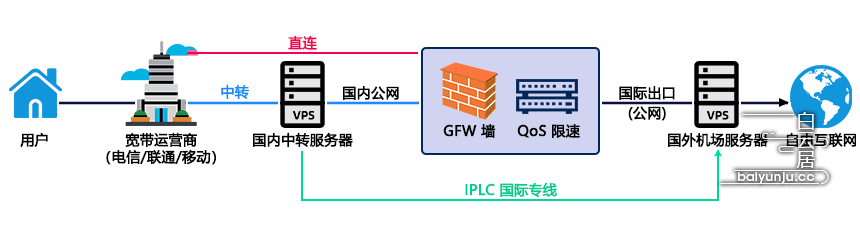

[toc]

### 临时邮箱

https://temp-mail.org/zh/

http://Yopmail.com

http://10minutemail.com/

http://www.20minutemail.com/%23top

https://burnermail.io/

https://tempmailo.com/

### 练手机场

[机场 – Telegraph](https://telegra.ph/jichang-11-22)

#### 一元机场

年付¥11元即可买"100G-传家宝"套餐，有香港日本新加坡美国地区，Trojan协议，可完全解锁 Netflix, Disney+

注册购买 → [https://一元机场.com](https://xn--4gq62f52gdss.com/#/register?code=DBRZqWfB)

#### efcloud
真一元月付 (air 不过只有法定节假日才有能买)
https://www.efcloud.cc/#/plan

### [直连、中转、BGP和IPLC国际专线节点是什么意思，有何区别](https://baiyunju.cc/9413)

一幅图看懂直连、中转、IPLC国际专线节点机场是什么意思：

红色线路：直连
蓝色线路：中转
绿色线路：IPLC国际专线

IPLC国际专线实际上也是中转连接的类型之一。除了IPLC、BGP专线，中转机场还会使用 IEPL、CN2、CN2 GIA等类型线路，下面一一说明。

## 直连节点是什么意思？有何优缺点？

用户通过电信、联通、移动等运营商的宽带线路，使用**混淆流量**等方式骗过GFW墙审查，经过QOS国际限速出口，再连接海外的机场服务器，然后访问外网。

**优点：**价格便宜。
**缺点：**速度稍慢，容易被封锁，倍率低。

## 中转（中继）节点是什么意思？有何优缺点？

用户通过电信、联通、移动等运营商的宽带线路，**连接机场在国内部署的中转服务器**，再由机场中转服务器转发请求至海外服务器。

其中，**IPLC/IEPL等国际专线通过中转服务器的流量不需要经过GFW审查和QOS限速，直接经过国际出口连接海外机场服务器**。

**优点：**速度快，延迟低，数据更安全，不易被封锁。
**缺点：**服务器增加了，价格比直连稍微高一点。

在中转节点机场中，常用的**中转线路类型**有BGP、IPLC、IEPL、CN2、CN2 GIA等：

#### BGP专线

BGP，全称Border Gateway Protocol，**边界网关协议**。用户通过宽带运营商连接到国内中转服务器BGP，BGP服务器再通过优化选择一条较优的线路和用户连接，再经过**隧道加密过墙**，提升过墙能力，再到国外的机场服务器。

BGP中转的优势是可以优化接入点网络，再以遂道加密，不容易被墙

价格比直连贵。

#### IPLC专线

IPLC，全称International Private Leased Circuit,即“**国际专线**”，是指用户专用的跨国通信线路。

IPLC线路一般通过国内中转服务器连接IPLC专线，不必经过GFW防火墙和QOS国际限速出口，直接连接海外机场服务器。

IPLC专线的优点是**延迟低，速度快**，一般作为**视频和游戏线路**。

缺点是价格较高，带宽小。

#### IEPC专线

IEPL是**国际以太网专线**，英文为International Ethernet Private Line，此线路为二层的电路，主要为跨国性企业提供高品质的以太网专线服务。

IEPL专线的优点是，低延时和高可靠性，最新的SDH技术确保时延和可靠性要求，提供与IPLC相同的性能指标。

缺点是价格更高，带宽更小 。

#### CN2专线

其实，CN2线路现在的普及率并不高，所以大家对它可能会有点陌生，今天咱们着重要讲的是连接国外机房服务器的电信CN2线路。CN2全称为中国电信**下一代承载网**，英文Chinatelecom Next Carrier Network，缩写为CNCN，进一步缩写为CN2。

CN2线路的优点是延迟低，速度快。CN2作为“精品网络项目”被提出来，其技术构造是远远领先于电信原有网络的，**极为先进**的QOS保证网络的畅通性。

#### CN2 GIA专线

CN2 GIA线路，GIA是Global Internet Access的缩写，CN2 GIA自然也是CN2线路的一种，并且是CN2线路中的高端产品，在CN2里的等级最高，全程和回程全部走59.43高速节点，CN2(AS4809)。

CN2 GIA线路优点是比较稳定，速度较快，丢包率低。然而这些优点背后是**高价**的线路和普通宽带几倍价格都换不来的大宽带。

### 中转线路类型有BGP、IPLC、IEPL、CN2、CN2 GIA, 分别是什么, 按质量排序 (chatGPT)

这些术语与互联网接入和数据传输有关，以下是它们的解释和按照质量排序的简要概述：

1. IPLC (International Private Leased Circuit) 是一种物理电路，提供点到点的连接。这种连接是直接连接两个地点，不需要中转，因此可提供较低的延迟和更高的带宽保证。IPLC通常用于传输高价值、敏感数据，如金融交易、数据备份等，因为它们提供更高的安全性和可靠性。IPLC的价格较高，适用于对网络质量要求较高的企业或机构。
2. IEPL (International Ethernet Private Line) 是一种基于以太网技术的专线连接。类似于IPLC，IEPL提供点对点连接，不需要中转，延迟低，且可以提供高速带宽。IEPL通常适用于需要高速和可靠连接的企业和机构，如跨国公司、数据中心、云服务提供商等。IEPL通常比IPLC价格更低，但仍然较昂贵。
3. BGP (Border Gateway Protocol) 是互联网上的路由协议，它帮助数据在不同的ISP之间传输，将数据包从一个ISP传递到另一个ISP。BGP路由通常具有较高的带宽和较低的延迟，但它的质量取决于所使用的ISP的网络质量和路由质量，因此它的稳定性和可靠性可能因ISP而异。BGP通常用于中小型企业或组织，需要较低的价格和较好的连接质量。
4. CN2 (ChinaNet Next Carrying Network) 是中国电信的下一代承载网络。它是由中国电信运营的高速骨干网，覆盖全球。CN2的网络拓扑结构具有较好的负载均衡和容错性，可以提供高质量、稳定的网络连接。CN2适用于需要连接中国市场或与中国公司进行业务往来的企业和组织。
5. CN2 GIA (Global Internet Access) 是CN2的国际互联网接入服务，为客户提供连接到全球互联网的通道。CN2 GIA的质量和稳定性与CN2网络类似，但提供更广泛的覆盖范围和更高的带宽容量。CN2 GIA适用于需要连接全球市场和客户的企业和组织。

按照质量排序，从高到低是： IPLC、IEPL、CN2、CN2 GIA、BGP。

需要注意的是，这种排序并不代表这些技术的所有方面，因为每个技术都有自己的优缺点和适用场景。例如，IPLC和IEPL提供了最高质量的连接，但价格昂贵，适用于对网络质量和安全性有高要求的企业和机构。CN2和CN2 GIA则提供了更经济实惠的选择，但可能不如IPLC和IEPL提供的质量和安全性高。BGP则适用于对价格敏感的中小型企业或组织，需要较低的价格和较好的连接质量。因此，在选择中转线路类型时，需要考虑自己的需求、预算和业务情况，选择最适合自己的技术。

### [duyao 机场使用手册](https://www.duyaoss.com/archives/1086/)

#### 原生IP/本土 IP

> 原生 IP / 本土 IP：是指 VPS 所被分配到的 IP 的注册地址和 VPS 所在的国家 / 地区一致的 IP
>
> 原生 IP 一般不用于公有云计算服务或 IP 声誉好，一般能够用来解锁 Net­flix、HBO、Hulu 以及其它有限制的流媒体服务。

#### 中转

> 中转：将数据从一个服务器重定向到另外一个服务器。

#### 专线

> 专线：互连两点之间的通信，即点对点通信，用内网业务和公网业务来区分。
>
> 目前所见的机场用的 “专线” 基本都是以下几种：
> **公网** Tun­nel 转发占了大概 80%
> 阿里经典内网 / 云企业网占了大概 15%
>
> 其他 IPLC
>
> CN2 专线：CN2 专线业务是中国电信 CN2 Global In­ter­net Ac­ceSS，由某些卖北美 GIA CN2 的国人商家提出，16 年左右 -> CeR­aNet­works （CN2 专线），17 年安畅 -> CDIA （China Di­rect In­ter­net Ac­ceSS），从而不少人认为这种是真专线，不过 GFW。实则其实只是商家为了宣传而打出来的噱头，即使用 CN2 GIA 一样会在国内骨干网爆炸的时候无法正常使用。当然啦，由于 GFW 都是部署在骨干网出口的，因此自然而然的**走公网的业务必定是过墙**的，不存在不过墙的 CN2 专线业务。
>
> IEPL 和 MPLS VPN 以及 IPLC 在一定程度上他们做的事情都是差不多的，因此合并在一起。
>
> IPLC/IEPL：IPLC 的概念是用于互连两点之间的通信，即点对点通信。深港 IPLC 的意思是深圳到香港点对点传输而不经过公网，是完全的内网。目前阿里云经典内网 / 云企业网就是这种，在卸载阿里云盾后是可以被认为是真正意义上的专线。**这种专线因为没有走公网因此完全不过墙**，你传输什么 GFW 都是不会知道的。
>
> 还有一种比较特殊的情况，有一种公网 Tun­nel 也是不过墙的，由于 GFW 部署在运营商的出口处，因为国内到国内是没有 GFW 存在的。因此某些机场使用了如下结构构造无墙专线：徐州 VPS-> 上海阿里云 -> 阿里经典内网 -> 香港阿里云 ->HKT
>
> 而这种走法避开了部署在运营商出口的 GFW 而且因为目前国内运营商针对 IDC 带宽是很小的 QoS，HKT 对港内也是不限速的，因此也大大改善了连接速度。这种做法的确是不过墙的，并且因为很多 Tier 2 IDC 的审查并不如阿里云审查那么重，因此也被不少人选择。
>
> 总结一下，目前**基于公网的业务例如 GIA CN2，BBTEC，9929 均是会有 GFW 的，不仅有被墙风险还会有 QoS 的问题**。
>
> 而目前性价比较高的 IPLC 是阿里云经典网 / 云企业网搞出来的那套东西，
> [摘自 saber 的万事屋](https://t.me/sabershome)

#### Netflix/盒子奈飞/土区车/分辨率问题/

> 与国内不同，许多国外的流媒体服务提供商对软件 / 系统的 DRM 要求很高。这对习惯性阉割谷歌服务，自立门户的国内手机厂商影响很大。Net­fix 的清晰度无法手动调节，在这个前提下和收集 DRM 级别限制的情况下，部分用户播放的清晰度锁死在 540p，更甚者无法于谷歌商店下载对应的软件。
>
> 用户可于谷歌 play 下载 drm info 查下 wine­v­ide level。
> L1 支持高清，720/​1080。可于视频详情页面看到 HD 字样 / HDR / 杜比视界等
> L3 支持 540。国内手机一般是，如有需要，请刷国外版 ROM。
> 此外 root 过的手机一般都是 L3。
> 手机端具体支持可与 Net­flix 搜索 test pat­tern，播放后，可于右上角看到分辨率。
>
> 桌面端支持如下：
> Win­dows：Edge uwp 版 Net­flix 4K，其他全是 720，可通过插件支持 1080
> ma­cOS：sa­fari 1080 其他全是 720，可通过插件支持 1080
> Chrome OS： 1080
>
> 电视看 Net­flix：
> 第一关，是需要原生 IP，电视的 Net­flix 的 IP 库识别要比手机严格。
> 第二关：获得较低的认证或没有认证的机器一般看不了 4k。当然，国产 ROM 就别说了。
> 第三关：你的电视支持硬件要求，外挂盒子的话需要，数据线需要支持 HD­MI2.0 和 HD­CP2.2（不知道准不准），用 test pat­tern 可以看到分辨率。
>
> 土区车：Net­flix 不限购买服务后的 IP，而土区因为汇率比较便宜，而这一般又是合租的，又称上车。

### 网络连接中的Cloud Connect 线路

Cloud Connect是一种专门用于连接企业私有云和公共云服务提供商的网络连接方式。它通过在企业数据中心和云服务提供商之间创建一条私有连接来实现高速、低延迟的网络连接。

Cloud Connect线路通常是由云服务提供商或第三方网络服务提供商提供的。这些线路通常是点对点的连接，由云服务提供商的数据中心和企业数据中心之间的物理连接构成。连接可以使用多种协议，包括Multiprotocol Label Switching (MPLS)、Ethernet或IP协议。

Cloud Connect线路通常比公共互联网连接更可靠、更安全、更快速和更稳定。通过使用Cloud Connect，企业可以获得更高的带宽和更低的延迟，同时降低对公共互联网的依赖性。这对于需要处理大量敏感数据和实时应用程序的企业来说尤其重要。