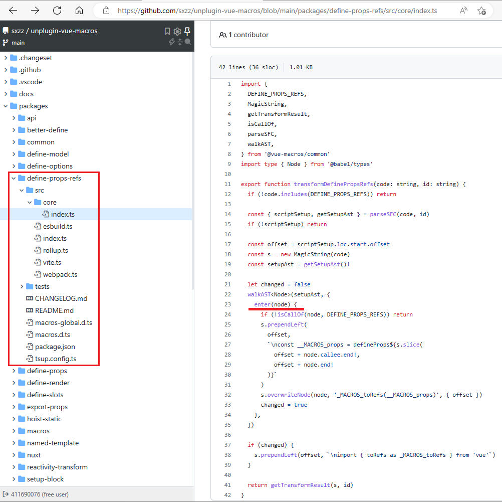
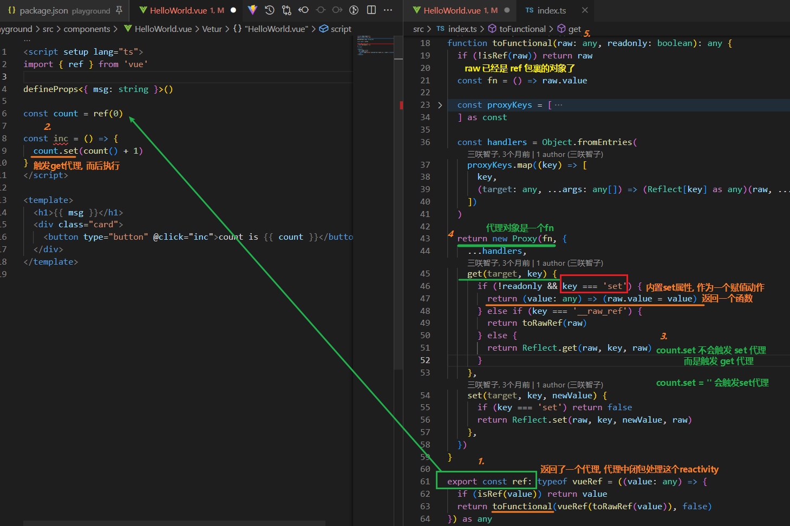
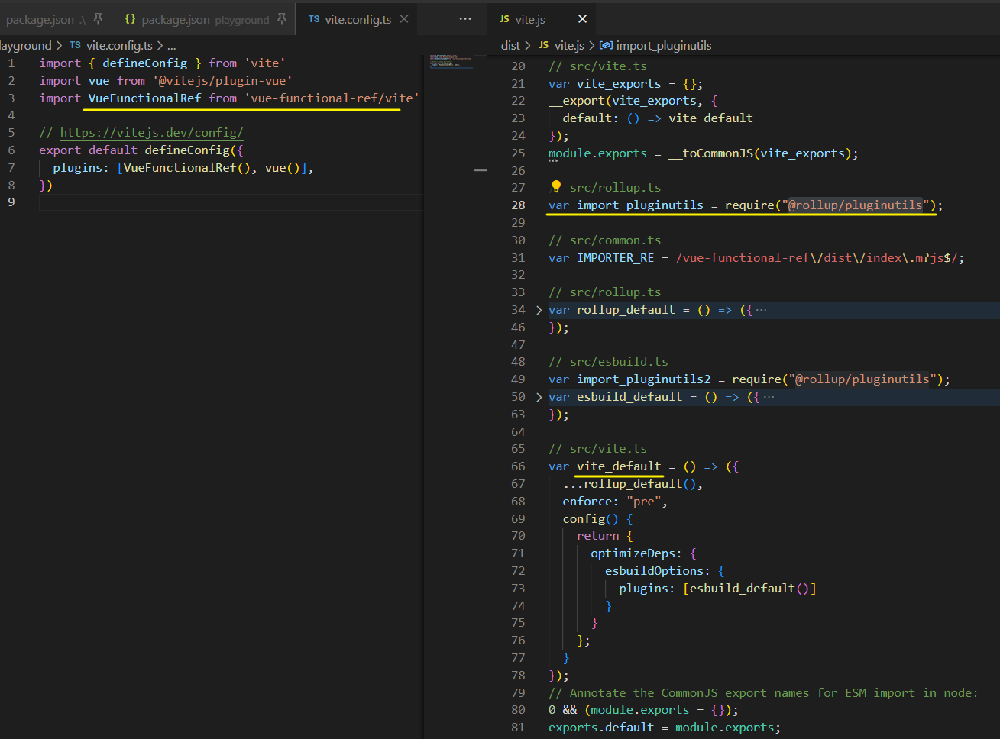
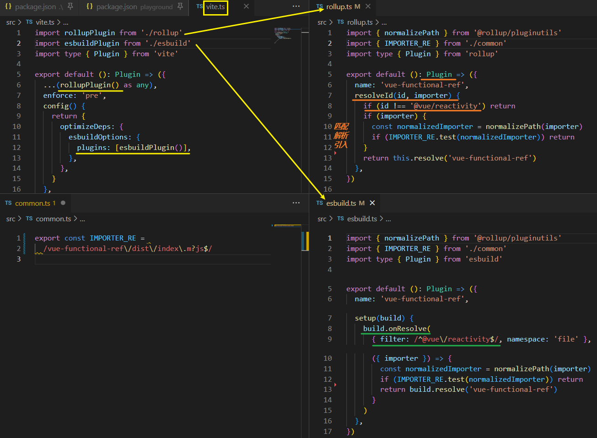
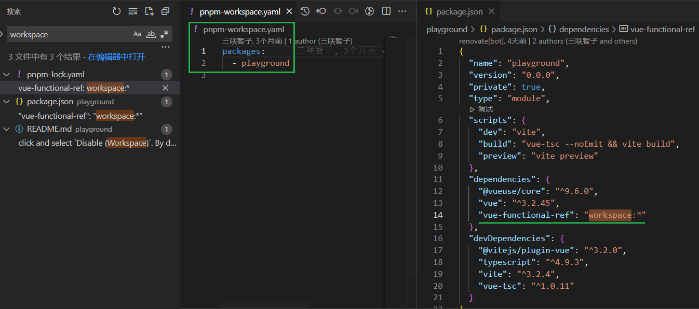

[toc]

### ChatGPT 及衍生

[科技爱好者周刊（第 234 期）：AI 聊天有多强？ - 阮一峰的网络日志 (ruanyifeng.com)](https://www.ruanyifeng.com/blog/2022/12/weekly-issue-234.html)


### [Defensive CSS](https://defensivecss.dev/)

各种防御性的 CSS 技巧，防止客户端出现各种破坏 CSS 显示的情况。

1. flex + wrap
2. 
3. 溢出文本打点
4. 
5. Auto-fit Vs Auto-fill
6. 1
7. CSS  grid
8. CSS 变量默认值


### [Apache Superset](https://superset.apache.org/)

一个数据探索和数据可视化工具，可以与各种数据源很好地集成。


### [Tutorial for Writing a TypeScript Library (tsmean.com)](https://www.tsmean.com/articles/how-to-write-a-typescript-library/)

简单教程，介绍如何写一个 TypeScript 库发布到 NPM 上面。


### [Getting Started | Vue Macros (sxzz.moe)](https://vue-macros.sxzz.moe/guide/getting-started.html)

author: sxzz

扩充 Vue **宏和语法糖**；

**可以看学习这个仓库**并尝试调试

 
如何调试？

`pnpm i`, `pnpm dev`(并行运行所有的packages/*/dev脚本), `pnpm play`

`dev` 指令会开启一个node.js进程， 可以用于 inspect

> "dev": "pnpm run --filter=\"./packages/*\" --parallel dev",
>
> "play": "pnpm run play:vue3",
>
>  "play:vue3": "pnpm run -C ./playground/vue3 dev",

- 单个package中的`"dev": "DEV=1 tsup"`

> Btw, macros 使用 vitepress 的方式也不简单


### [sxzz/vue-functional-ref: Functional-style refs for Vue. (github.com)](https://github.com/sxzz/vue-functional-ref)

Functional-style refs for Vue. Inspired by [@antfu](https://github.com/antfu).

Extend refs with functional style.

如何编写 vue 插件, 并提供给打包工具解析

> 使用 @vue/reactivity 库
>
> 拓展

源码在线查看: [index.ts - vue-functional-ref](https://github.dev/jiang-24-gdufs/vue-functional-ref)

clone 后 `build` 后才能在 playground 中运行

**可以从 test 中看这个 库 的主要功能**

**以及源工程的多仓库代码结构**

> 调试纪录, 使用proxy, 覆盖了vue原有的Ref和其他
>
> 最早的函数式转换: [vue-functional-ref@4d41cf5](https://github.com/sxzz/vue-functional-ref/commit/4d41cf5cc4f709feedcedbc774b3fb717c1d38c0)

函数式 ref 工作逻辑如下, 标记 1~5




#### 库引入方式

##### PNPM (Recommended)

If you're using pnpm, try this approach first! (推荐使用pnpm)

`pnpm i vue-functional-ref`

. 在 package.json中配置 pnpm ?

```json
{
  // package.json

  // ...
  "pnpm": {
    "overrides": {
      "@vue/runtime-core>@vue/reactivity": "npm:vue-functional-ref"
    }
  }
}
```

实际playground中是用 vite 以插件的方式引入的

```ts
import VueFunctionalRef from 'vue-functional-ref/vite'
//                   Rollup: 'vue-functional-ref/rollup'
//                  esbuild: 'vue-functional-ref/esbuild'

export default {
  plugins: [VueFunctionalRef()],
}
```






### Vue3 源码?

结构?


### pnpm 工作空间（Workspace）

[工作空间（Workspace） | pnpm](https://pnpm.io/zh/workspaces)

创建一个 workspace 以将多个项目合并到一个仓库中。

一个 workspace 的根目录下必须有 [`pnpm-workspace.yaml`](https://pnpm.io/zh/pnpm-workspace_yaml) 文件

> 如果`bar`引用`"foo": "^1.0.0"`并且`foo@1.0.0`存在工作区，那么pnpm会从工作区将`foo@1.0.0`链接到`bar`。 但是，如果 `bar` 的依赖项中有 `"foo": "2.0.0"`，而 `foo@2.0.0` 在工作空间中并不存在，则将从 npm registry 安装 `foo@2.0.0` 。 这种行为带来了一些不确定性。

pnpm 支持 workspace 协议 `workspace:` 。 

当使用此协议时，pnpm 将拒绝解析除本地 workspace 包含的 package 之外的任何内容。


