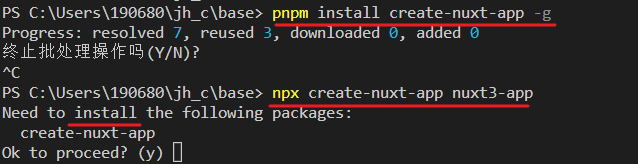

### 移民

antf 在其公司 [nuxtlabs](https://nuxtlabs.com/) 的帮助下去到了法国

NuxtLabs诞生于2017年，几个月后[NuxtJS](https://nuxtlabs.com/nuxtjs)的生产发布以及许多公司对Nuxt培训和咨询的需求

NuxtLabs是一家分布式公司，其团队遍布全球6个国家

antfu 开始使用: [Mastodon (webtoo.ls)](https://m.webtoo.ls/explore/links)

#### Mastodon Servers

Mastodon is not a single website. To use it, you need to make an account with a provider—we call them **servers**—that lets you connect with other people across Mastodon.

Mastodon 是去中心化的，所以无论在哪个实例创建账号，都可以关注本服务器上的账号并与之交流。 或者你还可以自己搭建实例！

## Nuxt.js 解决什么问题

现在 `Vue.js` 大多数用于单页面应用，随着技术的发展，单页面应用已不足以满足需求。并且一些缺点也成为单页面应用的通病，单页面应用在访问时会将所有的文件进行加载，首屏访问需要等待一段时间，也就是常说的白屏，另外一点是总所周知的 **`SEO` 优化**问题。

`Nuxt.js` 的出现正好来解决这些问题，如果你的网站是**偏向社区**需要**搜索引擎提供流量**的项目，那就再合适不过了。比较注重 **流量** 的，推荐使用 SSR，比如 **博客、论坛、官网** 等，流量就是命脉

最常用的就是用来作SSR（服务器端渲染）

#### [Nuxt 3 - 中文文档 (nuxtjs.org.cn)](https://www.nuxtjs.org.cn/)

### npx 

使用npx调用一个全局安装的库时, 如果没有安装则会先提示安装

