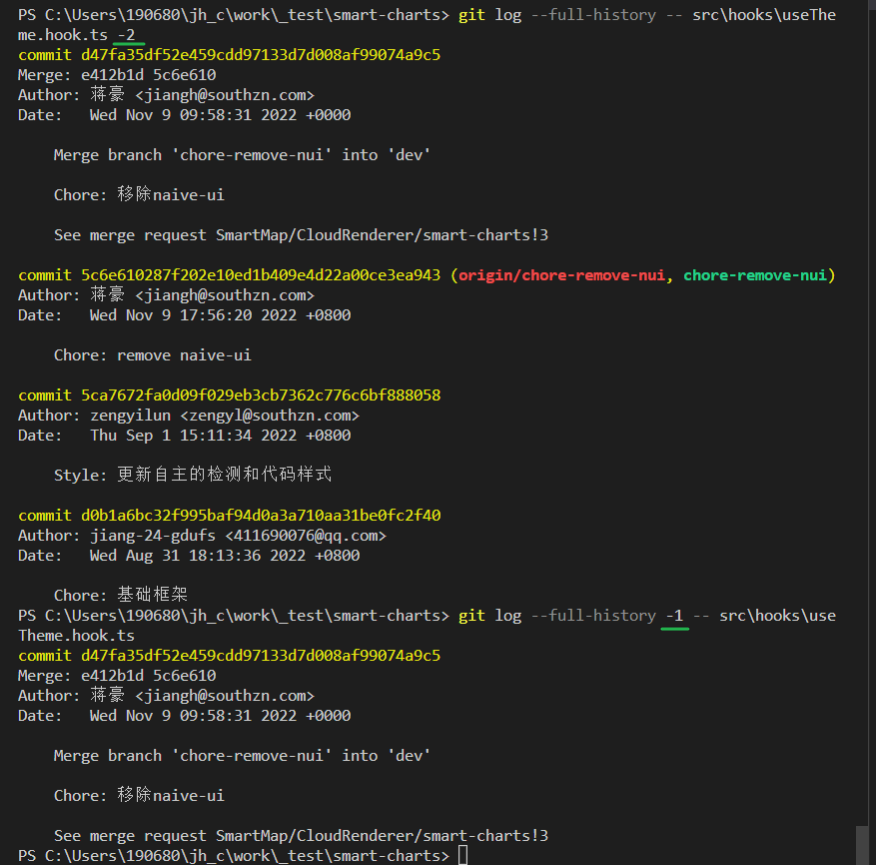

### tree 命令的 node 替代

[MrRaindrop/tree-cli: 🌴List contents of directories in tree-like format. (github.com)](https://github.com/MrRaindrop/tree-cli)

tree-cli  treee 命令

List contents of directories in tree-like format.

Tree-cli is a recursive directory listing program that produces a depth indented listing of files. With no arguments, tree lists the files in the current directory. When directory arguments are given, tree lists all the files and/or directories found in the given directories each in turn. Upon completion of listing all files/directories found, tree returns the total number of files and/or directories listed.

#### Use the command `tree` or `treee` (to avoid confliction with system command).

**NOTE: use `treee` instead of `tree` on windows system.**

## Options

- --help: outputs a verbose usage listing.
- --version: outputs the version of tree-cli.
- --debug: show debug info.
- --fullpath: prints the full path prefix for each file.
- --ignore: ignores directory or file you specify - accepts arrays as comma-delimited strings: `'node_modules/, .git/, .gitignore'`
- --link: follows symbolic links if they point to directories, as if they were directories. Symbolic links that will result in recursion are avoided when detected.
- --noreport: omits printing of the file and directory report at the end of the tree listing and omits printing the tree on console.
- --base: specify a root directory. Relative path from cwd root and absolute path are both acceptable. This argument is optional.
- -a: all files are printed. By default tree does not print hidden files (those beginning with a dot '.'). In no event does tree print the file system constructs '.' (current directory) and '..' (previous directory).
- -d: list directories only.
- -f: append a '/' for directories, a '=' for socket files and a '|' for FIFOs.
- -i: makes tree not print the indentation lines, useful when used in conjunction with the -f option.
- -l: max display depth of the directory tree.
- -o: send output to filename.


可以采用命令: `treee --ignore node_modules/ -a -l 10`,

- 输出文件 (忽略依赖)
- 层级需要指定 (指定层级时可以不用-a)


如何指定某个路径输出 `treee --base plop -a  -l 3`

- 指定base


hhh meow 库 用来添加 cli 的helper信息

https://github.com/sindresorhus/meow


### 如何查询git中被删除的文件是在哪个版本被删除的

[Git - Tutorial (vogella.com)](https://www.vogella.com/tutorials/Git/article.html#retrievefiles_finddeletedfile)

The `git log` command allows you to determine which commit deleted a file. 

You can use the `--` option in `git log` to see the commit history for a file, even if you have deleted the file.

git log命令允许您确定哪个提交删除了一个文件。

你可以使用git log中的——选项来查看文件的提交历史，即使你已经删除了该文件。

```bash
# see the changes of a file, works even
# if the file was deleted
git log --full-history -- [file_path]

# limit the output of Git log to the
# last commit, i.e. the commit which delete the file
# -1 to see only the last commit
# use 2 to see the last 2 commits etc
git log --full-history -1 -- [file_path]

# include stat parameter to see
# some statics, e.g., how many files were
# deleted
git log --full-history -1 --stat -- [file_path]
```

limit 参数需要放置在 path 前.




### [JSZip (stuk.github.io)](https://stuk.github.io/jszip/)

JSZip is a javascript library for creating, reading and editing .zip files, with a lovely and simple API.
