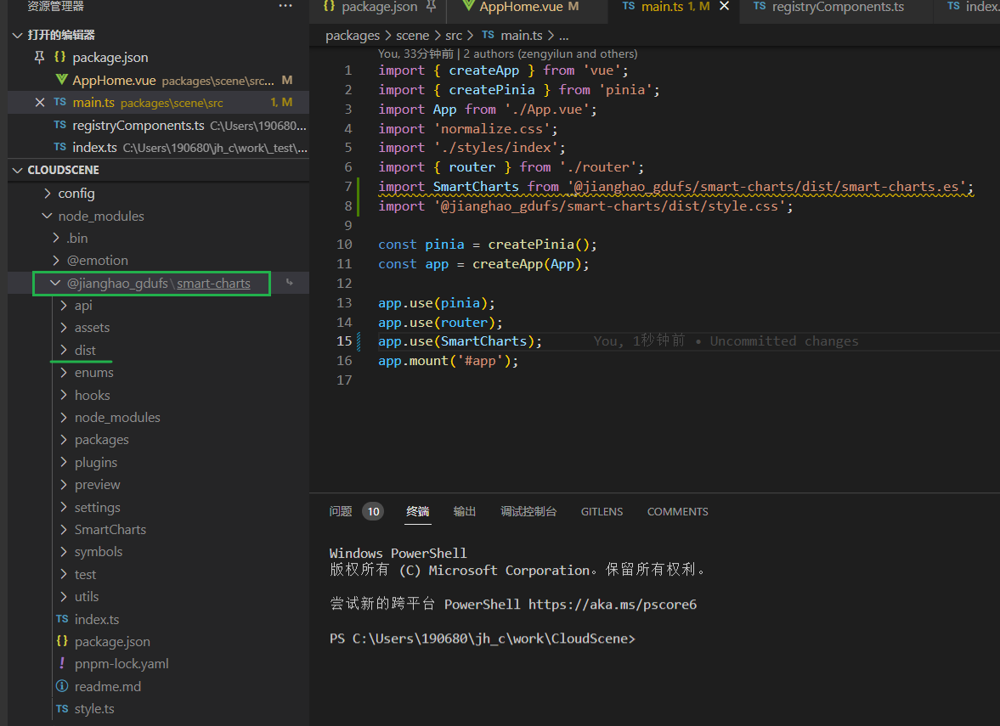

### Puppeteer + Nodejs 通用全屏网页截图

### npm link

dep + project

直接dep中的文件, 作为全局node_modules中的依赖使用, 可以在不安装, 直接以整个路径作为依赖

- 第一步，使用npm link将common模块创建成本地依赖包 `npm link`
- 进入到project1项目目录里，和本地common模块建立链接 `npm link common`

使用npm link能够避免重复且繁琐的打包发布操作，给开发调试带来便捷，而且使用方法简单。

