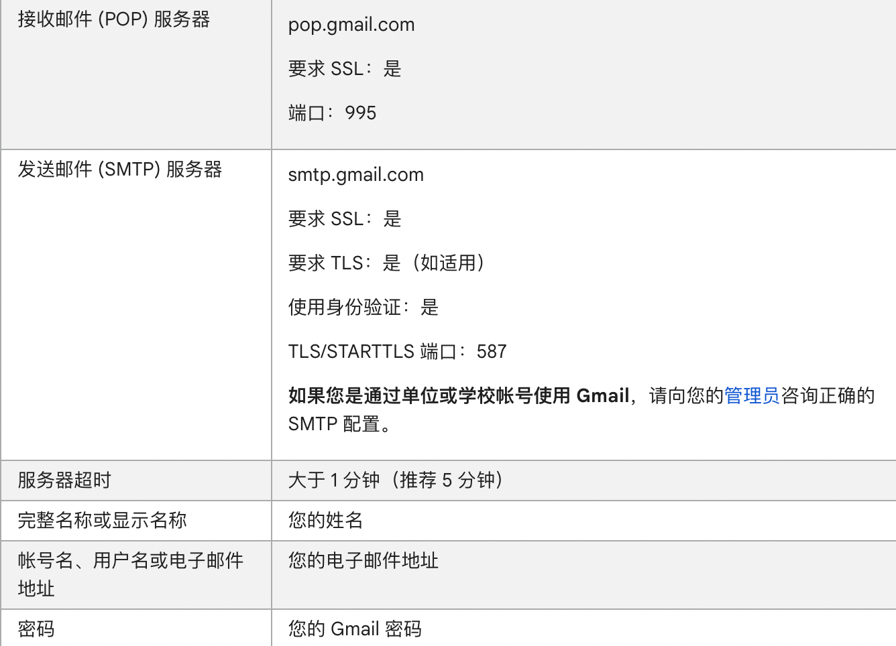
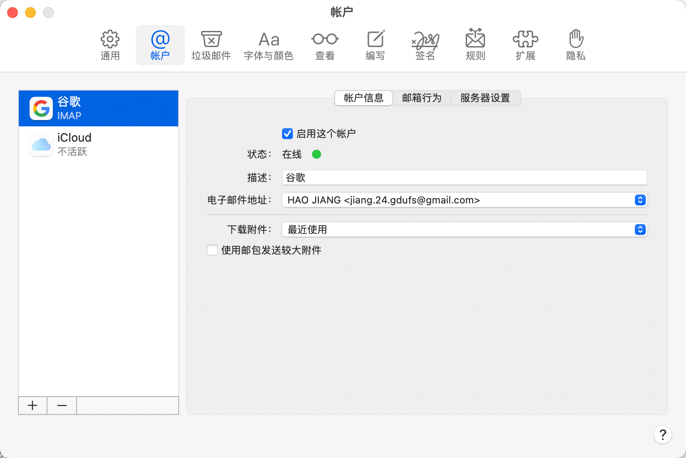

### mbp can not send email

未能发送此邮件，因为您的帐户没有首选的发件服务器。请从下面的列表中选择一个发件服务器。

正在发送的邮件由发件人发出

gmail.com 所有设置=>开启pop/imap

> ## 第 2 步：设置 POP
>
> ### 首先在 Gmail 中设置 POP
>
> 1. 在计算机上打开 [Gmail](https://mail.google.com/)。
> 2. 点击右上角的“设置”图标   **查看所有设置**。
> 3. 点击**转发和 POP/IMAP** 标签页。
> 4. 在“POP 下载”部分，选择**对所有邮件启用 POP** 或**对从现在起收到的邮件启用 POP**。
> 5. 点击页面底部的**保存更改**。
>
> ### 然后在电子邮件客户端上进行更改
>
> 前往您的客户端（如 Microsoft Outlook），然后检查这些设置。
>
> 

> Link https://support.google.com/mail/answer/7104828?hl=zh-Hans&visit_id=638069565131836426-3497275977&rd=1

需要启用这个账户? 不确定进行了什么操作后可以发送邮件了

> 极有可能是需要 勾选 `启用这个账户`

### [h3](https://github.com/unjs/h3) 

H3 is a minimal h(ttp) framework built for high performance and portability

> org: UnJS (Unified JavaScript Tools), antfu 也是该组织的member
>
> nitro & h3 都是一家

#### Features

✔️ **Portable:** Works perfectly in Serverless, Workers, and Node.js

✔️ **Minimal:** Small and tree-shakable

✔️ **Modern:** Native promise support

✔️ **Extendable:** Ships with a set of composable utilities but can be extended

✔️ **Router:** Super fast route matching using [unjs/radix3](https://github.com/unjs/radix3)

✔️ **Compatible:** Compatibility layer with node/connect/express middleware

