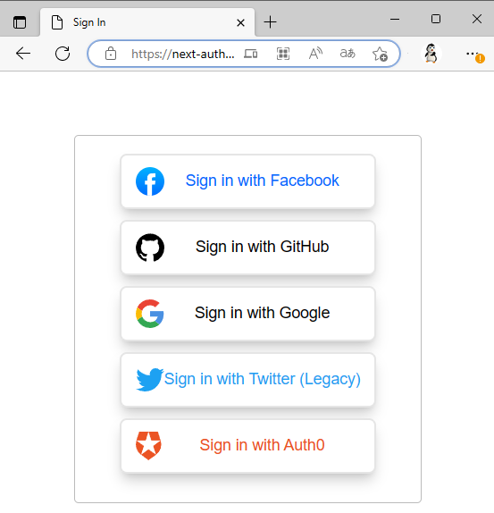

[toc]

### [像写 CSS 一样写 SVG](https://yuanchuan.dev/experimenting-a-new-syntax-to-write-svg)（英文）

作者介绍他发明的一种新工具，可以改变 SVG 的写法，让手写 SVG 变得像写 CSS 一样。

[#](https://css-doodle.com/)

### [Bolt.css](https://boltcss.com/)

一个极简的 CSS 框架，不使用 class，只修饰 HTML 原生元素。

#### HTML 元素参考

此页面列出了所有使用[标签](https://developer.mozilla.org/zh-CN/docs/Glossary/Tag)创建的 [HTML](https://developer.mozilla.org/zh-CN/docs/Glossary/HTML) [元素](https://developer.mozilla.org/zh-CN/docs/Glossary/Element)。

### [Auth.js](https://authjs.dev/)

这原来是 Next.js 的授权模块，最近改成了通用模块。它用来提供 Web 的登录服务，内置了很多身份验证服务。

- 内置支持 60 +流行服务
  _（谷歌，Facebook，Auth0，苹果..._
- 与*任何* OAuth 2 或 OpenID Connect 提供程序配合使用

### [MacOS 的 zsh 教程](https://scriptingosx.com/2019/06/moving-to-zsh/)（英文）

zsh 已经替代 Bash，成为 Mac 电脑的默认 Shell。

这是针对 MacOS 的 zsh 系列教程，一共 8 个部分。
