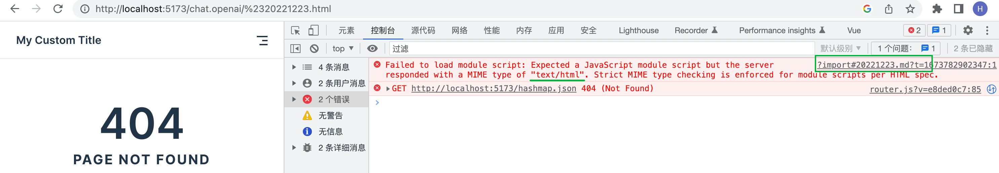

[toc]

### 如何将已有的 typora 文档用 vitepress 部署

1. `#` 字符不能作为 URL ，影响sidebar

   > 考虑如何在不重命名的前提下使得带`#`的链接生效 
   >
   > - url encode '#' => '%23', 但是并不能匹配路由 (encodeURIComponent同样无效)
   >
   >   即无法仅通过把 ‘#’ 转换为在地址显示 ‘%23’ 来达到目的
   >
   >   
   >
   > [搜索到相关的 issue](https://github.com/vuejs/vitepress/issues/1439)
   >
   > > 根本原因是当你有一些文件的路径中有这些字符之一（/[\u0000-\u001F "#$&*+,:;<=>?[\]^`{|}\u007F]/g），生成的资产名称是不同的（这些字符被替换成_）。VitePress目前无法处理这些边缘情况（同时猜测需要导入的文件名）。
   >
   > > 关于以上的说明有源码支撑 [INVALID_CHAR_REGEX](https://github.com/vuejs/vitepress/blob/main/src/shared/shared.ts#L169)
   > >
   > > 把link的属性值修改，`replace('#', '_')` 不能达到目的
   >
   > 把#开头的文件重命名为 `_` 为前缀的文件名可以工作

2. `[[toc]]` && `[toc]` 配置兼容

3. `[toc]` 生产的nav未包含h1 ～ h6， 默认为 [2,3], 

   > vitepress doc 配置为[0,0]
   >
   > [mdit](https://github.com/mdit-vue/mdit-vue/tree/main/packages/plugin-toc#options)

4. yaml标题 与 顶级标题的冲突

   > ```markdown
   > ---
   > title: Blogging Like a Hacker
   > lang: en-US
   > ---
   > 
   > # 如何用node.js快速写后台代码 
   > ```
   >
   > MD025/single-title/single-h1: Multiple top-level headings in the same documentmarkdownlint[MD025](https://github.com/DavidAnson/markdownlint/blob/v0.26.2/doc/Rules.md#md025)
   >
   > 迁移时先不要使用顶部 yaml，也不要在意顶部的 `[toc]` 提示的警告信息

5. 动态配置边栏菜单， 因为不可能为每个md编写配置，所以需要找到一个动态匹配并生成多层菜单的方法 

   > ```ts
   >  {
   >    text: '${date dir}',
   >      items: [
   >        { text: '${day md file}', link: '/introduction' },
   >        { text: 'Getting Start', link: '/getting-start' },
   >      ]
   >  },
   > ```
   >
   > 如何在 vitepress 的 config.ts 中使用vite的 [Glob导入](https://cn.vitejs.dev/guide/features.html#glob-import) 
   >
   > `const modules = *import*.meta.glob('./dir/*.js')`

   > Warning: `You need to set the output format to "esm" for "import.meta" to work correctly.`

   类似的解决方案：[自动生成vitepress侧边栏](https://juejin.cn/post/7176873356027772965)

   **注意 `npm run docs:dev`时 baseUrl 是以 `vitepress` 根目录为相对目录的**

6. 更新vitepress到.40是默认通过文件系统创建路由，可以通过URL来访问。但是`docs`目录下的软链接(目录)是没有正确的创建路由

7. 如何部署到`user.github.io/repo/`

   [vitepress 部署](https://vitepress.vuejs.org/guide/deploying)

8. 


