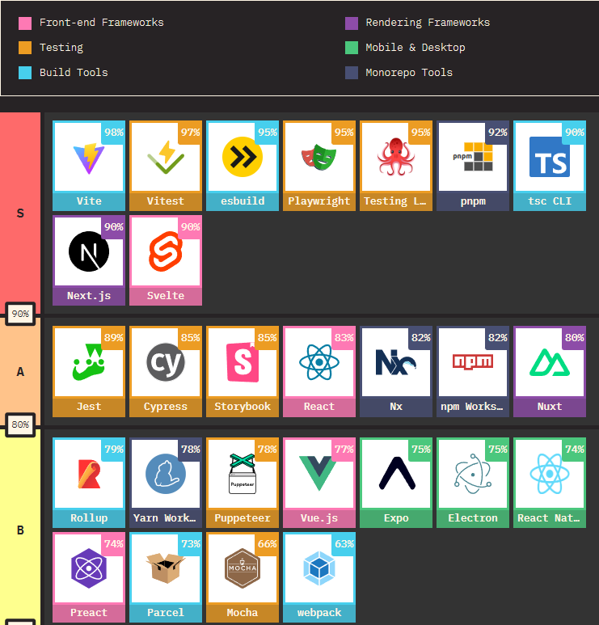
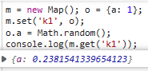

[toc]

### [《朗文当代高级英语词典》mac 版，适配原生 Dictionary APP - V2EX](https://v2ex.com/t/907272)

[《牛津高阶 10th》mac 版，适配原生 Dictionary APP - V2EX](https://www.v2ex.com/t/908245#reply14)

### [The State of JS 2022](https://2022.stateofjs.com/en-US/libraries/#tier_list)

度对代码库进行排名 满意度指的是"会再次使用这个库的人数"

1. FE Frameworks:
2. Rendering Frameworks:  nuxt
3. Testing: Vitest *playwright*?
4. Build Tools: vite esbuild

#### [Other Tools](https://2022.stateofjs.com/en-US/other-tools/)

工具类库

### Astro: What is Astro?

Astro is an **all-in-one** **web framework** for building **fast,** **content-focused** websites.

### [Chart.js | Open source HTML5 Charts for your website (chartjs.org)](https://www.chartjs.org/)

[github](https://github.com/chartjs/Chart.js)

### Map 的set值为引用值

### [`Object` 和 `Map` 的比较](https://developer.mozilla.org/zh-CN/docs/Web/JavaScript/Reference/Global_Objects/Map#object_和_map_的比较)

[`Object`](https://developer.mozilla.org/zh-CN/docs/Web/JavaScript/Reference/Global_Objects/Object) 和 `Map` 类似的是，它们都允许你按键存取一个值、删除键、检测一个键是否绑定了值。因此（并且也没有其他内建的替代方式了）过去我们一直都把对象当成 `Map` 使用。

不过 `Map` 和 `Object` 有一些重要的区别，在下列情况中使用 `Map` 会是更好的选择：

|              | Map                                                          | Object                                                       |
| :----------- | :----------------------------------------------------------- | :----------------------------------------------------------- |
| 意外的键     | `Map` 默认情况不包含任何键。只包含显式插入的键。             | 一个 `Object` 有一个原型，原型链上的键名有可能和你自己在对象上的设置的键名产生冲突。**备注：**虽然可以用 [`Object.create(null)`](https://developer.mozilla.org/zh-CN/docs/Web/JavaScript/Reference/Global_Objects/Object/create) 来创建一个没有原型的对象，但是这种用法不太常见。 |
| 键的类型     | 一个 `Map` 的键可以是**任意值**，包括函数、对象或任意基本类型。 | 一个 `Object` 的键必须是一个 [`String`](https://developer.mozilla.org/zh-CN/docs/Web/JavaScript/Reference/Global_Objects/String) 或是 [`Symbol`](https://developer.mozilla.org/zh-CN/docs/Web/JavaScript/Reference/Global_Objects/Symbol)。 |
| 键的顺序     | `Map` 中的键是有序的。因此，当迭代的时候，一个 `Map` 对象以插入的顺序返回键值。 | 虽然 `Object` 的键目前是有序的，但并不总是这样，而且这个顺序是复杂的。因此，最好不要依赖属性的顺序。自 ECMAScript 2015 规范以来，对象的属性被定义为是有序的；ECMAScript 2020 则额外定义了继承属性的顺序。参见 [OrdinaryOwnPropertyKeys](https://tc39.es/ecma262/#sec-ordinaryownpropertykeys) 和 [EnumerateObjectProperties](https://tc39.es/ecma262/#sec-enumerate-object-properties) 抽象规范说明。但是，请注意没有可以迭代对象所有属性的机制，每一种机制只包含了属性的不同子集。（[`for-in`](https://developer.mozilla.org/zh-CN/docs/Web/JavaScript/Reference/Statements/for...in) 仅包含了以字符串为键的属性；[`Object.keys`](https://developer.mozilla.org/zh-CN/docs/Web/JavaScript/Reference/Global_Objects/Object/keys) 仅包含了对象自身的、可枚举的、以字符串为键的属性；[`Object.getOwnPropertyNames`](https://developer.mozilla.org/zh-CN/docs/Web/JavaScript/Reference/Global_Objects/Object/getOwnPropertyNames) 包含了所有以字符串为键的属性，即使是不可枚举的；[`Object.getOwnPropertySymbols`](https://developer.mozilla.org/zh-CN/docs/Web/JavaScript/Reference/Global_Objects/Object/getOwnPropertySymbols) 与前者类似，但其包含的是以 `Symbol` 为键的属性，等等。） |
| Size         | `Map` 的键值对个数可以轻易地通过 [`size`](https://developer.mozilla.org/zh-CN/docs/Web/JavaScript/Reference/Global_Objects/Map/size) 属性获取。 | `Object` 的键值对个数只能手动计算。                          |
| 迭代         | `Map` 是 [可迭代的](https://developer.mozilla.org/zh-CN/docs/Web/JavaScript/Reference/Iteration_protocols) 的，所以可以直接被迭代。 | `Object` 没有实现 [迭代协议](https://developer.mozilla.org/zh-CN/docs/Web/JavaScript/Reference/Iteration_protocols#the_iterable_protocol)，所以使用 JavaSctipt 的 [for...of](https://developer.mozilla.org/zh-CN/docs/Web/JavaScript/Reference/Statements/for...of) 表达式并不能直接迭代对象。**备注：**对象可以实现迭代协议，或者你可以使用 [`Object.keys`](https://developer.mozilla.org/zh-CN/docs/Web/JavaScript/Reference/Global_Objects/Object/keys) 或 [`Object.entries`](https://developer.mozilla.org/zh-CN/docs/Web/JavaScript/Reference/Global_Objects/Object/entries)。[for...in](https://developer.mozilla.org/zh-CN/docs/Web/JavaScript/Reference/Statements/for...in) 表达式允许你迭代一个对象的*可枚举*属性。 |
| 性能         | 在频繁增删键值对的场景下表现更好。                           | 在频繁添加和删除键值对的场景下未作出优化。                   |
| 序列化和解析 | 没有元素的序列化和解析的支持。（但是你可以使用携带 *replacer* 参数的 [`JSON.stringify()`](https://developer.mozilla.org/zh-CN/docs/Web/JavaScript/Reference/Global_Objects/JSON/stringify) 创建一个自己的对 `Map` 的序列化和解析支持。参见 Stack Overflow 上的提问：[How do you JSON.stringify an ES6 Map?](https://stackoverflow.com/q/29085197/)） | 原生的由 [`Object`](https://developer.mozilla.org/zh-CN/docs/Web/JavaScript/Reference/Global_Objects/Object) 到 JSON 的序列化支持，使用 [`JSON.stringify()`](https://developer.mozilla.org/zh-CN/docs/Web/JavaScript/Reference/Global_Objects/JSON/stringify)。原生的由 JSON 到 [`Object`](https://developer.mozilla.org/zh-CN/docs/Web/JavaScript/Reference/Global_Objects/Object) 的解析支持，使用 [`JSON.parse()`](https://developer.mozilla.org/zh-CN/docs/Web/JavaScript/Reference/Global_Objects/JSON/parse)。 |

### smart-charts 设计顶层API难点

1. 封装成库后如何提供顶层API去控制内部图表组件的状态 (如显示/隐藏)

   在渲染图表的顶层组件中循环遍历并渲染各个图表组件

   渲染使用的方法为: component 动态组件, 渲染

   使用ref绑定一个函数 `:ref="(component: any) => activeComp = component"`获取当前动态组件的引用, 子组件内部expose方法来修改.

   **问题:**

   1. 在根组件中, 会多次执行`ref` 绑定的属性 `activeComp`会多次变更, 导致最终的值为最后一个挂载的图表组件的引用. 

   2. 这种情况下去缓存引用, 所有组件最终调用的方法只是最后一个组件中暴露的值, 仅能修改这个组件的状态

   **解决思路:**

   1. 使用多个ref隔离各个组件的引用, 每一个执行绑定的ref都会有一个组件引用传入到函数中 . 获取这个组件引用来区分

      `:ref="(component: any) =>compMap[item.id] = component"`

   2. 在传入

   

2. 
