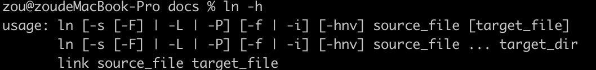
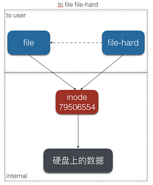
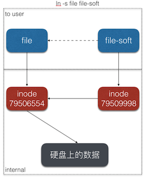
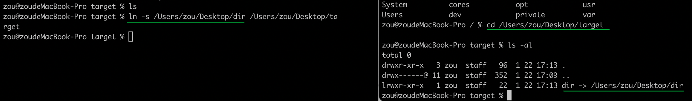
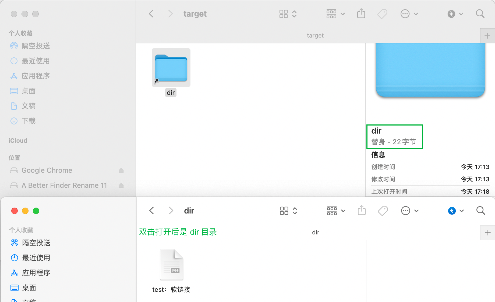
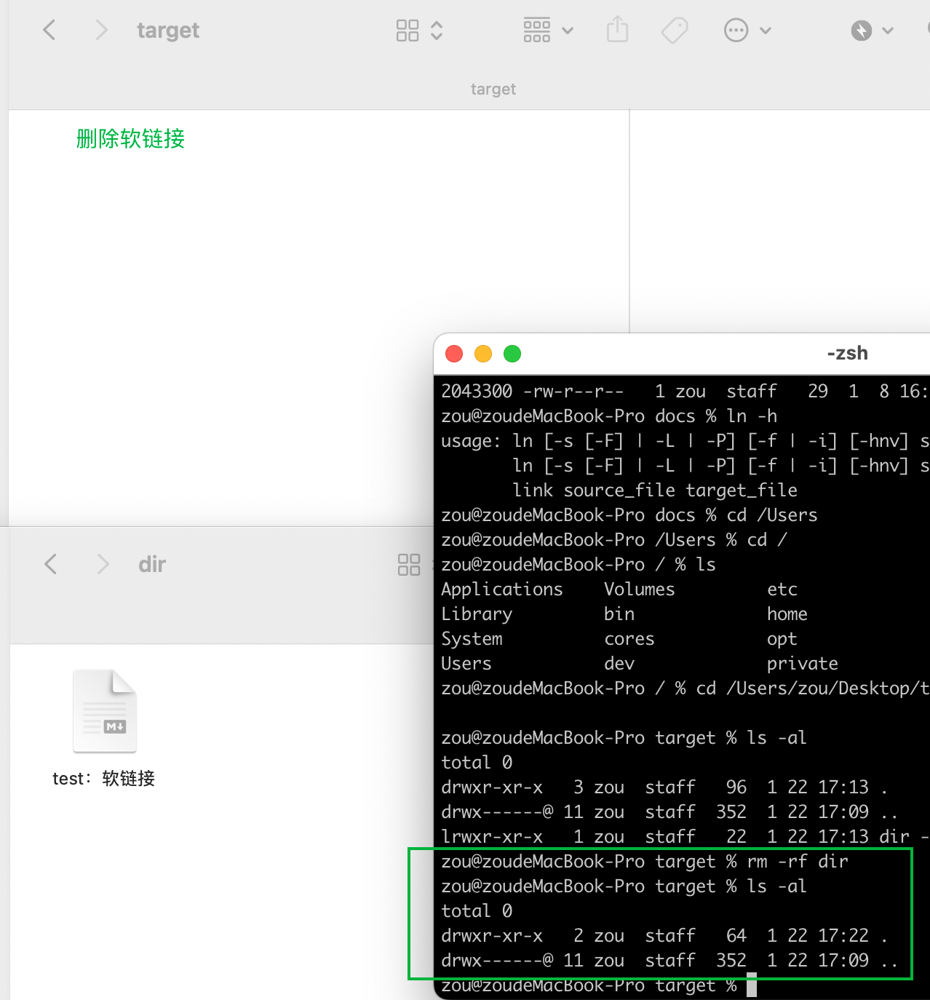
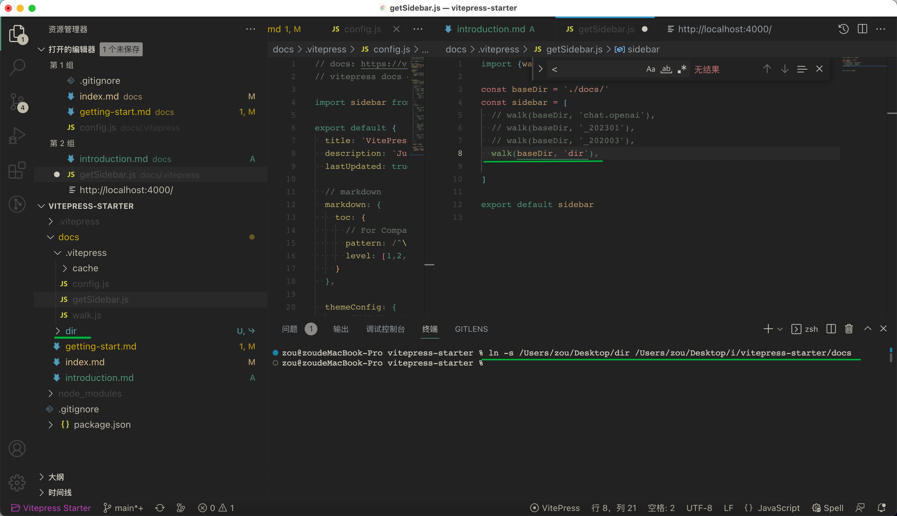
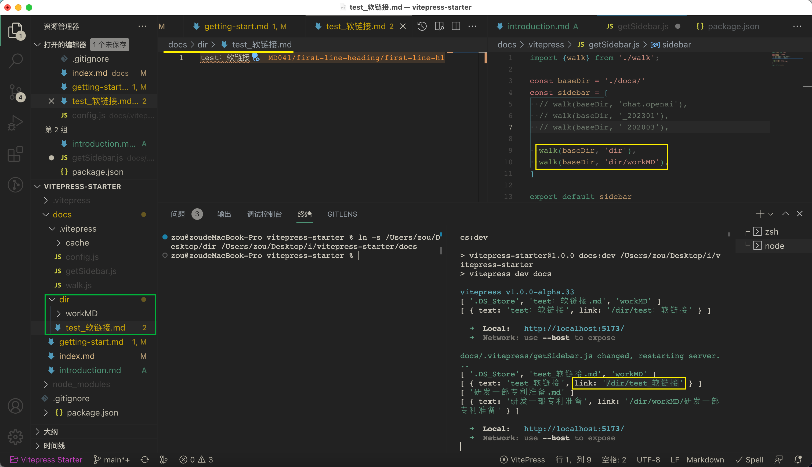

[toc]

### macOS 创建目录的复制(链接）

vitepress docs 不想复制文件，如何把typora创建的文档目录通过软连接的方式导入到docs目录

使用到的命令 `ln`

[Linux ln 命令](https://www.runoob.com/linux/linux-comm-ln.html)

ln（英文全拼：link files）命令是一个非常重要命令，它的功能是为某一个文件在另外一个位置建立一个同步的链接。

当我们需要在不同的目录，用到相同的文件时，我们不需要在每一个需要的目录下都放一个必须相同的文件，我们只要在某个固定的目录，放上该文件，然后在 其它的目录下用ln命令链接（link）它就可以，不必重复的占用磁盘空间。

> # [理解inode](http://www.ruanyifeng.com/blog/2011/12/inode.html)
>
> ### 硬链接
>
> 一般情况下，文件名和inode号码是"一一对应"关系，每个inode号码对应一个文件名。但是，Unix/Linux系统允许，多个文件名指向同一个inode号码。
>
> 这意味着，可以用不同的文件名访问同样的内容；对文件内容进行修改，会影响到所有文件名；但是，删除一个文件名，不影响另一个文件名的访问。这种情况就被称为"硬链接"（hard link）。
>
> 只能给文件建立硬链接，而不能给目录建立硬链接。 —— [#](https://kohpoll.github.io/blog/2016/05/30/hardlink-symlink-require-in-nodejs/)
>
> ### 软链接
>
> 文件A和文件B的inode号码虽然不一样，但是文件A的内容是文件B的路径。读取文件A时，系统会自动将访问者导向文件B。因此，无论打开哪一个文件，最终读取的都是文件B。这时，文件A就称为文件B的"软链接"（soft link）或者"符号链接（symbolic link）。
>
> 这意味着，文件A依赖于文件B而存在，如果删除了文件B，打开文件A就会报错："No such file or directory"。这是软链接与硬链接最大的不同：文件A指向文件B的文件名，而不是文件B的inode号码，文件B的inode"链接数"不会因此发生变化
>
> 
>
> 
>
> 

#### 创建目录的软链接

删除软链接

**测试 vitepress + 软链接**

失败： 正常生产配置数组， 但是浏览器中没有正确关联md文档

> 可能的原因是 vitepress 配置的嵌套sidebar有问题，需要再研究一下
