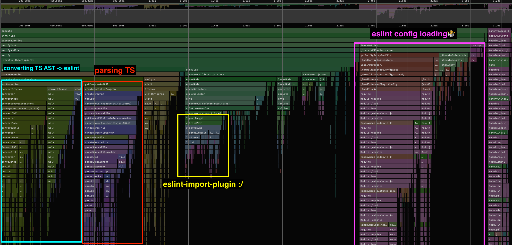

[toc]

### 不建议在 Vite 中将 eslint 作为模块转换管道的一部分运行

https://twitter.com/youyuxi/status/1617332228383735809

> https://twitter.com/marvinhagemeist/status/1616766023235174402
>
> Most of the time is spent on things other than running the actual linting rules.
>
> 
>
> Q: Out of curiosity, how do you generate that flame graph?
>
> A: Node has a built-in `--cpu-prof` flag. That generates a profile in json format that can then be visualized in other tools.

替代品：https://github.com/fi3ework/vite-plugin-checker

A Vite plugin that can run TypeScript, VLS, vue-tsc, ESLint, Stylelint in worker thread.

### discussion: 完全重写ESLint

[Complete rewrite of ESLint](https://github.com/eslint/eslint/discussions/16557)
