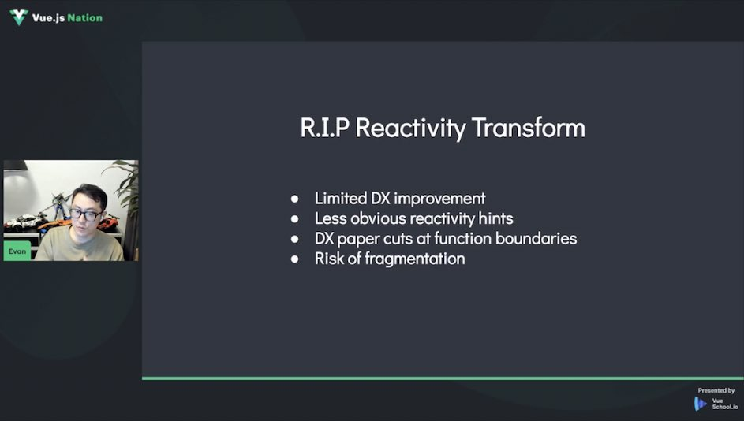

[toc]

### vuejs 2023 nation

[Vue.js Nation 2023 (vuejsnation.com)](https://vuejsnation.com/)

> **世界上最大且唯一的 100% 免费 Vue.js 会议** 
>
> *Nation Conference 国家会议*

RIP: Reactivity Transform (响应式转换)

Day1/17:00开始

### 什么是 Reactive Transform

cn: https://cn.vuejs.org/guide/extras/reactivity-transform.html

en: https://vuejs.org/guide/extras/reactivity-transform.html

中文译为: **响应性语法糖**

> antfu 建议始终使用 ref: [t](https://twitter.com/antfu7/status/1619100680928501762)
>
> use **ref** all the time without mixing with reactive objects.
>
> 

#### VueMacros 保留了复制RT内容到该仓库中

> [t](https://twitter.com/sanxiaozhizi/status/1618346590997184514)
>
> Just copied code from `@vue/reactivity-transform` to Vue Macros. You can use Reactivity Transform on both Vue 2 and Vue 3 now, with Vue Macros. Documentation and some bugs inherited from official version will be resolved tomorrow. 
>
> 刚刚将代码从 `@vue/reactivity-transform` 复制到 Vue 宏。 您现在可以通过 Vue 宏在 Vue 2 和 Vue 3 上使用 Reactivity Transform。 文档和一些继承自正式版的bug明天会解决。
>
> [Reactivity Transform | Vue Macros (sxzz.moe)](https://vue-macros.sxzz.moe/features/reactivity-transform.html)
>
> [code](https://github.com/sxzz/unplugin-vue-macros/blob/main/packages/define-props-refs/src/core/index.ts)

### [broider (maxbittker.github.io)](https://maxbittker.github.io/broider/)

This a tool for making "9-patch" borders.
Draw on the grid above to design your pattern.

### steamDB的作者不投放广告

SteamDB： https://steamdb.info/

我已经运行它 10 多年了，它是一个包含 Steam 游戏、它们的更新、价格历史、图表等等的数据库。

在早期，我们接受金钱捐赠，但几年后停止了。每月运行成本不到100美元。Cloudflare 报告过去 30 天内有 552.2M 个请求，以及 6.09M 个独立访问者。

### Reddit怎么玩?

当豆瓣小组玩啊，去worldnews看新闻，去earthporn看美景，去getmotivated给自己打鸡血，去nosleep看恐怖故事，去askscience看科普，去loseit研究减肥食谱，去relationships看尽鸡毛蒜皮和悲欢离合，去unsentletters流泪，去socialskills提高情商，去showerthoughts会心一笑，去gendercritical看女权，去theredpill看男权，等等……

reddit 常用缩写。如果遇到其他不懂的，[urban dictionary](https://www.zhihu.com/search?q=urban dictionary&search_source=Entity&hybrid_search_source=Entity&hybrid_search_extra={"sourceType"%3A"answer"%2C"sourceId"%3A130167028}) 往往很好用。

AFAIK: as far as I know

AmA: ask me anything

ATM: at [the moment](https://www.zhihu.com/search?q=the moment&search_source=Entity&hybrid_search_source=Entity&hybrid_search_extra={"sourceType"%3A"answer"%2C"sourceId"%3A130167028})

DAE: does anybody else

FTFY: fixed that for you

ELI5: explain like I'm 5

IANAL: I'm not a lawyer

idk: I don't know

lmao: laugh my arse/ass off 

imma: I am going to. 常用于 imma let you finish，用来表达相反意见。（这个 meme 叫 Kanye Interrupts，有兴趣可以查查）

inb4: in before (post)

IIRC: if I remember/recall correctly

irl: in real life

ITT: in this thread

NSFL: not suitable/safe for life

NSFW: not suitable/safe for work

OP: original post/poster

PITA: pain in the ass

SO: significant other. 伴侣/爱人。

SMH: shake/shaking my head

TIFU: today I fucked up

TIL: today I learned

TL;DR: too long/lazy, didn't read 太长不看

/s: sarcasm 表明以上内容为讽刺

### TypeScript 5.0 Beta

https://devblogs.microsoft.com/typescript/announcing-typescript-5-0-beta/

> TypeScript 5.0 Beta is now out to try!  Now with ES decorators, better modes for modules in Node & bundlers, new inference tools for library authors, JSDoc support - and last but not least, some great speed and size improvements!
>
> ES 装饰器、Node 和打包器中更好的模块模式、库作者的新推理工具、JSDoc 支持
>
> 一些速度和大小的改进！

> [t](https://twitter.com/styfle/status/1619058702753071105)
>
> TypeScript 5 beta removed an unused 26.3 MB of JS making it smaller than TypeScript 3
>
> Here's the [PR](https://github.com/microsoft/TypeScript/pull/51387)
>
> **将 命令空间 转为 模块**
>
> TL;DR: The TypeScript compiler is now implemented internally with modules, not namespaces. The compiler is now *10-25% faster*. `tsc` is now *30% faster* to start. Our npm package is now *43% smaller*. More improvements are in the works.
>
> TypeScript 编译器现在在**内部使用模块实现，而不是命名空间**。编译器现在快了10-25%。TSC现在启动快了30%。我们的npm包现在缩小了43%。更多的改进正在进行中。

### sxzz 维护仓库

from: https://github.com/sxzz

Maintaining

- [vuejs/core](https://github.com/vuejs/core) - Vue.js is a progressive, incrementally-adoptable JavaScript framework for building UI on the web.
- [vueuse/vueuse](https://github.com/vueuse/vueuse) - Collection of essential Vue Composition Utilities for Vue 2 and 3.
- [elk-zone/*](https://github.com/elk-zone) - A nimble Mastodon web client.
- [unplugin-vue-components](https://github.com/antfu/unplugin-vue-components) - On-demand components auto importing for Vue.

##### Personal

- [vue-functional-ref](https://github.com/sxzz/vue-functional-ref) - Functional-style refs for Vue.
- [unplugin-vue](https://github.com/sxzz/unplugin-vue) - Transform Vue 3 SFC to JavaScript. Supports Vite, Webpack, Vue CLI, Rollup, esbuild and more.
- [unplugin-vue-macros](https://github.com/sxzz/unplugin-vue-macros) - Extend macros and syntax in Vue.
- [unplugin-jsx-string](https://github.com/sxzz/unplugin-jsx-string) - Converts JSX to HTML strings at compile time.
- [unplugin-ast](https://github.com/sxzz/unplugin-ast) - Manipulate the AST to transform your code.
- [esbuild-plugin-transform](https://github.com/sxzz/esbuild-plugin-transform) - Pipe transformation plugins for esbuild.
- [ast-walker-scope](https://github.com/sxzz/ast-walker-scope) - Traverse Babel AST with scope information.
- [My ESLint config](https://github.com/sxzz/eslint-config) - ESLint config for JavaScript, TypeScript, Vue 2, Vue 3, Prettier. Free to choose and match.
- [Free HLS Live](https://github.com/sxzz/free-hls-live) - Free live streaming with Free-HLS.
