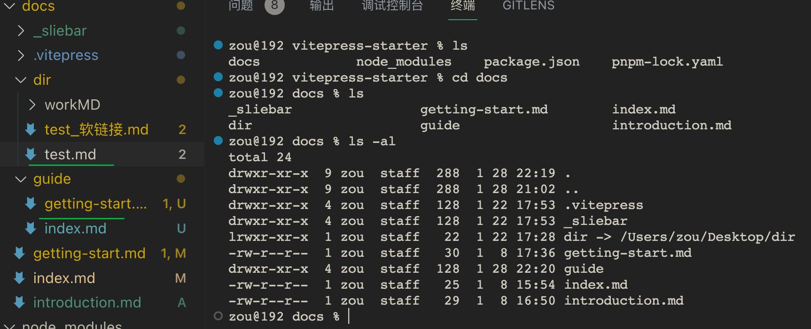
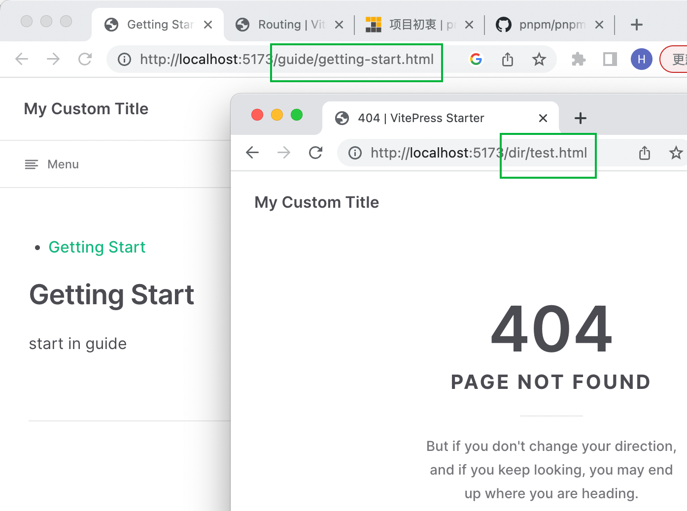

[toc]

### VitePress 新增路由文档

> [commit](https://github.com/vuejs/vitepress/commit/00abac611664e12710e5152d0259390b22c0e8ca)  [routing.md](https://github.com/vuejs/vitepress/commit/00abac611664e12710e5152d0259390b22c0e8ca#diff-211eea052dd9d26cfdf85ab0c2144c8182ee201d58ac0cd28f85c3791cf341c3) Commits on Jan 27, 2023
>
> tag: [v1.0.0-alpha.40](https://github.com/vuejs/vitepress/releases/tag/v1.0.0-alpha.40)

旧 vitepress-starter 使用 `vitepress` 的version: "1.0.0-alpha.33"

是否自然而然地解决我的动态边栏的问题呢？

结果：直接升级`vitepress`不能实现我的需求

> 1. 通过新建文件夹 + 文件，默认就可以通过URL的方式来访问md文件
> 2. 但是通过软链接不能添加到路由中？
> 3. 
> 4. 

提一个discussion: https://github.com/vuejs/vitepress/discussions/1854

> Vitepress 的路由如何能支持软链接
>
> How Vitepress' routing can support Symbolic Link

> 我在docs目录下手动创建的文件目录可以通过URL访问。
> 于此同时，我也在docs目录下创建了一个包含.md文件目录的软链接。通过这种方式没有办法通过URL来访问链接的.md文件。
> 我推断原因是当读取软链接时返回的仅是一个文本字符串，提前返回没有创建链接。
> 是否有人有使用过该方式来创建路由，有没有什么方法可以让vitepress通过URL访问到软链接关联的目录下的文件？
>
> The file directory I created manually in the `docs` directory can be accessed via URL.
> At the same time, I also created a Symbolic Link to a directory containing `.md` files in the `docs` directory. There is no way to access the linked `.md` file via URL in this way.
> I deduce that the reason for this is that when the Symbolic Link is read the return is **only a text string**, returned early and did not create a link.
> Has anyone used that method to create a route, and is there any way to get vitepress to access the files in the directory associated with the Symbolic Link via URL?

### pnpm 更新 npm 包

[pnpm update](https://pnpm.io/zh/next/cli/update)

在不带参数的情况下使用时，将更新所有依赖关系。

#### 摘要：[#](https://pnpm.io/zh/next/cli/update#摘要)

| Command              | Meaning                                                |
| -------------------- | ------------------------------------------------------ |
| `pnpm up`            | 遵循 `package.json` 指定的范围更新所有的依赖项         |
| `pnpm up --latest`   | 更新所有依赖项，此操作会忽略 `package.json` 指定的范围 |
| `pnpm up foo@2`      | 将 `foo` 更新到 v2 上的最新版本                        |
| `pnpm up "@babel/*"` | 更新 `@babel` 范围内的所有依赖项                       |

### 机场测速

打开以下网址自行测速
speedtest：https://www.speedtest.net
Netflix：https://fast.com
Google：https://fiber.google.com/speedtest/
Cloudflare：https://speed.cloudflare.com

### GPT 生成工作邮件

https://email-helper.vercel.app/

### vue 虚拟滚动

https://github.com/Akryum/vue-virtual-scroller

在选择上优于 `import { useVirtualList } from '@vueuse/core'`

antfu 准备弃用这个Api 来支持它的仓库

### vps中的原生节点是指什么

VPS (Virtual Private Server) 中的原生节点指的是虚拟服务器运行的**物理主机**。这些物理主机是真实存在的硬件服务器，上面运行着虚拟机管理软件，如 VMware、Xen 或 KVM，用于在其上创建和管理虚拟机。原生节点是虚拟机的基础，提供了硬件资源供虚拟机使用。

### antfu 开源文档

本月我的开源项目文档的带宽使用量达到 1TB！

月浏览量

VueUse      395K 

**Vitest**        1,511K 

Vitest CN   104K 

Icônes          115K 

UnoCSS        36K 

Vite PWA    298K  [github](https://github.com/vite-pwa/vite-plugin-pwa) : Zero-config PWA Framework-agnostic Plugin for Vite

Handle         275K  (汉兜游戏: https://handle.antfu.me/)

My blog         86K

### 依赖版本升级&changelog

[t](https://twitter.com/JoshuaKGoldberg/status/1603076531693449216)

semantic-releases 不支持 pre-1.0 packages 

有没有人有一个替代项目可以根据常规提交生成变更日志、升级版本并发布到 npm？

> antfu: I use bumpp + changelogithub
>
> daniel: I often use [release-it](https://github.com/release-it/release-it).

### 如何调用 vite 提供的API

vitepress 仅是一个 vite 的插件;

[vitepress/src/node/server.ts](https://github.com/vuejs/vitepress/blob/main/src/node/server.ts#L2)

创建了一个 viteServer & 传入了一个 plugins 参数.

### Vue 服务端渲染 (SSR)

docs:https://cn.vuejs.org/guide/scaling-up/ssr.html

### iScene-next 内 vitepress 是不错的案例

###  
