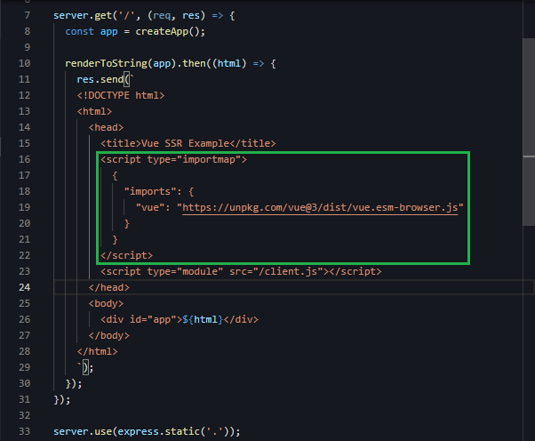
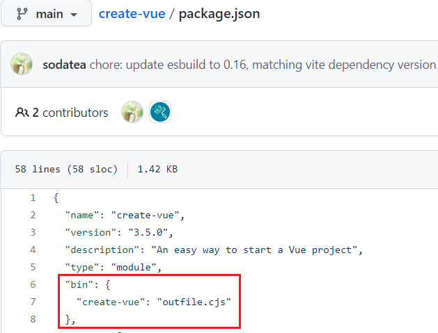
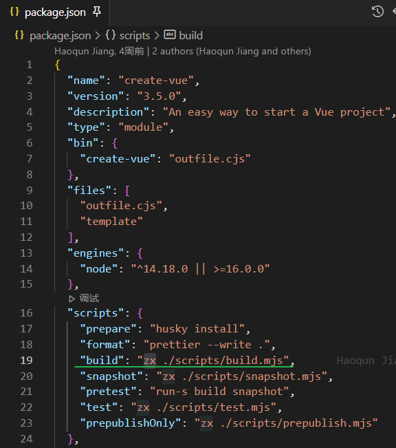
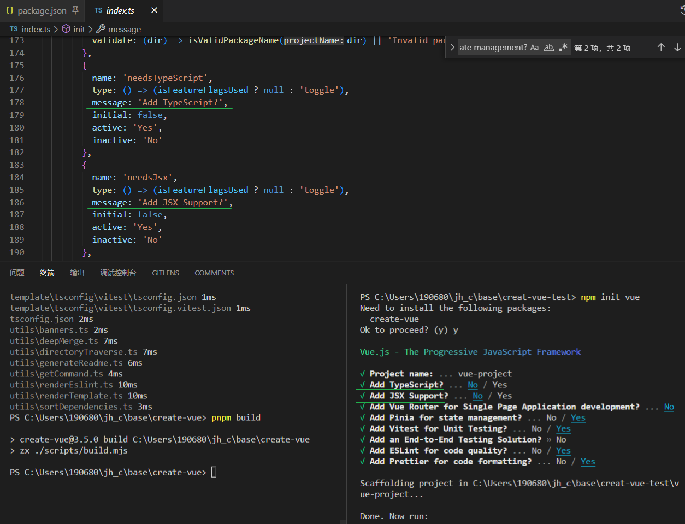
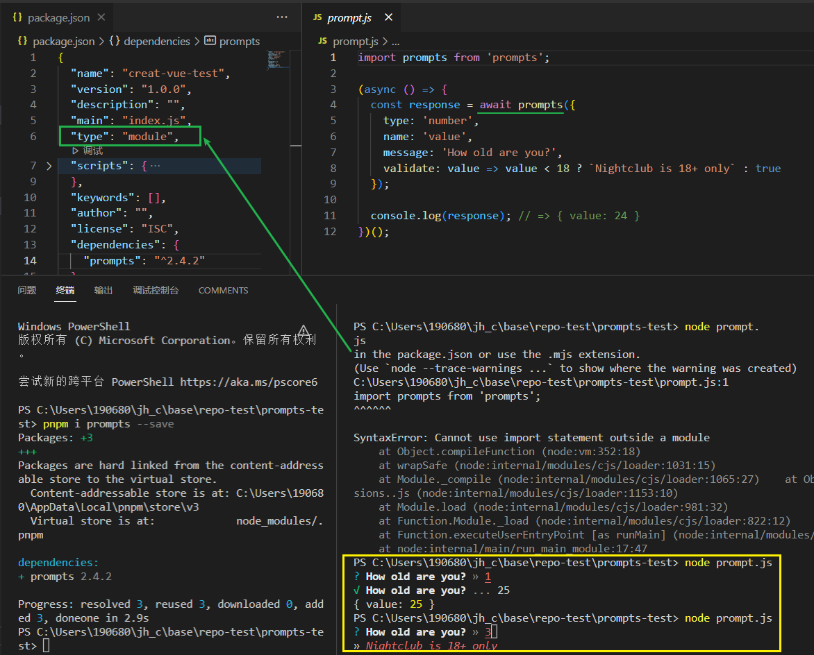
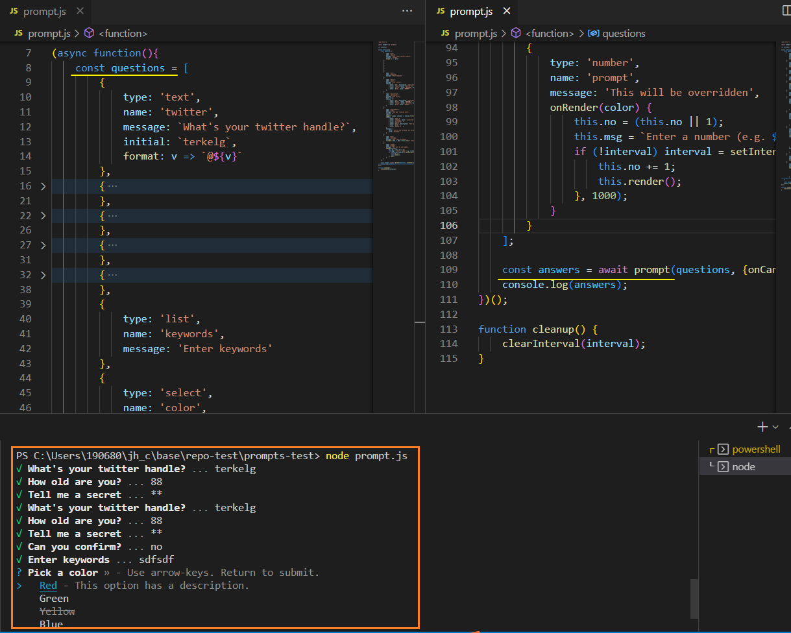

[toc]

### Import maps

`<script type="importmap">`

规范: https://html.spec.whatwg.org/multipage/webappapis.html#import-maps

[在浏览器中通过 importmap 使用 ES 模块](https://beginor.github.io/2021/08/16/using-es-modules-in-borwser-with-importmaps.html)

[mdn](https://developer.mozilla.org/en-US/docs/Web/HTML/Element/script/type/importmap)

[*how to control the behavior of JavaScript imports*](https://github.com/WICG/import-maps#the-import-map)

在 Node.js 环境下， 可以这样导入全局模块：

```typescript
import * as _loadash from 'loadash';
```

Node.js 会自动从 `node_modules` 目录中去加载对应的模块， 但是浏览器默认不会这样做，因为不知道从哪里加载全局模块。

`import-maps` 就是为了解决浏览器中的全局模块而出现的 (兼容性不一定很好)

`import-maps` 使用 Json 的形式来定义浏览器中的全局模块：

```xml
<script type="importmap">
{
  "imports": {
    "loadash": "/libs/loadash/index.js",
    "jquery": "/libs/jquery/index.js",
    "three": "/libs/three.js/three.js",
    "three/examples/": "/libs/three.js/examples/"
  }
}
</script>
```

全局 ES 模块的定义分两种形式：

- 通过别名指定模块的地址， 适用于只有一个 js 文件的模块；
- 通过路径指定模块的目录，适用于多个js文件组成的模块；

有了上面的 `importmap` 定义， 可以在浏览器环境中这样使用全局模块：

```typescript
import * as _loadash from 'loadash'; // 自动加载 /libs/loadash/index.js
import $ from 'jquery'; // 自动加载 /libs/jquery/index.js
import { Scene, WebGLRenderer } from 'three'; // 自动加载 /libs/three.js/three.js
import { CinematicCamera } from 'three/examples/jsm/cameras/CinematicCamera.js' // 自动加载 /libs/three.js/examples/jsm/cameras/CinematicCamera.js
```




### [awesome-vite](https://github.com/vitejs/awesome-vite#plugins)

A curated list of awesome things related to [Vite.js](https://github.com/vitejs/vite)

vite插件 (与框架无关) :  [#](https://github.com/vitejs/awesome-vite#framework-agnostic-plugins)


### 飞客 信用卡

[信用卡社区-飞客网 (flyert.com)](https://www.flyert.com/forum.php?gid=226)

[想办张信用卡 - V2EX](https://www.v2ex.com/t/911584#reply3)

去飞客逛逛吧, 要先确定办卡的目的, 比如
加油优惠, 低于多少折扣
积分换里程
商超吃饭优惠
等等, 没有卡是包含所有的, 只能先确定需求再办


网上有相关的总结文章，关注一下年费和权益就知道哪张适合了
https://mp.weixin.qq.com/s/pu-k8VuiQKF5FiLOb26I5Q
https://mp.weixin.qq.com/s/n7nVu848MC82fS-e5XLGBA


### 项目脚手架

要使用 Vite 来创建一个 Vue 项目，非常简单：

```sh
$ npm init vue@latest
```

这个命令会安装和执行 [create-vue](https://github.com/vuejs/create-vue)，它是 Vue 提供的官方脚手架工具。

为什么呢?



> `npm init foo` -> `npm exec create-foo`
>
> `npm init foo@latest` # fetches and runs the latest `create-foo` from the registry


create-vue repo



```js
// scripts/build.mjs
import * as esbuild from 'esbuild'

await esbuild.build({
  bundle: true,
  entryPoints: ['index.ts'], // 源入口
  outfile: 'outfile.cjs',
  format: 'cjs',
  platform: 'node',
  target: 'node14',

  plugins: [...]
})
```

通过Message搜索到源码部分




### npm init 命令 [#](https://docs.npmjs.com/cli/v9/commands/npm-init)

最简单的用法: Create a package.json file

如果省略了 initializer （直接调用npm init），init会退回到传统的init行为。

它将问你一堆问题，然后为你写一个package.json。

```sh
npm init <package-spec> (same as `npx <package-spec>`)
npm init <@scope> (same as `npx <@scope>/create`)

aliases: create, innit
```

`npm init <initializer>`可以用来设置一个新的或现有的npm包。

在这种情况下，initializer是一个名为`create-<initializer>`的npm包，它将被[`npm-exec`](https://docs.npmjs.com/cli/v9/commands/npm-exec)安装，然后执行其 **main bin** --大概是创建或更新package.json并运行任何其他初始化相关的操作。

init命令被转换为相应的npm exec操作，如下所示。

- `npm init foo` -> `npm exec create-foo`
- `npm init @usr/foo` -> `npm exec @usr/create-foo`
- `npm init @usr` -> `npm exec @usr/create`
- `npm init @usr@2.0.0` -> `npm exec @usr/create@2.0.0`
- `npm init @usr/foo@2.0.0` -> `npm exec @usr/create-foo@2.0.0`

注意：如果用户已经全局安装了`create-<initializer>`包，那将是npm init使用的。如果你希望npm使用最新的版本，或者其他特定的版本，你必须指定它。

- `npm init foo@latest` # fetches and runs the latest `create-foo` from the registry
- `npm init foo@1.2.3` # runs `create-foo@1.2.3` specifically


### zx

[github](https://github.com/google/zx)  ~ [doc](https://github.com/google/zx#documentation)

Bash很好，但当涉及到**编写更复杂的脚本**时，许多人更喜欢更方便的编程语言。

JavaScript是一个完美的选择，但Node.js的标准库在使用前需要额外的麻烦。

zx包为child_process提供了有用的封装，对参数进行转义并给出合理的默认值。


### prompts

[terkelg/prompts: ❯ Lightweight, beautiful and user-friendly interactive prompts (github.com)](https://github.com/terkelg/prompts)

**Lightweight, beautiful and user-friendly interactive prompts**
\>_ Easy to use CLI prompts to enquire users for information▌


- **Simple**: prompts has [no big dependencies](http://npm.anvaka.com/#/view/2d/prompts) nor is it broken into a [dozen](http://npm.anvaka.com/#/view/2d/inquirer) tiny modules that only work well together.
- **User friendly**: prompt uses layout and colors to create beautiful cli interfaces.
- **Promised**: uses promises and `async`/`await`. No callback hell.
- **Flexible**: all prompts are independent and can be used on their own.
- **Testable**: provides a way to submit answers programmatically.
- **Unified**: consistent experience across all [prompts](https://github.com/terkelg/prompts#-types).

> 轻便、漂亮和用户友好的互动提示
>
> \>_ 易于使用的CLI提示来询问用户的信息▌
>
> 简单：prompt没有大的依赖关系，也没有分成一打的小模块，只在一起很好地工作。
> 用户友好：提示使用布局和颜色来创建漂亮的cli界面。 **(hhh 这里炫了一把技, 依赖少)**
> 许诺：使用许诺和async/await。没有回调地狱。
> 灵活：所有的提示都是独立的，可以单独使用。
> 可测试：提供了一种以编程方式提交答案的方法。
> 统一：所有提示的体验一致。


hhh interesting.. 更多使用方式请看仓库文档



repo ~ [exmaple.js](https://github.com/terkelg/prompts/blob/master/example.js)




### [Visualization of npm dependencies (anvaka.com)](http://npm.anvaka.com/#/view/2d/prompts)

npm 依赖可视化 (2d/3d)

源码[repo](https://github.com/anvaka/npmgraph.an)


### vanilla.js is a Joke

就是不使用 framework


### github pages

https://pages.github.com/

Websites for you and your projects.

Hosted directly from your [GitHub repository](https://github.com/). Just edit, push, and your changes are live.

> known from [npmgraph](https://github.com/anvaka/npmgraph.an)
>
> #### How it's done?
>
> [angular.js](https://angularjs.org/) + [browserify](https://browserify.org/) + [ngraph](https://github.com/anvaka/ngraph) => [gulp](https://gulpjs.com/) => https://npm.anvaka.com/
>
> The website is entirely hosted on [GitHub Pages](https://pages.github.com/).
>
> The npm data is coming from `registry.npmjs.cf` and is collected by [npmgraphbuilder](https://github.com/anvaka/npmgraphbuilder) at real time.
