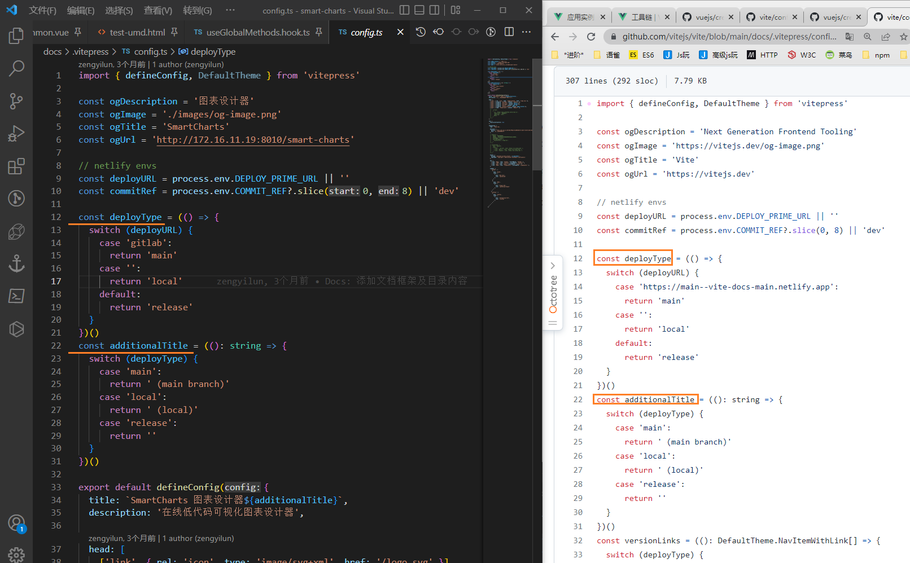

[toc]


### vitepress config

https://vitepress.vuejs.org/guide/configuration

Introduction： https://vitepress.vuejs.org/config/introduction

App config：https://vitepress.vuejs.org/config/app-configs

更改pages目录

默认 `VitePress dev` => 以根目录作为服务器

更改： `vitepress dev docs` => 更改为 docs

> 1. `vitepress dev docs` 命令行参数应该会优于 `config.js` 中的 srcDir
> 2. `vitepress dev`  + `config.js ~ srcDir` => 
>
> 首页默认404，文档URL需要通过固定的目录？URL 是怎样的呢？
>
> 执行1时没有带上这个 目录 前缀
>
> 

但是新增的 `srcDir` 配置, 听说可以在 package 中执行 vitepress 可以不用带路径参数了. 

但是我没有正确测试出来。


### typora markdownlint

插件格式化 + 配置 

[markdownlint/.markdownlint.json at v0.27.0 · DavidAnson/markdownlint (github.com)](https://github.com/DavidAnson/markdownlint/blob/v0.27.0/.markdownlint.json)

插件市场: [markdownlint - Visual Studio Marketplace](https://marketplace.visualstudio.com/items?itemName=DavidAnson.vscode-markdownlint)

#### Workspace

To lint all Markdown files in the current workspace, run the `markdownlint.lintWorkspace` command (from the Command Palette or by binding it to a keyboard shortcut). This will use [`markdownlint-cli2`](https://github.com/DavidAnson/markdownlint-cli2), the same engine that powers the extension, to lint all files and output the results to a new terminal in the "Terminal" panel. Results will also appear in the "Problems" panel (`Ctrl+Shift+M`/`Ctrl+Shift+M`/`⇧⌘M`) because of the [problem matcher](https://code.visualstudio.com/docs/editor/tasks#_defining-a-problem-matcher) included with the extension. Entries in the "Problems" panel can be clicked to open the corresponding file in the editor. To customize the files that are included/excluded when linting a workspace, configure the `markdownlint.lintWorkspaceGlobs` setting (see below) at workspace or user scope.

> 要对当前工作区的所有Markdown文件进行检查，请运行markdownlint.lintWorkspace命令（从命令调色板或通过绑定键盘快捷键）。

仅检测? 我希望可以达到 `fix` 的目的


#### configure

`.markdownlint.json`

```json
{
    "MD001": false, // heading-increment/header-increment - Heading levels should only increment by one level at a time
    "MD013": false, // line-length - Line length
    "MD041": false, // first-line-heading/first-line-h1 - First line in file should be a top level heading
}
```


问题是我配置了但是对 workspace lint 的时候依旧对配置禁用的格式提出了警告..

lint 完工作区间大概有 22k+ 的警告, 直接忽略了.


### smart-charts 中的 vitepress 直接复制 vite的docs




### typora 支持图表

支持[flowchart.js](http://flowchart.js.org/), [sequence](https://bramp.github.io/js-sequence-diagrams/), [Mermaid](https://mermaid.js.org/intro/) (mermaid：美人鱼)

以上图表都可以在github上收到源码

*[mermaid~github](https://github.com/mermaid-js/mermaid/blob/develop/README.zh-CN.md) star数50k+ 值得关注, 文档中提及了多种类型

**Mermaid 允许您使用文本和代码创建图表和可视化。**

它是一种基于 JavaScript 的绘图和制图工具，可呈现受 Markdown 启发的文本定义以动态创建和修改图表。

🏆 **Mermaid 被提名并获得了 [JS Open Source Awards (2019)](https://osawards.com/javascript/2019) 的 "The most exciting use of technology" 奖项!!!**


1. ```sequence
   Alice->Bob: Hello Bob, how are you? 
   Note right of Bob: Bob thinks 
   Bob-->Alice: I am good thanks!
   ```

2. ```flow
   st=>start: Start:>http://www.google.com[blank]
   e=>end:>http://www.google.com
   op1=>operation: My Operation
   sub1=>subroutine: My Subroutine
   cond=>condition: Yes
   or No?:>http://www.google.com
   io=>inputoutput: catch something...
   para=>parallel: parallel tasks
   
   st->op1->cond
   cond(yes)->io->e
   cond(no)->para
   para(path1, bottom)->sub1(right)->op1
   para(path2, top)->op1
   ```

3. ```mermaid
   graph TD
       A[Christmas] -->|Get money| B(Go shopping)
       B --> C{Let me think}
       C -->|One| D[Laptop]
       C -->|Two| E[iPhone]
       C -->|Three| F[fa:fa-car Car]
   ```

   [mermaid demo](https://mermaid.live/edit#pako:eNpVkE1qw0AMha8itGohvoAXgcZus0lJodl5shAeOTOk88NYpgTbd-_YptBqJfS-J6Q3Yhs0Y4m3RNHApVYecr00lUm2F0f9FYpiPx1ZwAXPjwkOT8cAvQkxWn973vjDAkE1nhaMQYz193mTqtV_9jxB3ZwoSojXv8rlO0zw2tgPk9f_V0zi7HprOio7KlpKUFFaEdyh4-TI6nz6uEwUimHHCsvcau5o-BKFys8ZpUHC58O3WEoaeIdD1CRcW8pPu98hayshvW9prKHMPxz_W4g)


### typora ==主题==


https://theme.typoraio.cn/


### 企业同时裁员并招聘

一边裁人一边招人实质上是 ZF 要求的。各地都对大企业每年提供就业岗位有要求，特别是对应届毕业生的招聘，有硬指标的

因为年轻人有激情有梦想，还没挨过现实的铁拳，大量年轻人无业会自发形成某些组织，对统治秩序产生冲击，具体可以参考 70 年代后期到 80 年代严打前那段知青返城的日子

所以 ZF 非常看重应届毕业生的就业率，会给大企业摊派吸纳就业任务，所以企业要招人，刻企业再大，容量也有限，要招就要裁，裁的就是有一定年龄的

像 35 岁那种，大部分都有家室了，没家室的大多也挨过铁拳了，失业了也不会怎么样，顶多偶尔有几个独狼式报复社会，很少有合伙搞事情的


<hr />
=== "tab_1"

    Content of tab_1  
    

=== "tab_2"

    Content of tab_2  
    


~~~py
## Tabs 

```curl
$ curl -O wget http://example.com/pk.zip
```

```wget
$ wget http://example.com/pk.zip
```

## Single block

```
$ ls -lisa
```
~~~


### 保存网页到本地

[如何优雅的保存网页到本地，就算原网页失效了，依然不影响我查看这个网页 - V2EX](https://www.v2ex.com/t/796366)


### 简悦

浏览器[插件](https://chrome.google.com/webstore/detail/simpread-reader-view/ijllcpnolfcooahcekpamkbidhejabll/related?hl=en), 阅读 + 动作


> 虽然我也在用简悦，但是真不建议用，产品逻辑太混乱。目前转战 cubox
>
> 简悦付费用户主要是导出到 notion ，但是经常遇到兼容性问题，目前转到 cubox 
>
> cubox +1 挺好用的。
>
> 推荐 cubox ，看到好文章先用插件点个收藏，至于会不会细看日后随缘


### cubox  [#](https://help.cubox.pro/hi/5bca/)

Cubox 是一站式信息收集和管理服务，是你的个人阅读、学习和研究好帮手。

我们习惯在笔记中收集文章资料，却常常再也没有阅读过，也懒得整理。笔记作为强大的写作与编辑工具，在阅读和碎片信息管理方面有诸多不便，无法在「输入端」真正发挥信息的价值。

Cubox 则专为「阅读管理」而设计，旨在让每个人都能轻松地从日常碎片信息中汲取养分：通过收集、阅读标注、回顾来构建知识库，通过自动解析、智能分类、卡片式组织来轻松整理，无需丰富的写作或知识管理经验。

#### 剪藏网页片段

通过剪藏片段的方式，只收藏你所需要的部分内容，而非整个网页。


插件:  [Cubox - Chrome 应用商店 (google.com)](https://chrome.google.com/webstore/detail/cubox/bflmgpechpeohjfomgfdkkfcbhfcjohl)

一键收藏网页和片段供稍后阅读、标注、搜索

快速**收藏**你正在浏览的**网页**、网页片段、链接，方便日后随时使用。

你可以轻松将所需内容**保存**到 Cubox，并可在您使用的所有平台**同步**，包括网页、iPhone、iPad、Mac、Android。

您还可以记录详细的网站信息，并利用收藏夹、标签等方式，快速将书签分类，方便日后查找。你可以设置自己的分类规则，让 Cubox 每次为你自动分类所有收藏，无需繁琐地手动整理。

高效收集

- 一键保存当前浏览的网页
- 通过拖拽剪藏网页片段
- 自动根据网页内容，建议相关标签
- 自动填充网站标题、描述、封面图
- 手动更新已收藏网站的信息，包括标题、描述、位置、标签、封面图
- 自动检测当前网页是否已收藏，可以随时更新信息，执行归档或删除等操作
- 收藏的图片可以自动解析文本，识别物体，方便搜索

> 可以用来收藏网页的片段 (并收藏该页面原地址)

> 98 一年 . 一般有节日搞活动时是 68 一年。 找人用 edu 给官方代发一个邮件49 充了一年
> 需要的话可以试试 下载或注册 Cubox 输入推荐码 vj2xjd 领取 7 天会员
> 从即日起（2023 年 1 月 19 日）暂停教育优惠的申请，后续重新放开时间待定。

在 2023 年 2 月 6 日前，仅需 88 元即可购买年度会员礼品卡，支持重复购买，方便你赠送给多个好友。

通过礼品卡升级为年度会员后，可以继续领取 3 个月礼品卡(再次回到礼品卡购买页面选择3个月领取)，也就是 88 元获得 15 个月会员，优惠折上折。 https://cubox.pro/gift/purchase/


### SingleFile [#](https://github.com/gildas-lormeau/SingleFile)

SingleFile is a Web Extension (and a CLI tool) compatible with Chrome, Firefox (Desktop and Mobile), Microsoft Edge, Safari, Vivaldi, Brave, Waterfox, Yandex browser, and Opera. 

It helps you to save a complete web page into a single HTML file.

> 复制一个网页并保留相关的静态资源到本地的html文件中
>
> 优雅的保存网页到本地, 可以先F12将没用的元素删掉后再使用插件

插件地址:Chrome: https://chrome.google.com/extensions/detail/mpiodijhokgodhhofbcjdecpffjipkle


### [Obsidian](https://obsidian.md/)

> Obsidian [黑曜石] is a powerful and extensible knowledge base
> that works on top of your local folder of plain text files.
>
> 黑曜石是一个强大的、可扩展的知识库。
> 它可以在你的纯文本文件的本地文件夹上工作。

tag: 图谱关系 

> 一切皆有关联
> 人类的大脑是非线性的：我们从一个想法跳到另一个想法，一直如此。你的第二大脑也应该这样工作。
>
> 在黑曜石中，建立和跟踪联系是无障碍的。像园丁一样照顾你的笔记；在一天结束的时候，你可以坐下来，对自己的知识图谱感到惊叹。


