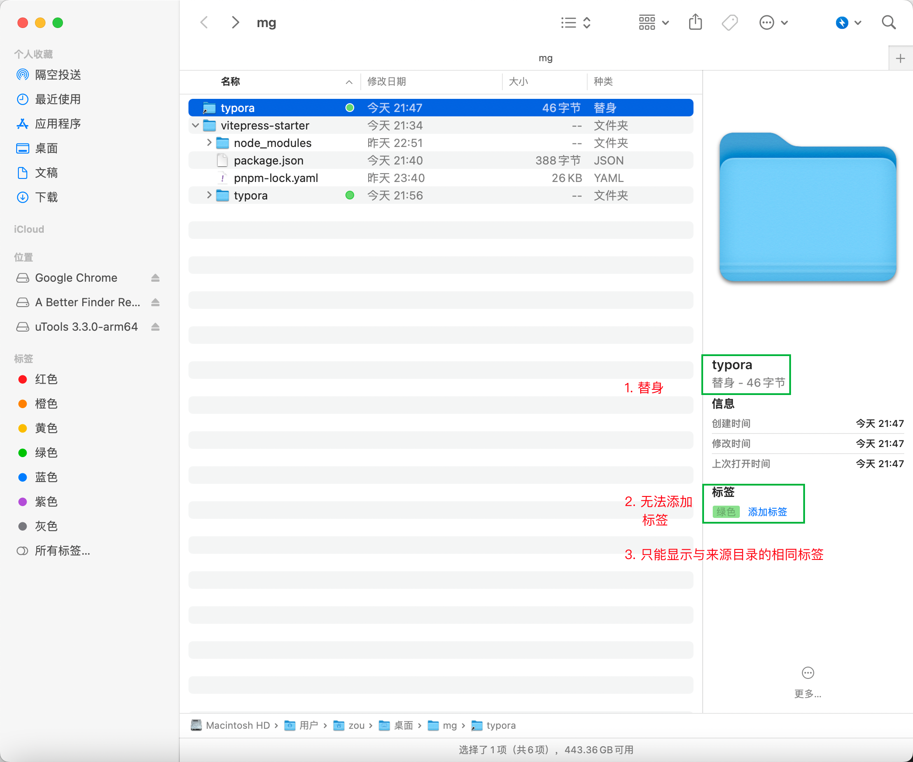

[toc]

### typora 路径迁移

typora 作为 vitepress 的子目录，
typora 软链接到另外的目录

```bash
zou@192 mg % ln -s /Users/zou/Desktop/mg/vitepress-starter/typora /Users/zou/Desktop/mg/typora          
```



**vitepress sidebar 动态更新 & 报错md检查** 


### Go-view 文档

[GoView 说明文档 | 低代码数据可视化开发平台 (mtruning.club)](https://www.mtruning.club/)

[Vue 大屏模板](https://www.mtruning.club/guide/screenTemplate/vueScreenTemplate.html)


### 公积金提取


### 灵活版权

[主页 | 小雅的分类 Alist (xiaoya.pro)](http://alist.xiaoya.pro/)

[爱看电影网_超清影院 - 真正永久免费的超清蓝光电影剧集动漫综艺网站 (ikandy.fun)](https://www.ikandy.fun/)


### 电驴

[日常通勤小电驴要怎么选? - V2EX](https://www.v2ex.com/t/912130#reply46)


### 阿里云盘 高级版使用

> [阿里云盘为啥火了？ - V2EX](https://www.v2ex.com/t/912163#reply22)
>
> 因为 **Alist** 的出现，使得阿里云盘的使用场景大大增加了。而且阿里云盘不限速，可以 **webdav** 到电视端在线观看无需下载，所以最近挺火的。
> 我目前就在用 alist 挂载阿里云盘，webdav([alist内的设置](https://alist.nn.ci/zh/guide/drivers/common.html#webdav-%E7%AD%96%E7%95%A5)) 到 **infuse** 上观看，使用体验相当完美，90 多 G 的阿凡达原盘，无卡顿，声音画面质量很棒。家里是 400M 的宽带。
>
> [infuse+alist+网盘，不用 NAS 打造影音库教程](https://www.bilibili.com/video/BV1dA411D73y/?spm_id_from=333.337.search-card.all.click)
>
> [Alist本地挂载硬盘傻瓜式教程 - 知乎 (zhihu.com)](https://zhuanlan.zhihu.com/p/572827191)

#### [Home | AList文档 (nn.ci)](https://alist.nn.ci/zh/)


### typora 更改自定义快捷键

切换到英语版, 找到操作的==英文名==, 更改`user.json`, 重启


### Code diffs

https://vitepress.vuejs.org/guide/markdown#colored-diffs-in-code-blocks

Adding the `// [!code --]` or `// [!code ++]` comments on a line will create a diff of that line, while keeping the colors of the codeblock.


### Code Tabs

https://vitepress.vuejs.org/guide/markdown#code-groups


### @types

使用 `@types` 统一管理**第三方库的声明文件**。

`@types` 的使用方式很简单，直接用 npm 安装对应的声明模块即可，以 jQuery 举例：

```bash
npm install @types/jquery --save-dev
```

可以在[这个页面](https://microsoft.github.io/TypeSearch/)搜索你需要的声明文件。

[npm displays packages with bundled TypeScript declarations | GitHub Changelog](https://github.blog/changelog/2020-12-16-npm-displays-packages-with-bundled-typescript-declarations/)


### 阿里云认证 专项扣除

[Apsara Clouder云计算专项技能认证：云服务器ECS入门 (aliyun.com)](https://edu.aliyun.com/certification/cldc15)
