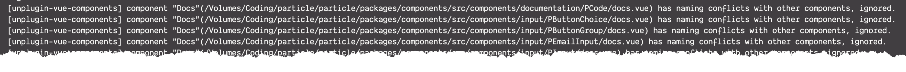
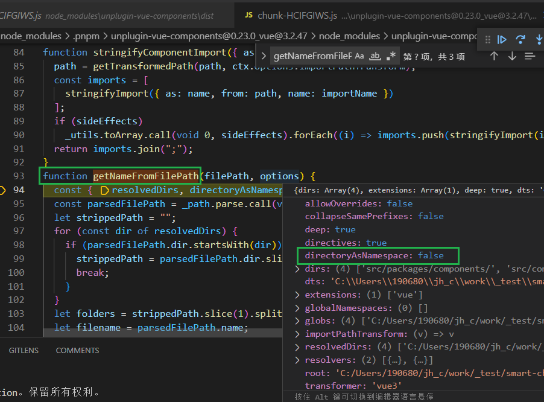
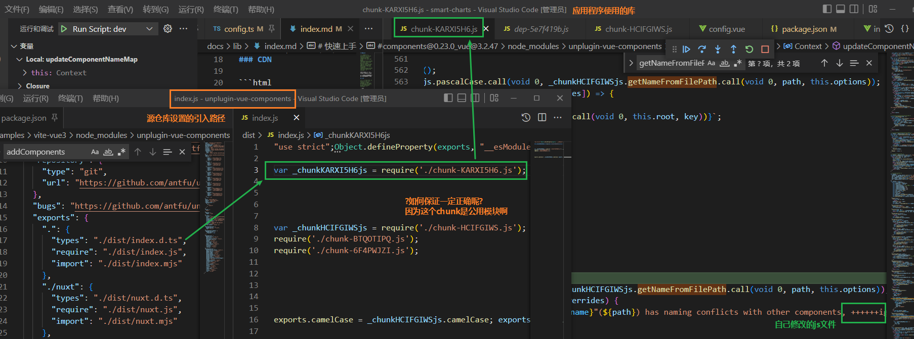
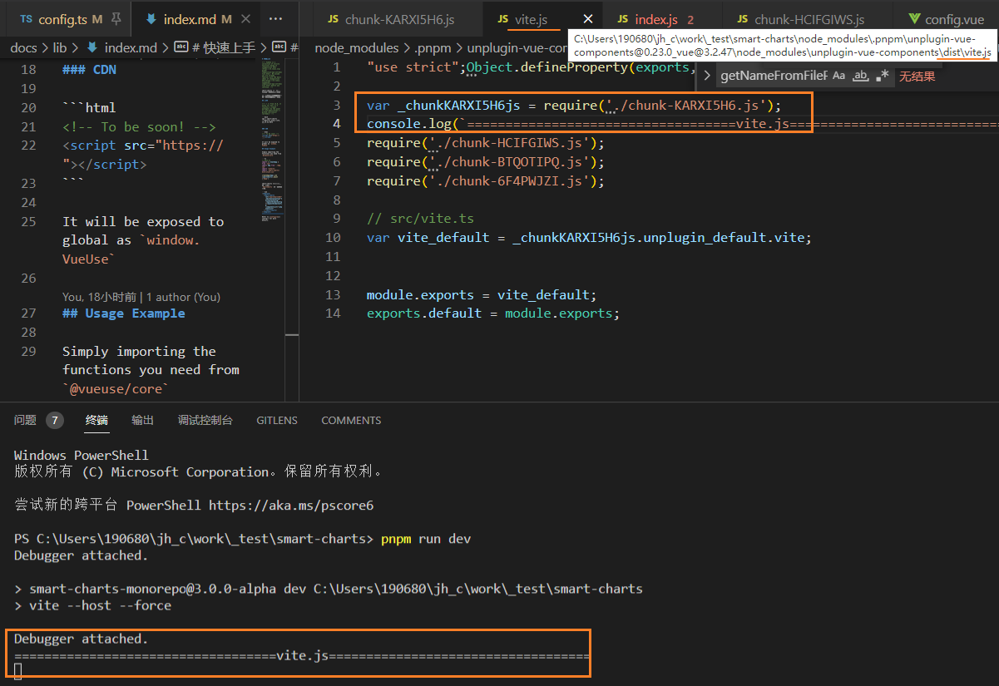

[toc]

### kodi

看电视在手机上安装了 kodi


### 刷机

红米那些搭载高通 SoC 的手机都可以，便宜的同时还能刷机。解锁 BL 和刷机不会失去保修。
可以用 https://xiaomi.eu/ ，虽然本地化没了，但其实比起 iPhone 这样的只是少了农历和节假日信息，可以用第三方日历代替。


### [nrm](https://www.npmjs.com/package/nrm)

NPM registry manager

`nrm` can help you easy and fast switch between different npm registries, now include: `npm`, `cnpm`, `taobao`, `nj(nodejitsu)`.

`nrm ls` 

`nrm use`

`nrm add`


### Vitepress sidebar (multiple)

单 (所有文档都会公用的边栏)

```ts
export default {
  themeConfig: {
    sidebar: [
      {
        text: 'Guide',
        items: [
          { text: 'Introduction', link: '/introduction' },
          { text: 'Getting Started', link: '/getting-started' },
          { text: 'Introduction', link: '/guide/' }   // This shows `/guide/index.md` page.
          ...
        ]
      }
    ]
  }
}
```

边栏菜单的最简单形式是传入一个链接数组。

第一层项目定义了侧边栏的 "section"。它应该包含`text`，这是该部分的标题，以及作为实际导航链接的`items`。

每个链接应指定实际文件的路径，以`/`开头。

如果你在链接的末尾添加尾部斜线，它将显示相应目录的index.md。


items 也可以**嵌套**


#### Multiple Sidebars

可以根据页面路径来显示不同的侧边栏。

To do so, first **organize** your **pages** into **directories** for each desired section:

将你的**pages**组织成每个需要的**部分**的**目录**。

```
.
├─ guide/
│  ├─ index.md
│  ├─ one.md
│  └─ two.md
└─ config/
   ├─ index.md
   ├─ three.md
   └─ four.md
```

Then, update your **configuration to define your sidebar for each section.** 

This time, you should pass an object instead of an array.

```ts
export default {
  themeConfig: {
    sidebar: {
      // This sidebar gets displayed when a user
      // is on `guide` directory.
      '/guide/': [
        {
          text: 'Guide',
          items: [
            { text: 'Index', link: '/guide/' },
            { text: 'One', link: '/guide/one' },
            { text: 'Two', link: '/guide/two' }
          ]
        }
      ],

      // This sidebar gets displayed when a user
      // is on `config` directory.
      '/config/': [
        {
          text: 'Config',
          items: [
            { text: 'Index', link: '/config/' },
            { text: 'Three', link: '/config/three' },
            { text: 'Four', link: '/config/four' }
          ]
        }
      ]
    }
  }
}
```

**注意link中的url需要带上目录前缀**


### vitepress enhanceApp

组件要在文档的多个页面中使用，它们可以在主题中全局注册

在.vitepress/theme/index.js中，enhanceApp函数接收Vue应用实例，因此你可以像在普通Vue应用中那样注册组件。


### 美国外交七大定律 

1. **永远不要相信美国说了什么** 
2. **如果美国怀疑你做了什么坏事，那它自己肯定做过**
3. **如果你有好的资源，美国必然虎视眈眈，不攫取入囊中不罢休**
4. **如果你做得比美国好，那你肯定难逃一劫** 
5. **如果美国开始污蔑抹黑你，那它的黑手正向你伸来**
6. **当美国对你好，一定有所图**
7. **当美国称你为“盟友”，就是要当你的老大**


### 如何购买港股

下载你要选择的开户券商的APP，只需本人身份证和注册信息，按照提示一步步填写资料即可，无需现场办理。

对于港股新手来说推荐此种方式办理开户。

比较知名的互联网券商，比如[富途证券](https://www.zhihu.com/search?q=富途证券&search_source=Entity&hybrid_search_source=Entity&hybrid_search_extra={"sourceType"%3A"answer"%2C"sourceId"%3A2010876055})、老虎证券这类APP，开户方式都是大同小异的，拿富途证券举例，你准备好开户资料后，按富途牛牛APP指引完成以下操作：在线注册 —> 填写资料 —> [风险披露](https://www.zhihu.com/search?q=风险披露&search_source=Entity&hybrid_search_source=Entity&hybrid_search_extra={"sourceType"%3A"answer"%2C"sourceId"%3A2010876055}) —> 审核资料—> [入金交易](https://www.zhihu.com/search?q=入金交易&search_source=Entity&hybrid_search_source=Entity&hybrid_search_extra={"sourceType"%3A"answer"%2C"sourceId"%3A2010876055})。开户成功后，存入并到账对应资金后，即可进行交易，非常简单。

以我个人一直用的[富途牛牛](https://www.zhihu.com/search?q=富途牛牛&search_source=Entity&hybrid_search_source=Entity&hybrid_search_extra={"sourceType"%3A"answer"%2C"sourceId"%3A2010876055})为代表的互联网券商交易软件，不仅满足了互联网环境下投资者随时随地在线交易的需求，还为有多元化[资产配置](https://www.zhihu.com/search?q=资产配置&search_source=Entity&hybrid_search_source=Entity&hybrid_search_extra={"sourceType"%3A"answer"%2C"sourceId"%3A2010876055})需求的投资者，提供一站式的便捷服务。无论是投资新人还是老手，互联网券商都是买港股的不二选择。

其次，像富途牛牛这类互联网券商优势比传统的更多，比如投资者不仅可以体验到一键打新的便捷性，还可享有现金打新免手续费、[融资打新利率](https://www.zhihu.com/search?q=融资打新利率&search_source=Entity&hybrid_search_source=Entity&hybrid_search_extra={"sourceType"%3A"answer"%2C"sourceId"%3A2010876055})低至1.6%、最高10倍杠杆、[暗盘交易](https://www.zhihu.com/search?q=暗盘交易&search_source=Entity&hybrid_search_source=Entity&hybrid_search_extra={"sourceType"%3A"answer"%2C"sourceId"%3A2010876055})等多重优势。即使现金账户为0，也可通过持仓股票抵押，利用融资和杠杆，实现0本金参与[新股认购](https://www.zhihu.com/search?q=新股认购&search_source=Entity&hybrid_search_source=Entity&hybrid_search_extra={"sourceType"%3A"answer"%2C"sourceId"%3A2010876055})。

随着疫情逐步稳定，全球经济回温，越来越多的人想要加入境外炒股的行列中，新手想要尝试港股，我觉得直接上手风险太大，还是先下载富途牛牛APP在其牛牛圈或者其他投资论坛中先看看别的大佬都是怎么投资的，自己再尝试开启投资之旅


### 从文档页面跳转到github 源码

> repo: voloarjs 
>
> [commit](https://github.com/volarjs/volarjs.github.io/commit/3f4aa0b94c196d5771a399eb0695756fa354267c)


### VSCode API

https://code.visualstudio.com/api/language-extensions/embedded-languages


### 美团技术年货文章

公众号回复: *2022年货* *2022前端*


### smart-charts 重名文件 警告



[源仓库文档配置](https://github.com/antfu/unplugin-vue-components#:~:text=exclude%3A%20%5B/%5B%5C%5C/%5Dnode_modules%5B%5C%5C/%5D/%2C%20/%5B%5C%5C/%5D%5C.git%5B%5C%5C/%5D/%2C%20/%5B%5C%5C/%5D%5C.nuxt%5B%5C%5C/%5D/%5D%2C): 

修改为: 
`exclude: [/[\\/]src[\\/]packages[\\/]/, /[\\/]node_modules[\\/]/, /[\\/]\.git[\\/]/, /[\\/]\.nuxt[\\/]/],`

但是无效?

> antfu:  [issue](https://github.com/antfu/unplugin-vue-components/issues/195)
>
> `exclude` is actually for transforming targets. For your case, you might want to use negative globs for them
> exclude实际上是用来转换目标的。对于你的情况，你可能想对它们使用negative(负的) globs 


**directoryAsNamespace: true 在repo的example中可用.**

在smart-charts不可用 不是版本问题. 


打断点进去发现是 options 没有正确应用?



> 是多个地方使用了.Components(


### 如何进入调试node_modules库 打断点

打包出的各个类型的库文件, 如何确认哪个是自己需要的呢?

vite -> vite.config.ts -> plugins



是从vite.js中开始的 (是一种**新型前端构建工具**)


