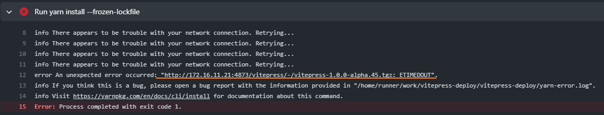
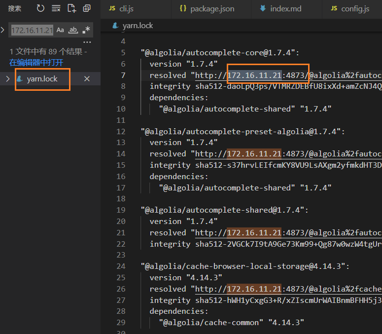

[toc]

### 海外实体卡

菲律宾 globe 卡，0 月租，只能接收短信，实体卡，啥都可以注册

现在已经开始实名了，但是随便填就能通过实名认证，然后注册 globe one ，注册 sim 卡后就可以看到手机号到期日期，也可以通过 app 自己续费续期

淘宝一搜就有

Globe 实名认证怎么通过的？我的估计过两个月就要被锁了 谷歌有教程，


新西兰有个实体卡 Skinny 零月租，Telegram 有拼团群 KakaSkinny

买了泰国的 ais ，一个月 10 泰铢，大概不到 3 块 RMB (虚拟号的淘宝店购入) (都是很短有效期的呀)


> [本帖](https://www.v2ex.com/t/966817)讨论的的全部都是长期可用的预付费卡，上台卡以及机场，接码网站等不在本帖讨论范围内
>
> 最适合国内上网的预付卡
>
> 1 香港移动鸭聊佳上网卡，无需实名长期可用
>
> 2 Csl 旗下 hk mobile 上网卡 无需实名长期可用
>
> 2 澳门电讯 CTM 5G chill 快卡 流量不过期长期可用
>
> 3 大马 Celcom 紫卡 流量套餐 57 国通用长期可用
>
> 最适合注册接码保号的预付卡
>
> 1 香港 hahasim 保号一年 10-20 港币 长期可用
>
> 2 英国 Vodafone 充值 5 英镑可用 25 年+ 长期可用
>
> ​	180天发一次短信（0.08英镑/条）延期
>
> 3 新西兰 Skinny 卡 余额变动**延期一年** **长期可用**
>
> 4 大马 Celcom 紫卡 5 马币延期 55 天 长期可用
>
> > 充值5马币延期55天
> > 长期可用
> > 可以开98马币60GB的30天流量套餐
>
> 5 泰国 ais 绿卡 dtac 蓝卡 每月 10 泰铢 长期可用
>
> > 有效期接近50天 
> > 每次充值10泰铢保号30天，约2元
> > 最多可叠加充值12次延期12个月
>
> 最适合打电话的预付卡
>
> 3Hk 国际万能卡 0.9 元一分钟 长期可用
>
> 咨询购买联络 https://t.me/+f93Gp2dh-oM0ZTc0
>
> PS.所列举所有卡收短信免费


#### skinny 激活

如何激活新西兰Skinny电话卡？

恭喜您收到了Skinny电话卡！为了开始使用，首先我们要检查包装是否完好未拆封。

Skinny电话卡激活不需要实名，把卡插入到手机然后登录激活网址接收一条验证码即可激活成功（卡手入手机就会有信号）

先插卡到手机等待信号出现，打开官方激活网址：https://www.skinny.co.nz/register/

点击 GET STARTED NOW，输入 Skinny 号码

点击 send authentication code，再输入接收到的验证码，最后点击提交即可完成激活，随后会收到欢迎短信。

#### 如何充值

[新西兰 0 月租手机卡了解一下 - V2EX](https://v2ex.com/t/431719)


### [Code brushes for GitHub Copilot | Christian Heilmann](https://christianheilmann.com/2022/12/13/code-brushes-for-github-copilot/)


### [大金字塔内部漫游](https://giza.mused.org/en/guided/266/inside-the-great-pyramid)


### el-dialog v-model="prop"

把el对话框的`model-value / v-model` (是否显示 Dialog)绑定到prop上的写法

```
:model-value="modelShow"
@close="$emit('update:model-value', $event)"
@open="$emit('update:model-value', $event)"
```

> v-model迁移策略: https://v3-migration.vuejs.org/zh/breaking-changes/v-model.html


### Code style issues found in the above file(s). Forgot to run Prettier?

> 日志来源: [pretty-quick bin](https://github.com/azz/pretty-quick/blob/master/bin/pretty-quick.js#L72)

To format a file in-place, use `--write`. (Note: This overwrites your files!)

In practice, this may look something like:

```bash
prettier --write .
```

#### [prettier cli](https://prettier.io/docs/en/cli.html)

[`--check`](https://prettier.io/docs/en/cli.html#--check)当你想检查你的文件是否被格式化时，你可以使用标志`--check`（或）`-c`运行 Prettier 。

这将输出一条人性化的消息和未格式化文件的列表（如果有）。

```bash
prettier --check "src/**/*.js"
```

如果所有文件都被格式化，则控制台输出：

```console
Checking formatting...
All matched files use Prettier code style!
```

如果某些文件需要重新格式化，则控制台输出：

```console
Checking formatting...
[warn] src/fileA.js
[warn] src/fileB.js
[warn] Code style issues found in 2 files. Forgot to run Prettier?
```

在第二种情况下，该命令将返回退出代码`1`，这在 CI 管道中很有用。

人性化的状态消息帮助项目贡献者对可能出现的问题做出反应。

为了尽量减少找到未格式化文件的次数`prettier --check`，您可能有兴趣在您的存储库中配置[预提交挂钩](https://prettier.io/docs/en/precommit.html)。

应用这种做法将最大限度地减少 CI 由于代码格式问题而失败的次数。

[`--write`](https://prettier.io/docs/en/cli.html#--write)

这将重写所有已处理的文件。这与工作流程相当`eslint --fix`。您也可以使用`-w`别名。


### git 设置代理

[给设置和取消代理](https://gist.github.com/laispace/666dd7b27e9116faece6?permalink_comment_id=4075973#gistcomment-4075973)

> ```
> git config --global http.proxy socks5://127.0.0.1:7890
> git config --global https.proxy socks5://127.0.0.1:7890
> ```

设置完速度就超快了..


### github actions

https://github.com/peaceiris/actions-gh-pages

This is a **GitHub Action** to deploy your static files to **GitHub Pages**. 


按vitepress docs部署上去, 居然有 把公司npm registry也弄上去了...



因为 我lock 文件的注册地址是



repo/settings/pages 需要选择 github action


> 推送测试自动部署
>
> 报错 ` Action failed with "The process '/usr/bin/git' failed with exit code 128"`
>
> 可以搜索相关类似的案例
>
> 原因分析：默认情况下，新存储库没有适当的工作流权限。
>
> ------
>
> 解决方案：
>
> 1. 转到存储库**Setting**
> 2. 选择**Actions**>>>**General**
> 3. 在"工作流权限(Workflow permissions)"中，选择`Read and write permissions`
>
> **可以正确运行action**, 但是怎么没有自动部署到站点上??


#### 阮一峰 github actions 入门

https://www.ruanyifeng.com/blog/2019/09/getting-started-with-github-actions.html
