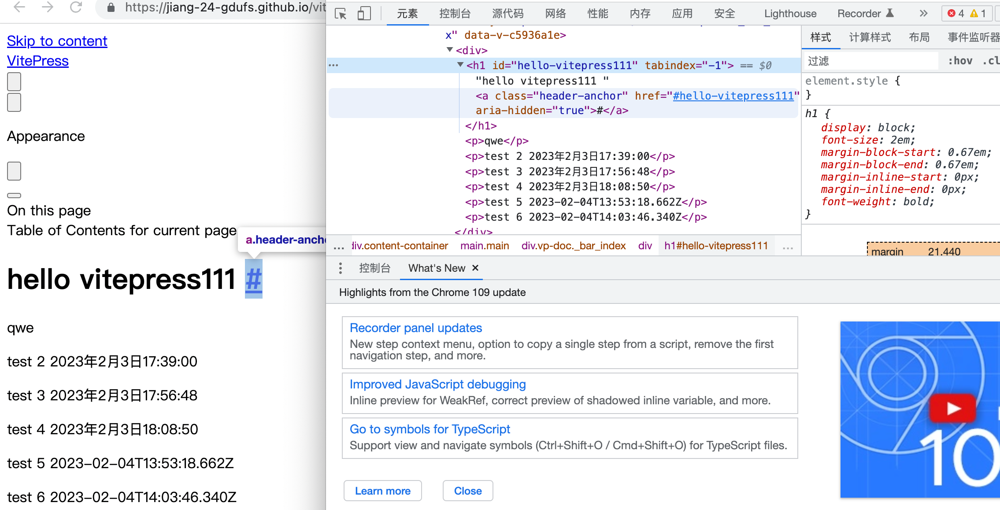
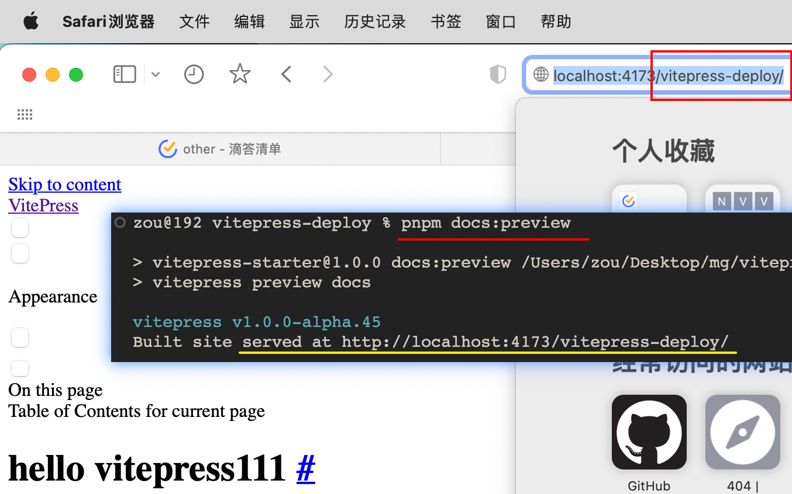

[toc]

### 计算一个数字二进制下1的个数

> [leetcode](https://leetcode.cn/problems/counting-bits/solution/bi-te-wei-ji-shu-by-leetcode-solution-0t1i/) 

#### 位运算

```js
function countOnes(x) {
        var ones = 0;debugger;
        while (x > 0) {
            x &= (x - 1);
            ones++;
        }
        return ones;
    }
```

很巧妙：-1可以让偶数位数减1

11： （1011）&（1010）= 1010 （10）

10:	（1010）&（1001）= 1000 （8）

8:	（1000）& （0111）= 0

------

14: （1110）&（1101）=1100（12）

12:（1100）&（1011）=1000（8）

8: ...

------

20: 10100&10011=10000

16:

------

i & (i - 1)可以去掉i最右边的一个1（如果有），因此 i & (i - 1）是比 i 小的，而且i & (i - 1)的1的个数已经在前面算过了，所以i的1的个数就是 i & (i - 1)的1的个数加上1

#### 数学思路

对于所有的数字，只有两类：

- 奇数：二进制表示中，奇数一定比前面那个偶数多一个 1，因为多的就是最低位的 1。
- 偶数：二进制表示中，偶数中 1 的个数一定和除以 2 之后的那个数一样多。因为最低位是 0，除以 2 就是右移一位，也就是把那个 0 抹掉而已，所以 1 的个数是不变的。
  另外，0 的 1 个数为 0，于是就可以根据奇偶性开始遍历计算了。

```c++
vector<int> countBits(int num) {
        vector<int> result(num+1);
        result[0] = 0;
        for(int i = 1; i <= num; i++)
        {
            if(i % 2 == 1)
            {
                result[i] = result[i-1] + 1;
            }
            else
            {
                result[i] = result[i/2];
            }
        }
        
        return result;
    }
```


### vitepress 自动部署成功


提交推送后执行workflow, 增加了一个分支。 再选择这条分支作为来源就可以CD。

但是没有样式： 

> 同样的问题：[v2ex](https://www.v2ex.com/t/883645)
>
> 问题答案中还补充了使用 pnpm 作为 action 中的包管理器的 yml 的修改内容
>
> 注意 vitepress 的 base 一定要和项目名称匹配.  
>
> **但是添加了base的vitepress 在preview时也有问题**， 会server在`localhost:port/base` 预览异常
>
> 
>
> 

### Cubox 在mac上需要借助一个helper

https://help.cubox.pro/save/fe02/
