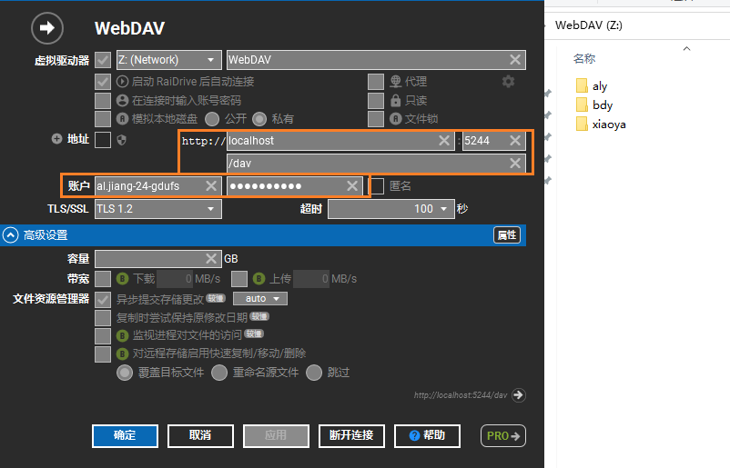
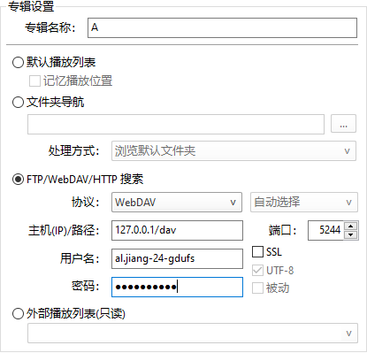
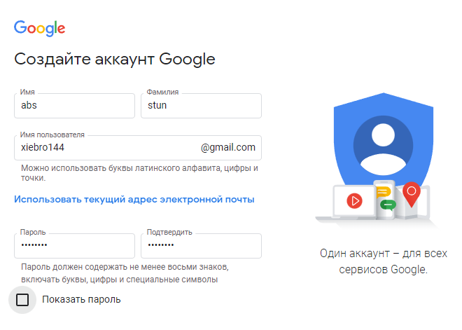
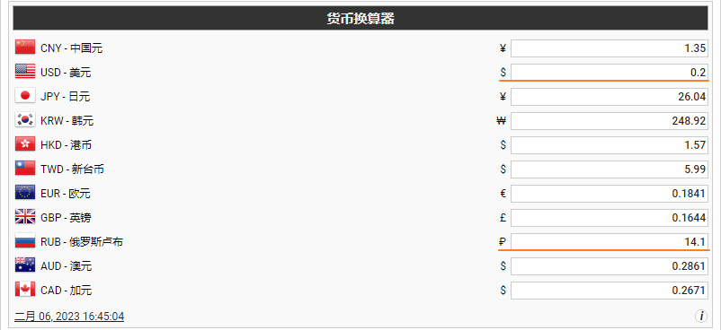
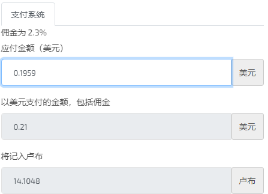

### alist

> win: 下载 [.zip](https://github.com/alist-org/alist/releases/download/v3.10.1/alist-windows-386.zip), 到目录下执行命令 `alist server` 部署到5244端口, 登录

存储配置(阿里云盘/百度云盘)

#### DaiDrive https://bbs.oldmanemu.net/thread-28054.htm

小雅:驱动选AlistV3,链接选http://alist.xiaoya.pro, (密码)可选: 无

​	就是把别人部署的alist挂载到自己的目录下提供访问, 跟直接访问这个站点一样..

重点在于同步到本地后, 可用RaiDrive

用RaiDrive把他挂载到本地做准备

安装过程中会装前置依赖 (net&c++)

> RaiDrive is not available for Mac but there are plenty of alternatives that runs on macOS with similar functionality. (有相似功能的替代品)

添加完就可以在磁盘目录找到关联的内容了

#### 开机自启 alist

#### potplayer加载小雅的视频教程

 https://bbs.oldmanemu.net/thread-28122.htm

>  前提部署了alist & 存储了 小雅的list

### How to start a startup

建议先看一遍 YC 出的 How to start a startup 视频，程序员脑补出来的创业之路和实际差别还是很大的。这两年和老婆一起做到上千万的流水，可以说每一步都被这个课程精准预测了。

### 哔哩哔哩字幕列表

浏览器插件

> 已经放弃在 B 站看一些科普向视频了，更积极去小红书看图文
> B 站视频的获取效率太低了，很多视频开头五分钟还在百度百科体

### 关于虚拟账户

1. 扶梯时部分不发gmail, 发QQ和网易
2. 虚拟gmail可以用来登陆其他社交平台,

### sms-active

> 我能找到最便宜的收费接码就是 [5sim.net](http://5sim.net/)
>
> sms 在23年4月份已经被openai风控了

找国外的接码。我今天用的这个 https://sms-activate.org/cn
需要充值，我选的美国虚拟号，15卢布一个号，能用20分钟不限接码次数，我注册了4个。

sms 注册gmail不能用来注册telegram.. 早知道换个高级的来码两个(不同类型)咯?  `不会被允许的`

俄罗斯的也不能注册 chat-gpt

印度尼西亚 22.5卢布(剩余余额8.4) 充值 14.1卢布 ($0.1959)

