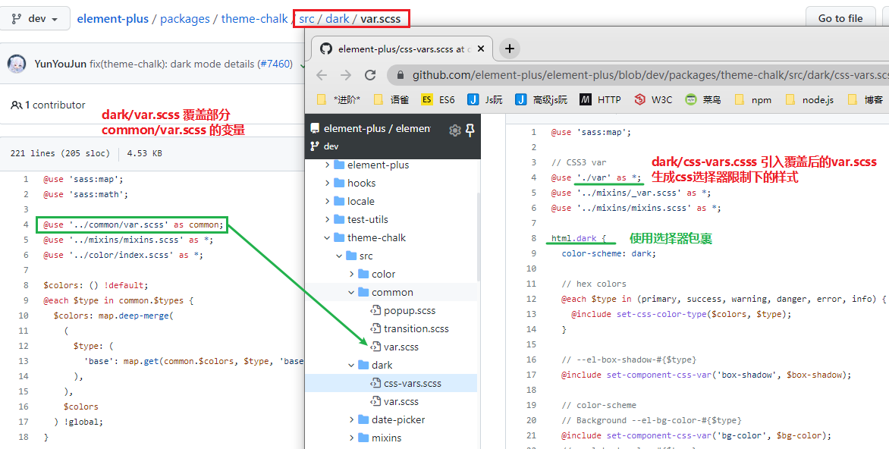

[toc]

### el+ 自定义主题 [#](https://element-plus.gitee.io/zh-CN/guide/theming.html)

1. 主题色覆盖
2. 通用scss直接修改 Element Plus 的样式变量(`src/common/var.scss`)
3. 黑色主题也通用



> 在 element-plus scss 文件之前导入`element/index.scss`以避免 sass 混合变量的问题，因为我们需要通过你的自定义变量生成 light-x。


#### 官方推荐的repo

1. https://github.com/element-plus/element-plus-vite-starter

   需要修改的内容为:

   覆盖样式[参考](https://github.com/element-plus/element-plus-vite-starter/blob/main/src/styles/element/index.scss)

   

#### [@forward](https://www.sasscss.com/documentation/at-rules/forward)

@forward规则加载一个Sass样式表，当你的样式表用@use规则加载时，它的混合函数和变量是可用的。它使组织Sass库跨越许多文件成为可能，同时允许其用户加载一个单一的入口文件。

该规则被写成@forward "`<url>`"。它像@use一样在给定的URL上加载模块，但它使加载的模块的**公共成员对你的模块的用户可用**，就像它们直接在你的模块中定义一样。不过，这些成员在你的模块中是不可用的--如果你想这样，你也需要写一个 @use 规则。别担心，它只会加载一次模块。

如果你在同一个文件中为同一个模块写了@forward和@use，最好是先写@forward。这样，如果你的用户想要配置被转发的模块，那么在你的@使用没有任何配置的情况下加载它之前，配置将被应用于@转发。


当导入模块时，会将所有样式规则导入，如果要访问其成员，可默认使用文件名（不带扩展名）作为命名空间，也可以使用`as`显式指定,如果指定为`*`，则可以直接使用其公共成员。

另外可以对标记默认值得变量进行重写，语法`@use <url> with (<variable>: <value>, <variable>: <value>)`

```scss
@use "src/corners" as c;
```


### sass在线编译

[@each](https://www.sass.hk/docs/#:~:text=8.4.-,%40each,-%40each%20%E6%8C%87%E4%BB%A4%E7%9A%84)

`@each` 指令的格式是 `$var in `, `$var` 可以是任何变量名，比如 `$length` 或者 `$name`，而 `<list>` 是一连串的值，也就是值列表。

`@each` 将变量 `$var` 作用于值列表中的每一个项目，然后输出结果

[SASS 2 CSS](http://www.wetools.com/sass-to-css)

scss 构建 css 变量


[@for](https://www.sass.hk/docs/#:~:text=p%20%7B%0A%20%20color%3A%20green%3B%20%7D-,8.3.%20%40for,-%40for%20%E6%8C%87%E4%BB%A4%E5%8F%AF%E4%BB%A5)

`@for` 指令可以在限制的范围内重复输出格式，每次按要求（变量的值）对输出结果做出变动。
```
这个指令包含两种格式：@for $var from <start> through <end>，或者 @for $var from <start> to <end>，
区别在于 through 与 to 的含义：当使用 through 时，条件范围包含 <start> 与 <end> 的值，而使用 to 时条件范围只包含 <start> 的值不包含 <end> 的值。
另外，$var 可以是任何变量，比如 $i；<start> 和 <end> 必须是整数值。
```


因为CSS变量是不再经过sass编译的, 右边的编译结果是不符合CSS规范的.

需要用 `calc` 包一下


