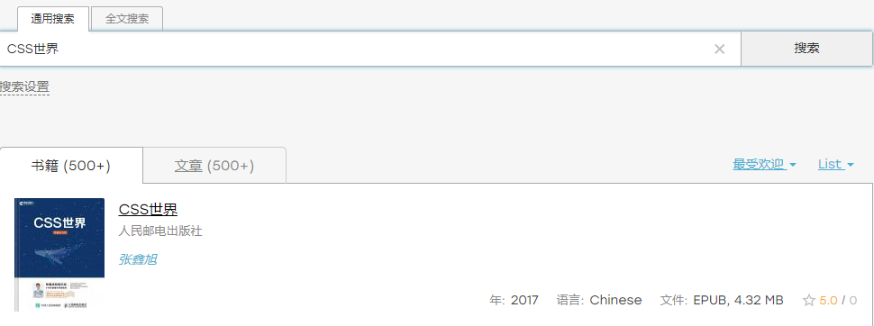
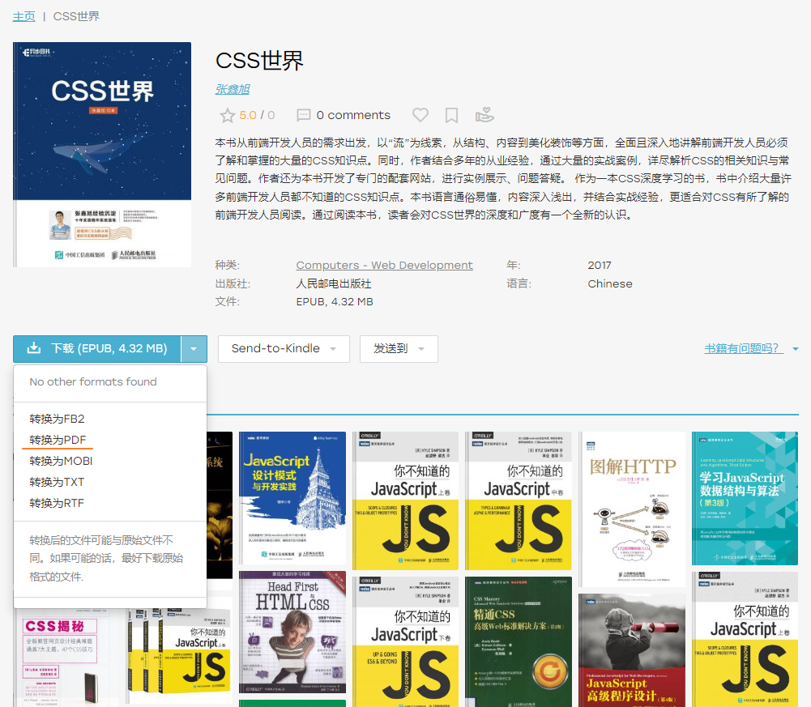
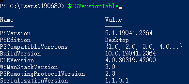
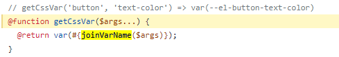

[toc]

### 润

议题: [润好像不太香了 - V2EX](https://www.v2ex.com/t/914098#reply67)

> 有关心过国际政治吗？
> 欧洲基本已经铁了心要脱钩转移产业链，脱钩的意思是，尽量不用所有商品。
> 美国更不用说了，已经没有鸽派，台湾保证法案在吵吵闹闹的众议院全票，注意是全票 0 反对通过
> 日韩完全跟随美国

> 不利于 run 的话要多说，把机会留给真正有需要的人

> 加拿大，狗都不去，把机会留给不怕死的人吧

> 警惕这样一种人：永远的批判者，他们的人生价值取决于对东西的批判，即使凭借一张飞机票来到了天堂，也要批判一番才罢休或永不罢休。跟哪呆着就骂哪，骂得非常对 井井有条 掷地有声，往往动用一些经济学术语和博弈论技巧，在话术里让自己的位置占据巅峰位置。骂地球
>
> 警惕这样一种人：永远的满足者，他们在哪里都感到满足，风吹到哪里就在哪里落地生根，毫无怨言，赞美花朵，赞美土壤
>
> 对于后者，非洲也有花朵 也有土壤，你去不去？
>
> 对于前者，人只有在被满足之后才能体现美好品质，所谓 ‘仓廪实而知礼节’，如果他们永远不满足即 故意永远不去达到 “仓廪实”，那么是不是连一个流浪汉都不如？这也是另一种 “不说自己真正想要什么；想要的太多了有没有一个 priority ? ” —— 如果想要的太多了，但没有一个 priority ，那么一个国家即使想主动去满足你都满足不了，因为你就是一个无法被满足的。

> 那么多明星和富豪都选择了移民，他们都是聪明人，可能有钱在这片土地上也未必过得好吧，前几天看袁腾飞的历史课，抄家在我们这片土地古已有之，历史上那些特别有钱被朝廷惦记上有几个好下场的？充公，收归国有，私有财产不可侵犯是那是西方的传统。

> 上学加工作在加拿大待了 8 年多不到 9 年，19 年回国了，我总体感觉是：
> 1. 中国人在那边很难融进去，过去也是混中国人圈子
> 2. 如果混中国人圈子，你肯定得在“一线”（多伦多，温哥华，蒙特利尔），但是现在这几个城市的生活成本也都不算低了（房租、放假、吃饭各种消费），至少和我待的那几年比性价比已经低很多了
> 3. 加拿大工作闲确实是比较闲，基本每个月都有 long weekend ，但是天花板也比较低
> 4. 税交的反正真的不低，如果可以接受灵活就业自己处理税务，自雇反而挣的更多些
> 5. 风景好的地方不少，对喜欢 hiking 、滑雪或者户外的人比较友好
> 6. 公立医院确实看病很慢，优先自己找家庭医生或者约 clinic

> 我国外呆了几年的朋友跟我讲过一个能润前提下的公式：
>
> 有钱有能力无所谓，有钱无能力国内，无钱有能力国外，无钱无能力国内。
>
> 没有验证过，仅作参考。


### 微软推出新版 Bing 和 Edge 浏览器，支持升级的 ChatGPT AI

1 、挂梯子； 2 、把国家 /地区改成漂亮国

https://www.bing.com/new?form=MY029I&OCID=MY029I&scdexwlcs=1

**你已加入候补名单**


### zlibrary 可以领个人三级域名了

> [zlibrary 可以领个人三级域名了 - V2EX](https://www.v2ex.com/t/913795)

 [https://singlelogin.me](https://singlelogin.me/) 全球最大的**数字图书馆**, 可以用来下载数字图书 (全局代理)

#### 有啥特别？

之前都是第三方捣鼓的方案，黄了多少次大家都有数。这次不需要搭建，已经喂到嘴里了🤪。目前支持转发之 TG 、邮箱、GD 等

#### 更多功能

个人可以设置自己的搜索喜好方式包括屏蔽一些不喜欢的资源，突出某些参数关键词，建立自己的书单，自己喜欢的读物类型。预计还在开发，搞不好成为强大的社群（像豆瓣影视

不确定是否会封车，不过有邮箱都搞一个吧，以便不时之需......


注册后邮箱中有域名 (可以通过私域来登录到下载页面)

格式为 [lib-XXXXXXXXXXXXX.cXXXXXn.pm](http://lib-xxxxxxxxxxxxx.cxxxxxn.pm/) 仅限本人登录。即使被别人用了，没有密码也进不去。

不过主域名要是被 ban 了还是一样完蛋。

> 请保持您的域名的私密性! 不要透露你的个人域名，也不要分享你的域名链接，因为它们受到你自己的密码保护，其他用户无法访问。你可以随时在个人资料页面找到你的域名。






### tor 浏览器

Tor 是在保障隐私和线上自由方面最强大的工具。

 这是一个由 Tor Project 和世界各地志愿者社区维护的自由及开放源代码软件。


### ni 命令执行时冲突

[issue](https://github.com/antfu/ni/issues/39) [#33](https://github.com/antfu/ni/issues/33)

```
`PS C:\Users\xxxxx> ni

位于命令管道位置 1 的 cmdlet New-Item
请为以下参数提供值:
Path[0]:`
```

#### [#47](https://github.com/antfu/ni/issues/47) 解决 Conflicts with PowerShell New-Item alias. 

[trouble-shooting](https://github.com/antfu/ni#trouble-shooting)

移除PS别名的命令, 但不能持久保存:

```js
'Remove-Item Alias:ni -Force -ErrorAction Ignore'
```

需要在相应路径下添加文件来保存. 

> 这个管用
>
> in Powershell 5.x, also can use
> `If (Test-Path Alias:ni) {Remove-Item Alias:ni -Force}`
> in `C:\Users\youname\My\\ Documents\WindowsPowerShell\Microsoft.PowerShell_profile.ps1`

#### 确认PS的版本

 -> PowerShell 5 (Windows PowerShell):


### Rust正在变为前端新基建

基本上前端工具链已经被Rust实现差不多了


### 调试Vue3源码正确姿势

[md](../chat.openai/~20230208.md)


### unplugin

https://github.com/unjs/unplugin

构建工具的统一插件系统。

sxzz使用该系统的案例:https://github.com/element-plus/unplugin-element-plus/blob/main/src/index.ts


### [Sass: At-Rules | Sass 中文网 (sasscss.com)](https://www.sasscss.com/documentation/at-rules)

@use从其他Sass样式表中加载混合器、函数和变量，并**将多个样式表的CSS组合在一起**。 

@forward加载一个Sass样式表，当你的样式表用@use规则加载时，它的混合器、函数和变量是可用的。

> `@forward`可以用来将多个`partials`集合起来。

@import *废弃* 扩展了CSS at-rule，从其他样式表加载样式、混合元素、函数和变量。

@mixin和@include使得重复使用大块的样式变得容易。

@function定义了可以在SassScript表达式中使用的自定义函数。

@extend允许选择器相互继承样式。

@at-root 将其中的样式放在CSS文档的根部。

@error 导致编译失败，并给出错误信息。

@warn 打印一个警告而不完全停止编译。

@debug 打印一条用于调试的信息。

流程控制规则，如@if、@each、@for和@while，控制是否或有多少次样式被发出。

Sass对普通的CSS at-rules也有一些特殊的行为：它们可以包含插值，并且可以嵌套在样式规则中。其中一些，如@media和@supports，也允许SassScript直接用于规则本身而不需要插值。

> @use 复用样式表


#### @use和@forward

用于导入和转发module和module 成员（mixins, functions, and variables）,原有的@import废弃。
 所有源文件模块及其属性默认导出，且编译成对应css文件，因此不需要显式导出。如果只想用于导出而不编译，可以在文件名前加下划线`_`前缀，其中的成员可以添加下划线前缀设为私有。

当导入模块时，会将所有样式规则导入，如果要访问其成员，可默认使用文件名（不带扩展名）作为命名空间，也可以使用`as`显式指定,如果指定为`*`，则可以直接使用其公共成员。
 另外可以对标记默认值得变量进行重写，语法`@use <url> with (<variable>: <value>, <variable>: <value>)`

```scss
@use "src/corners" as c;
```

当转发模块时,执行转发的文件内不可以使用被转发的内容，可以用于将多个模块统一对外暴露。另外还可以

- 利用` @forward "<url>" as <prefix>-*`为成员增加前缀
- 利用`@forward "<url>" hide <members...>`或` @forward "<url>" show <members...>`处理可见性，其中`<members...>`是逗号分隔的成员。
- 也可以用`with`重写默认值


#### @function


