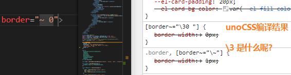
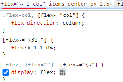
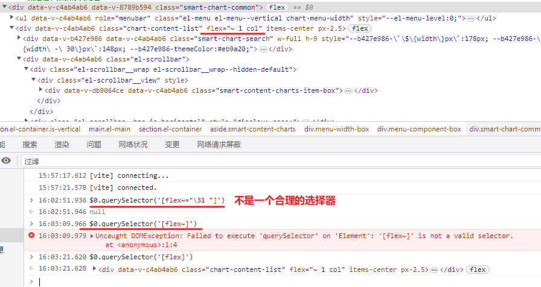

[toc]

### tailwind grid

控制列数, 比UI库带的layout组件更简单

使用 `grid-cols-{n}` 功能类来创建有 *n* 个同等大小的列的网格。

```html
<div class="grid grid-cols-3 gap-4">
  <div>1</div>
  <!-- ... -->
  <div>9</div>
</div>
```


#### tailwind css 响应式设计

Tailwind 使用移动优先的断点系统

意味着未加前缀的功能类 (像 `uppercase`) 在所有的屏幕上都有效，而加了前缀的功能类（如 `md:uppercase`）仅在指定断点及以上的屏幕上生效。

这种方式最令人们惊讶的地方是，要为移动设备设计样式，您需要使用无前缀的功能类，而不是带 `sm:` 前缀的版本。

通常最好先为移动设备设计布局，接着在 `sm` 屏幕上进行更改，然后是 `md` 屏幕，以此类推。

**不要使用 `sm:` 来定位移动设备**

```html
<!-- This will only center text on screens 640px and wider, not on small screens -->
<div class="sm:text-center"></div>
```

**使用无前缀的功能类来定位移动设备，并在较大的断点处覆盖它们**

```html
<!-- This will center text on mobile, and left align it on screens 640px and wider -->
<div class="text-center sm:text-left"></div>
```


### unoCSS \3








### unoCSS 规则优先级?

经常有同级别的选择器 覆盖了uno


### 如何给动态组件传prop?

与普通组件无异


