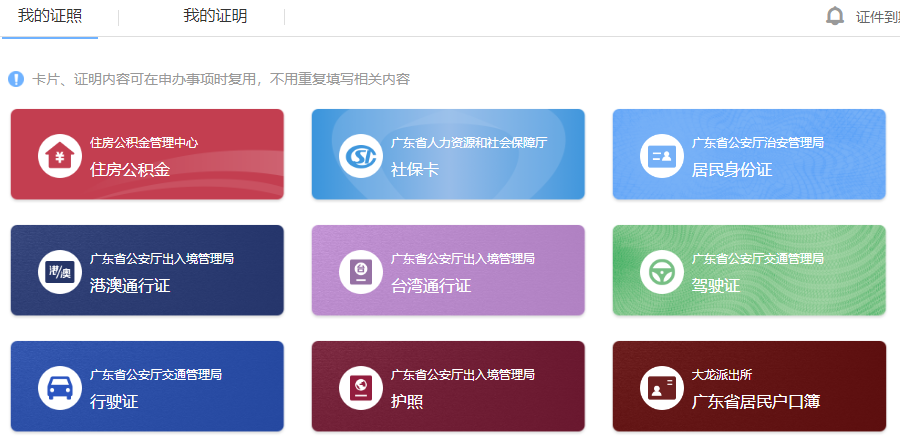

[toc]

### [言论](https://www.ruanyifeng.com/blog/2023/02/weekly-issue-241.html#:~:text=%E8%A7%A3%E5%86%B3%E7%9A%84%E9%97%AE%E9%A2%98%E3%80%82-,%E8%A8%80%E8%AE%BA,-1%E3%80%81)

1. 我不善于当众演讲，在人多的场合发言，我会紧张。但是后来，我发现听众真的不在乎，如果你讲得很糟糕，他们可能会发笑片刻，但很快就会忘记。

   事实是我们放大了别人的想法。有人说的很对：我们在想象中比在现实中，遭受更多的痛苦。

2. 我真正担心的是，今天的很多编程没有任何乐趣，它只是集合别人的软件，把组件拼起来并启动，不需要太多的创造力。

   我担心编程会变得太无聊，因为你没有机会做任何新鲜事。你的兴奋来自于看到机器产生出来的有趣结果，而不是来自创造新事物的过程。现在的乐趣变成，当你完成无聊的工作后，会突然得到一个很棒的结果，但在以前，工作本身并不乏味。

3. 大多数编程不再是艺术，也不再是高级工程。大多数程序都是微不足道的：编码人员只需要理解某些特定的接口，然后编写一些逻辑和胶水代码。

   

4. 

### [话题](https://www.ruanyifeng.com/blog/2022/02/weekly-issue-194.html#:~:text=%E6%88%91%E4%B8%8D%E5%A4%AA%E6%95%A2,%E5%9C%A8%E8%B5%B0%E4%B8%8B%E5%9D%A1%E8%B7%AF%E3%80%82)

**过去20年，乐观者简直是大获全胜。** 只要你坚定地看好互联网和手机，你就完全看对了。要是你再坚定看好房地产，妥妥就是人生赢家，任何看空的人，恐怕都输得要哭出来。

但是，乐观的日子会继续下去吗？经济和科技会一直这样高速发展吗？

我不太敢肯定，因为有五个负面因素，正在变得越来越严重。大家不妨看看下面五点，怎样才能解决。

> （1）熵的危机（气候危机）。经济发展需要消耗能源，只要能源消耗不下降，熵就会越来越多，直接导致气候灾难。
>
> （2）技术越来越复杂，人类社会依赖技术的程度加深。迟早有一天，那些技术的复杂度，会引发难以预测和控制的连锁反应。
>
> （3）失业增加。技术发展太快，导致很多人的劳动技能快速过时，一旦不再拥有高强度工作的体力，就会丧失就业竞争力，成为"无用的人"。
>
> （4）贫富分化，财富日益集中于科技寡头，中产阶级萎缩乃至消失，底层的人越来越难改变命运，很多老人完全依靠政府的养老金生存。
>
> （5）人口生育率下降。大多数人连自己的生活水平都无法维持，怎么有信心和能力去养育下一代。人类作为一种生物种族，是不是在走下坡路。

上面只是粗略地列出每一点，没有展开说。我其实想了很多，还因为这些写了一本书[《未来世界的幸存者》](./未来世界的幸存者.pdf)

**只要你仔细思考过上面的五点，就不太可能对未来那么充满信心，也许就会同意，未来可能是悲观的。** 我们对技术的正面作用谈得太多，对技术的负面作用谈得太少。

### [meduim](https://medium.com/)

[程序员如何通过在 Medium.com 上写技术博客赚钱？](https://medium.com/写作之路/程序员如何在medium-com上通过写技术博客赚钱-6d47d82b03dd)（中文）

但是这个作者没有在更新了呀

按他的提示说门槛有: 1. 英文 2. Stripe (身份验证 _ hhh 公司报税)

> 他的中文账号: [李帅-位鱼bitfish – Medium](https://bitfish-cn.medium.com/) 英文账号: [bytefish – Medium](https://bytefish.medium.com/)
>
> --中文账号(450+ fo) Jul 29, 2022 后不再更新
>
> -- 英文账号(3.9k fo) 22/8月前更新文字频繁, 但22/8月后更新频率暂停

#### Stripe Standard Account 和 Stripe Express Account

Stripe Standard Account其实和大家熟悉的支付宝商家账户很像。它有两个特点：

- 注册门槛高，手续复杂
- 功能强大

注册的时候你需要上传自己的证件，需要等待Stripe审核。当然，等你注册完之后，它的功能也是非常强大的。你可以用它收款付款，你也可以调用它的支付API，在你的网站中嵌入支付功能。

简化版的Stripe账户类型：Stripe Express Account。Express Account在注册的时候不需要太多手续，填写一下自己的证件号码、电话号码和银行卡号就行了。当然它的功能也非常有限，只能用来从特定公司收款，无法调用支付API。

### 柠檬清理

腾讯官方发布的免费 MacOS 系统的磁盘清理软件

### [微软数学求解器](https://mathsolver.microsoft.com/)（Microsoft Math Solver）

数学题求解网站。

### [文章总结器](https://labs.kagi.com/ai/sum)（Universal Summarizer）

搜索引擎 Kagi 推出的一个神奇工具，输入网址，就能快速总结出该网址文章的大意，支持中文网址。

-- 现在已经free sum [t](https://twitter.com/vladquant/status/1624151390527590401).

此免费技术预览已结束。[Universal Summarizer 将于 2023 年 2 月在Kagi Search](https://kagi.com/)中本地实现。

有关 API 的使用，请参阅[此推文](https://twitter.com/vladquant/status/1624151390527590401)并关注[@KagiHQ](https://twitter.com/KagiHQ)以获取更新。

> Free Account: **50** searches remaining in a month. 

### 如何刷其他rom

> [2023 年安卓机器该如何选择？ - V2EX](https://www.v2ex.com/t/914102#reply90)

买安卓 root 后刷其他 rom(非国产) 保护隐私?

xda 论坛上不少讨论

只要能 root ，就能干掉一些自带服务

> 目前 K40 刷 pixel experience 挺清爽的 就是拍照太垃圾 不过我基本不咋用 待机能有个小三天

### 安卓玩机需要知道的一些社区论坛

[XDA Forum](https://sspai.com/link?target=https%3A%2F%2Fwww.xda-developers.com%2F)，国外的开发者社区(全英文站)，里面汇聚了国内外顶尖的安卓开发者，拥有最全机型的 ROM，APP，Xposed 框架，游戏资源等全部有汇聚。还有官方提供的 App 如 XDA Labs、XDA Feed，可以方便地查看最新的 Android 动态。

### 我的证件

http://www.gd.gov.cn/hdjlpt/znzl/zjService

### 钻戒

莫桑钻 [【柯芙尼（kefuni）K003】柯芙尼925银D级莫桑石一克拉单钻戒指求婚情侣对戒生日情人节礼物送女友 【铂白金+莫桑钻】配送真爱抽屉礼盒 1克拉【行情 报价 价格 评测】-京东 (jd.com)](https://item.jd.com/10056792865733.html#crumb-wrap)

那么问题来了，怎么劝服女友不买钻戒

>  1、钻戒贬值，入手一万，二手不值钱。2、黄金保值。3、黄金戒指样式也新潮好看。4、实在不行，买个便宜的钻戒，生下来的钱吃喝玩乐直接起飞。

### map.merge

[element-使用方式](https://github.com/element-plus/element-plus/blob/dev/packages/theme-chalk/src/dark/var.scss#L57)   [sass-docs](https://sass-lang.com/documentation/values/maps#add-to-a-map)
