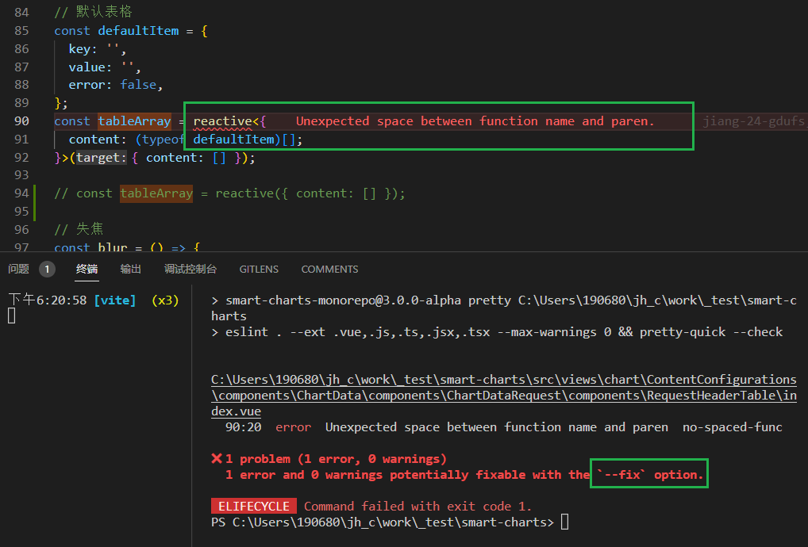

[toc]

### prettier

github: https://github.com/prettier/prettier

#### pretty-quick

github: https://github.com/azz/pretty-quick

usage: 安装 prettier&pretty-quick, 执行pretty-quick命令

> 遇到一个问题 npx pretty-quick --write, 之后再 npx pretty-quick --check

```
PS C:\Users\190680\jh_c\work\_test\smart-charts> nr lint

> smart-charts-monorepo@3.0.0-alpha lint C:\Users\190680\jh_c\work\_test\smart-charts
noEmit && pretty-quick --check

🔍  Finding changed files since git revision null.
🎯  Found 1 changed file.
⛔️  Check failed: ./index.vue        
✗ Code style issues found in the above file(s). Forgot to run Prettier?     
PS C:\Users\190680\jh_c\work\_test\smart-charts> npx pretty-quick --check ./index.vue
🔍  Finding changed files since git revision null.
🎯  Found 1 changed file.
⛔️  Check failed: ./index.vue        
✗ Code style issues found in the above file(s). Forgot to run Prettier?     
PS C:\Users\190680\jh_c\work\_test\smart-charts> npx pretty-quick --write ./index.vue
🔍  Finding changed files since git revision null.
🎯  Found 1 changed file.
✍️  Fixing up ./index.vue.
✅  Everything is awesome!
PS C:\Users\190680\jh_c\work\_test\smart-charts> npx pretty-quick --check ./index.vue
🔍  Finding changed files since git revision null.
🎯  Found 1 changed file.
✅  Everything is awesome!
```

> ` "lint": "eslint . --ext .vue,.js,.ts,.jsx,.tsx --max-warnings 0 --fix && vue-tsc --noEmit && pretty-quick --check",`
>
> lint 脚本运行完, prettier提示并退出. 重新对该文件运行 prettier .
>
> lint 脚本还报错的话, 应该不是这个prettier命令的问题

#### 原因

`eslint --fix` 把文件修改了但又不符合prettier了...



#### 为 `reactive()` 标注类型

`reactive()` 也会隐式地从它的参数中推导类型：

```ts
import { reactive } from 'vue'

// 推导得到的类型：{ title: string }
const book = reactive({ title: 'Vue 3 指引' })
```

要显式地标注一个 `reactive` 变量的类型，我们可以使用接口：

```ts
import { reactive } from 'vue'

interface Book {
  title: string
  year?: number
}

const book: Book = reactive({ title: 'Vue 3 指引' })
```

> TIP: 不推荐使用 `reactive()` 的泛型参数，因为处理了深层次 ref 解包的返回值与泛型参数的类型不同。

把reactive的变量提前. 适配第二种情况

```ts
const defaultItem = {
  key: '',
  value: '',
  error: false,
};
const tableArray: {
  content: (typeof defaultItem)[];
} = reactive({ content: [] });
```


### vue-tsc

类型检查工具。[源代码](https://github.com/vuejs/language-tools/blob/master/packages/vue-tsc/bin/vue-tsc.js)

## 用法

类型检查：

```sh
vue-tsc --noEmit
```

构建 dts：

```sh
vue-tsc --declaration --emitDeclarationOnly
```


### grammarly

Grammarly提供了多种使用场景：除了直接使用它的网页版之外，你还可以安装Grammarly谷歌浏览器**插件**、下载手机和电脑**客户端**App以及在Microsoft Word和Wordpress中使用Grammarly。

Typora 在使用时也可以有用, 不过对代码检查的部分会提示


## Vue.js 3.0 核心源码内参

[拉勾\教育](https://kaiwu.lagou.com/course/courseInfo.htm?courseId=946&sid=20-h5Url-0&lgec_type=website&lgec_sign=86228E00A960E2EB44DCA4027393428B&buyFrom=2&pageId=1pz4#/sale)

b站/youtube有视频: 

> Vue2的源码课《Vue技术揭秘》，大概刷了两遍，真的是受益匪浅，学到了太多，后面相关的Vue3的课程可能是写的比较早吧，内容不是很多。


### downie

视频下载工具

Video downloader for macOS with support for YouTube and other 1200 sites.

US$19.99 (30% Off Student Discount)


### [youtube-dl](https://github.com/rg3/youtube-dl/) 

Command-line program to download videos from YouTube.com and other video sites

命令行工具


### element-plus

函数式混入 (mixins)  

[getCssVar](https://github.com/element-plus/element-plus/blob/dev/packages/theme-chalk/src/mixins/function.scss#L63) -> css


### 美国舆论霸权的体现

2023年2月的前两周，美国通过三件事，向我们展示了什么叫舆论管制的巅峰水平。

首先是间谍气球，一个主要出于美国国内党争需要的无中生有的事件，被全美左翼右翼、大报小报采取铺天盖地信息轰炸的方法，以一种反常识的姿态，硬生生灌输给了每一个人（《[说说“气球事件”的前因后果](https://link.zhihu.com/?target=http%3A//mp.weixin.qq.com/s%3F__biz%3DMzIzMjI3MzM1Mg%3D%3D%26mid%3D2650637066%26idx%3D1%26sn%3D933e5ab29462ed837c1f0dd94d02feef%26chksm%3Df09e47adc7e9cebbe499ef5cd611b71adb9bae3368139ebbcbe808adb1dfa053905ec577bf58%26scene%3D21%23wechat_redirect)》）。

同一时间，是Seymour Hersh关于美国和挪威合谋炸毁北溪管道的深度报道被掩埋。报道作者是德高望重的普利策奖得主、若干重大历史事件的爆料人，报告本身提供了精确的时间、地点、人物，作者甚至自信到主动联系美挪官方要求评论，而美挪官方要么拒绝评论，要么空洞地否认，全世界都在关注这份报道，美媒到今天却仍然一片鸦雀无声（《[“美国炸毁北溪管道始末”：Seymour Hersh的新调查报告](https://link.zhihu.com/?target=http%3A//mp.weixin.qq.com/s%3F__biz%3DMzIzMjI3MzM1Mg%3D%3D%26mid%3D2650637104%26idx%3D1%26sn%3D3c996bec3319f3989b4c1802cd7f2d91%26chksm%3Df09e4797c7e9ce814f5f54c4f487785c02dbb992fc22254a45d681a305655072d6fe98dd7102%26scene%3D21%23wechat_redirect)》）。

气球和北溪两件事，本身的对比已经足够鲜明，然而我们常说现实往往比戏剧更具有戏剧性，这两天人们发现，原来在同一时间，美国还藏着第三件大事。有多大呢？目前有不少人称它是**“美国版切尔诺贝利事件”**。

> 2月3号，也就是上上周五，在俄亥俄州和宾夕法尼亚州边境的小镇East Palestine附近，一辆载有化学物品的火车脱轨、起火、泄露。
>
> 月4日和5日，火车就在East Palestine边上静静地燃烧，新闻媒体几乎没有报道，仅有的几个报道也只是淡淡地提了一句“火车事故”，基本没提有严重的化学泄露。直到2月5日也就是周日晚上，East Palestine的5000居民才收到政府的紧急撤离通知。
>
> 美国有关部门同时拿出了救灾方案——让火车继续烧。当然叫法很专业，叫“可控燃烧”。整整五车厢的氯乙烯继续“可控”地烧到2月10日，
>
> 到2月12日，各大美媒才开始姗姗来迟地正面报道起这件已经发生了九天的生化危机。

2月9日，有一则某记者在俄亥俄州因为报道火车出轨事故被逮捕、被刑事起诉的新闻，当时我读到了但没多想，因为在美国抓个把记者也是常有的事，现在想起来，我应该也是**被美国媒体转移视线的春秋笔法给忽悠了**，完全没想到“记者被捕”和“火车事故”背后还有这么严重的生化灾难。


### 净水器滤芯


小米是根据通电时间来计算是否更换滤芯的。用了一年多了，测 tds 在 22 ，自来水是 110 左右。
