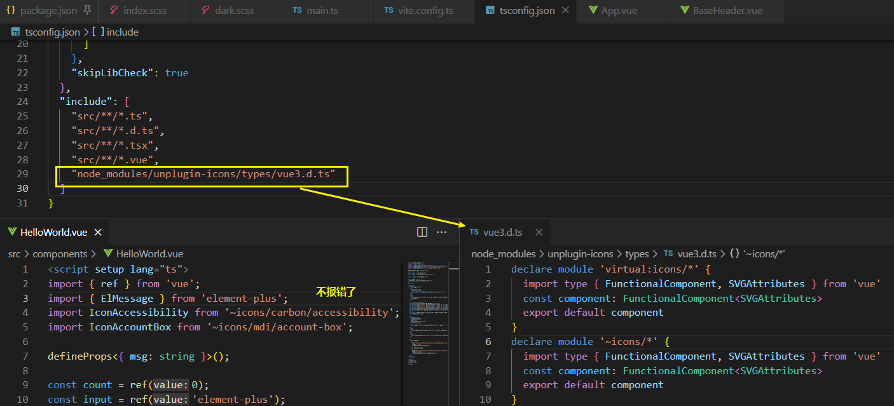

[toc]

### [实用工具推荐](https://www.v2ex.com/t/916516)

#### Listary

*Listary – 一个真正令人惊叹且精致的搜索实用程序，介于启动器和文件管理器之间，两者都不是。Listary 位于您的主要文件管理应用程序旁边，使管理其列表和查找文件变得轻而易举。*

#### WizTree

The FASTEST Disk Space Analyzer (磁盘空间分析)

Find the files and folders using the most space on your hard drive - QUICKLY!

需要排除依赖文件不然消耗时间

`node_modules` `.git` `.pnpm`, 使用`|`分隔

通过点击扫描按钮下的过滤器图标，或选择选项->过滤扫描结果，或按Ctrl+Shift+F来切换过滤器的开关。
包含过滤器 “将在结果中只包括匹配的文件。
排除过滤器 “将从结果中排除任何匹配的文件

文件是使用整个文件路径和文件名进行匹配的。过滤器支持所有标准的文件搜索功能，如通配符、文件大小、文件日期等。

例如，要想只过滤大于5MB的mp3或wav类型的文件，不包括C:Windows文件夹中的任何文件，你可以输入。
包括过滤器。*.mp3|*.wav >5m
排除过滤器。C:Windows

> https://www.paijishu.net/thread-13744-1-1.html

### win10自带工具

- win10 自带的 windows 快捷键 + V 可以开启剪贴板历史记录，复制图片无压力 (不支持图片)
- Windows 11 自带的时钟应用，自带番茄时钟，提醒器，很好用。

### [Netlify](https://www.netlify.com/)

[link](../_202204/~20220420.md)

### antfu 图标库

https://github.com/antfu/unplugin-icons#install

usage:

安装插件, 在vite中加入插件, 安装图标库, 引入

 

options 的配置表现跟元素属性相关.

导入后有Vetur报错如何引入相关的声明

### 
