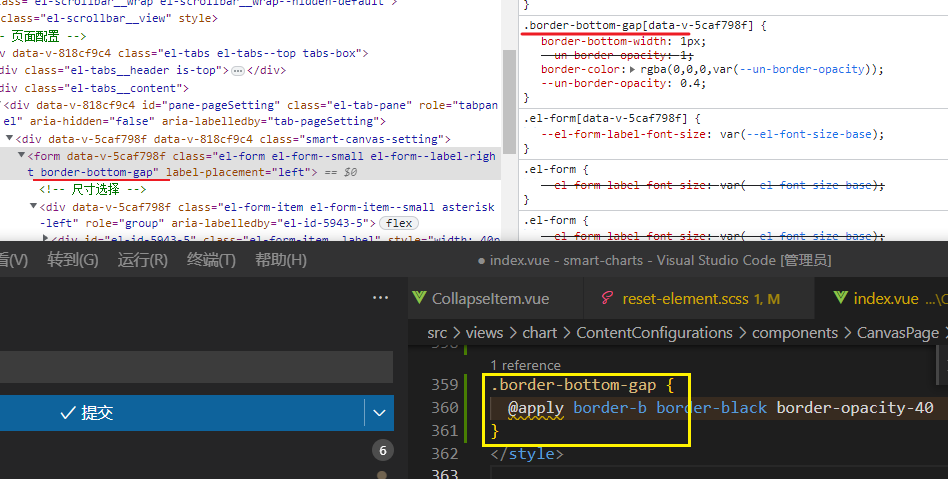

[toc]

## CSR SSR SSG

[Comparing the Gatsby, Next, Nuxt, and Nest Open-source JavaScript Frameworks (twilio.com)](https://www.twilio.com/blog/comparing-nextjs-nestjs-nuxt-gatsby)

**Rendering 渲染**:  在一个非常高的水平上，所有网站的工作都是一样的。**客户端**向持有所需信息的服务器**发送一个初始请求**。服务器**响应**所请求的文件，这可能会或可能不会触发一连串**更多的请求**。最终，**客户端拥有所有需要的数据**，并可以渲染一个页面，将信息直观地展示给用户。


### 网络应用程序的性能指标

这些指标是由Chrome团队推出的，通常也被称为Web Vitals。

- [第一个字节的时间（TTFB）](https://web.dev/ttfb/)
TTFB是一个衡量直到收到一个请求的第一个字节的时间的指标。这个指标可以用来评估服务器和客户端与服务器之间的网络的负载。
- [首次绘画（FB）](https://web.dev/rendering-on-the-web/#terminology)
任何像素第一次对用户可见的时间。这包括TTFB和客户端在渲染工作之前所要做的计算。
- [第一次有内容的绘制 (FCP)](https://web.dev/first-contentful-paint/)
第一次有内容的绘制标志着第一个文本或图像被绘制的时间。与FB类似，但它是一个技术性较低的衡量标准，定义了向用户提示页面正在工作的渲染阶段。
- [最大内容的绘制(LCP)](https://web.dev/lcp/)
Largest Contentful Paint标志着最大的文本或图像被绘制的时间。这项措施也可以描述为直到用户看到预期结果的时间。
- [互动时间(TTI)](https://web.dev/interactive/)
互动时间是指页面变得完全互动所需的时间。用户可能期望这与LCP的时间相同，但这可能是不同的。如果TTI和LCP不同，用户可能会认为网站已经坏了。


### [Client-side Rendering (CSR)](https://www.twilio.com/blog/comparing-nextjs-nestjs-nuxt-gatsby#:~:text=Client%2Dside%20Rendering%20(CSR))


在客户的浏览器中渲染单个页面的应用程序也经常被称为单页应用程序。这个概念被称为**CSR，或客户端渲染**。

服务器本质上是为在客户端执行的压缩的JavaScript代码提供服务，通过HTTP请求获取额外的信息，并渲染DOM元素。对于许多网络开发者来说，这现在是开发网络应用的事实标准。流行的SPA框架有React、Angular、Vue.js和Svelte。

这种方法的优点是它的扩展性好，因为大部分计算都发生在客户端，这导致了快速的第一字节时间。另一个优点是，你可以使用现代浏览器支持的Web API，如地理位置、剪贴板或推送。

不过，也有缺点。由于所有的渲染都发生在客户端，一旦JavaScript文件被加载，这就需要额外的时间，并可能导致在这段时间内的用户界面被封锁。因此，像First Paint、First Contentful Paint、Largest Contentful Paint和Time-to-Interactive这样的指标需要更多的时间。

为了弥补这一等待时间，前端开发者通常会创建闪屏以减少感知的加载时间。另一个缺点是，大多数**搜索引擎不执行JavaScript**，当你对**SEO**感兴趣时，这导致了一些问题--因为爬虫会很难理解页面内容，这会影响你的页面的可发现性。当然，可能有些项目，如公司内部的应用程序，与SEO无关，这方面的问题也不会困扰你。

### [Server-side Rendering (SSR)](https://www.twilio.com/blog/comparing-nextjs-nestjs-nuxt-gatsby#:~:text=Server%2Dside%20Rendering%20(SSR))

SSR（或称**服务器端渲染**）在响应传入的请求之前计算完全渲染的HTML，**交付一个完整的页面**。这种渲染方法在很多方面都与客户端渲染相反。

由于搜索引擎爬虫正在解析完整的网页，这种方法对搜索引擎友好，并且仍然显示最新的内容，而这些内容因用户而异。有趣的是，第一次绘画、第一次内容绘画、最大的内容绘画和互动时间都很快，而且通常非常接近，因为网站通常是一次性渲染。

这里也有一个缺点。由于服务器必须在提供标记之前完成计算，**Time To First Byte通常需要更多时间**。这种方法相对来说更难扩展，因为每增加一个用户，计算负荷就会增加。对所有用户来说看起来非常相似的网页会因这种方法而大受影响，因为同样的计算和同样的结果要重复计算。

### [Static Site Generation (SSG)](https://www.twilio.com/blog/comparing-nextjs-nestjs-nuxt-gatsby#:~:text=are%20computed%20repeatedly.-,Static%20Site%20Generation%20(SSG),-SSG%2C%20or%20Static)

SSG，即**静态网站生成**，在网络应用程序的构建过程中计算页面标记，而不是按需进行。这种方法主要是**通过预先计算动态网页**来**减少服务器端的重复计算**。这导致了较长的构建时间，但最终通过提供这些预先计算的页面来节省计算时间。

所有的指标（第一个字节的时间、第一次绘画、第一次内容丰富的绘画、最大内容的绘画和互动时间）都受益于这种方法，因为它与静态服务非常相似。这自然也导致了低服务器成本和出色的可扩展性。

其显著的**缺点**是，所有的**页面对每个用户来说都是一样的**。这只有在某些类型的网络应用中才是理想的，甚至是可能的。你能想象一个网络商店，特别是一个购物车，对每个用户都是一样的吗？

**对于某些页面，如API文档或小型博客，作者可以完全利用这种渲染策略。**

但 "静态网店 "的例子显示了第二个**缺点**--每当你**改变一个普通元素时，都需要重建网站**！你需要重建整个应用程序来更新一个产品描述--否则，商店将永远不会显示最新的信息。因此，对于静态网站生成，修改一下策略是有意义的，让页面过期或在构建时不渲染，等到第一次被请求时再渲染。这些修改分别被称为[增量静态再生](https://nextjs.org/docs/basic-features/data-fetching/incremental-static-regeneration)和[延迟网站生成](https://www.gatsbyjs.com/docs/how-to/rendering-options/using-deferred-static-generation/)。

### [混合渲染策略--通用/同构应用、水化和客户端获取](https://www.twilio.com/blog/comparing-nextjs-nestjs-nuxt-gatsby#:~:text=Hybrid%20rendering%20strategies%20%E2%80%93%20universal/isomorphic%20apps%2C%20hydration%2C%20and%20client%2Dside%20fetching)

前面提到的策略的纯粹形式分别将所有的计算负载转移到客户端、服务器或构建服务器。而副作用就是所列举的优点和缺点，例如，对SEO友好与对SEO支持不佳。但是，它不一定是这样的！为什么不把一些计算做得更好呢？为什么不**在客户端做一些计算，在服务器上做一些计算**呢？

对于可发现性，尽量减少客户端渲染的页面元素的数量似乎是合理的。这意味着我们只想在浏览器中渲染用户特定的元素。所有其他的页面元素--页眉、页脚、侧边栏，甚至整个页面，如 "关于我们"，都可以在服务器上渲染和缓存，以节省时间。

这种方法在各种框架中使用了一些不同的名称。有些人将这类应用程序描述为通用/同构。其他框架称这个过程为（重新）水化或客户端获取。有时你也会遇到prerendering这个词，但我避免使用它，因为它并没有明确的定义。

### chat: [CSR SSR SSG 之间的区别](../chat.openai/~20230217.md)


### [Create account | LastPass](https://lastpass.com/create-account.php)


### 流媒体拼车

比如奶飞 tuerqi 就 25 一月。人均就算 6 补整数，一个季度也不过 18 然而好多所谓的开车动不动三四十，就是为了自己不掏钱甚至能赚，一个月缺那几十块钱吗
顺便一些常用价钱参考：
奶飞：tuerqi 总约 25 人均约 5-6/月 bajisitan 总约 40 人均 8/月 baxi 人均 15/月 五人车
迪士尼：美、港、台人均约 80/年 tuerqi 或者 baxi 人均订阅 50/年 六人车
油罐：yindu 人均约 30/年 agenting 人均约 23/年 六人车
声破天：feilvbin 约 5/月
亚马逊视频：tuerqi 约 15/年 yindu 约 30/年 四人车
Apple One：美国约 32/月
HBOMax：agenting 约 40/年
希望大家不要上一些无良车主的车 以上价钱基本都是向上取整过的，不存在车主会亏的情况

> 一些服务只有当地发行的银行卡才能支付，甚至只有当地的手机号才能注册）。多出来的那部分其实是车主掌握渠道的利润，而并非单纯只看作拉皮条的抽水
>
> 找人搭车是需要付出时间成本的 据我一年多的观察 车满的情况只有 1-2 季度

> 只上审核车,小心私聊,前段时间群里被一个私聊的骗了一大片
>
> 肉仔那个群少看，那个人黑历史太多了哈哈哈哈


### GARMIN 运动手环

GarminSmart 5 产品料号 010-02645-32 

> ¥ 1,080 [薄荷绿](https://www.garmin.com.cn/products/sports-recreation/vivosmart-5-mint/)  pdd 980


### unoCSS 聚合

如何聚合部分样式成为一个单独的属性呢

```html
<div border-b
      border-black
      border-opacity-40> asd </div>
```



同windi, 不过会有插件识别错误


#### 如何聚合其他类?

[@apply](https://www.tailwindcss.cn/docs/functions-and-directives#apply) 只能提取预设的类名


### 内联元素垂直居中

