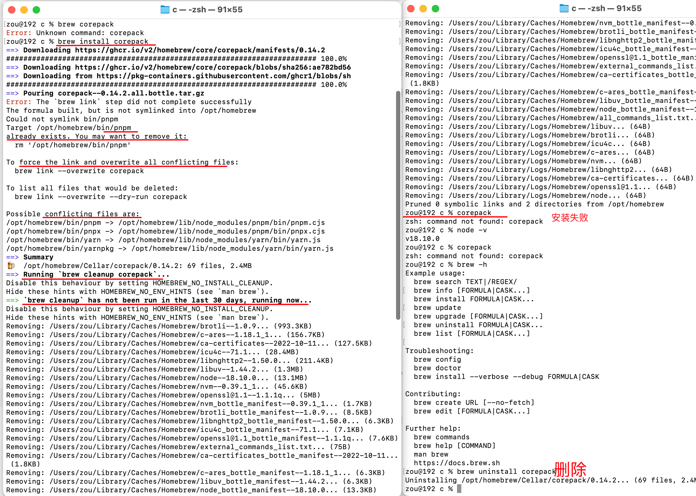

[toc]

# antfu contribution guide [#](https://github.com/antfu/contribute)

To set the repository up:

| Step                                                         | Command              |
| ------------------------------------------------------------ | -------------------- |
| 1. Install [Node.js](https://nodejs.org/), using the [latest LTS](https://nodejs.org/en/about/releases/) | -                    |
| 2. [Enable Corepack](https://github.com/antfu/contribute#corepack) | `corepack enable`    |
| 3. Install [`@antfu/ni`](https://github.com/antfu/ni)        | `npm i -g @antfu/ni` |
| 4. Install dependencies under the project root               | `ni`                 |

## Sending Pull Request

### Discuss First

在你开始处理一个功能拉取请求之前，最好先开**a feature request issue**，与维护者讨论是否需要这个功能以及这些功能的设计。这将有助于节省维护者和贡献者的时间，并帮助功能更快地被交付使用。

### Commit Convention

We use [Conventional Commits](https://www.conventionalcommits.org/) ([约定式提交](https://www.conventionalcommits.org/zh-hans/v1.0.0/))for commit messages, which allows the changelog to be auto-generated based on the commits. 

Only `fix:` and `feat:` will be presented in the changelog.

### Pull Request

If you don't know how to send a Pull Request, we recommend reading [the guide](https://docs.github.com/en/pull-requests/collaborating-with-pull-requests/proposing-changes-to-your-work-with-pull-requests/creating-a-pull-request).

When sending a pull request, make sure your **PR's title** also follows the [Commit Convention](https://github.com/antfu/contribute#commit-conventions).

If your PR **fixes or resolves an existing issue,** please add the following line in your PR description

```
fix #123
```

This will let GitHub know the issues are linked, and **automatically close them** once the PR gets merged. Learn more at [the guide](https://docs.github.com/en/issues/tracking-your-work-with-issues/linking-a-pull-request-to-an-issue#linking-a-pull-request-to-an-issue-using-a-keyword).

It's ok to have multiple commits in a single PR, you don't need to rebase or force push for your changes as we will use `Squash and Merge` to squash the commits into one commit when merging.


## Maintenance

This section is for maintainers with write access, or if you want to maintain your own forks.

### Update Dependencies

**Keeping dependencies up-to-date** is one of the important aspects to keep projects alive and getting latest bug fixes on time. We recommend to update dependencies in weekly or bi-weekly intervals(一两周更新一次).

We **use [`taze`](https://github.com/antfu/taze) to update the dependencies** manually most of the time. As deps updating bots like [Dependabot](https://github.com/dependabot) or [Renovate](https://renovatebot.com/) could be a bit annoying when you have a lot projects.

> 我们大部分时间都是用taze来手动更新依赖关系。
>
> 因为当你有很多项目时，像Dependabot或Renovate这样的依赖性更新机器人可能会有点烦人

With `taze`, you can run `taze major -Ir` to check and select the versions to update interactive. `-I` stands for `--interactive`, `-r` stands for `--recursive` for monorepo.

After bumpping, we install them, runing build and test to verify nothing breaks before pushing to main.


### Releasing

Before you do, make sure you have lastest git commit from upstream and all CI passes.

For most of the time, we do `nr release`. It will prompts a list for the target version you want to release. After select, it will bump your package.json and commit the changes with git tag, powered by [`bumpp`](https://github.com/antfu/bumpp).

There are two kinds of publishing setup, either of them are done by `nr release` already.

1. Build Locally

   For this type of setup, the building and publishing process is done on your local machine. Make sure you have your local [`npm` logged in](http://npm.github.io/installation-setup-docs/installing/logging-in-and-out.html) before doing that.

   > 对于这种类型的设置，构建和发布过程是在你的本地机器上完成的。在这之前，请确保你的本地npm已经登录了。

   In `package.json`, we usually have:`{  "scripts": {    "prepublishOnly": "nr build"  } }`

   So whenever you run `npm publish`, it will make sure you have the latest change in the distribution.

2. Build on CI

   For complex projects that take long time to build, we might move the building and publishing process to CI. So it doesn't block your local workflow.

   They will be triggered by the `v` prefixed git tag added by `bumpp`.  

   > 它们会被bumpp添加的v前缀的git标签所触发。

   The action is usually defined under `.github/workflows/release.yml`

   > When maintaining your own fork, you might need to see `NPM_TOKEN` secret to your repository for it to publish the packages.
   >
   > 当维护你自己的分叉时，你可能需要看到NPM_TOKEN秘密到你的仓库，以便它发布包。

3. 对于需要长时间构建的复杂项目，我们可能会将构建和发布过程转移到CI。所以它不会阻碍你的本地工作流程。

   它们会被bumpp添加的v前缀的git标签所触发。该动作通常定义在.github/workflows/release.yml下

   当维护你自己的分叉时，你可能需要看到NPM_TOKEN秘密到你的仓库，以便它发布包。

**Changelogs are always generated by GitHub Actions.**


### Corepack

TL;DR 要启用它，请运行

```
corepack enable
```

安装Node.js后，您只需要做一次。

```sh
macOS运行 corepack 报错了
zou@192 c % corepack enable
zsh: command not found: corepack
```


搜索相关的问题， [#1](https://stackoverflow.com/questions/70082424/command-not-found-corepack-when-installing-yarn-on-node-v17-0-1)

Because I had installed node via nvm (and I had installed nvm using Homebrew), the corepack command wasn't available. The fix that worked for me was to install corepack via homebrew by running:

> brew install corepack

After installing corepack via homebrew, I was able to run the `corepack enable` command from the terminal and the `yarn` command became available as well.



[#2](https://blog.clapcare.com/posts/corepack-enable-%E6%8F%90%E7%A4%BAcommand-not-found/#:~:text=npm%E5%AE%89%E8%A3%85corepack,install%20%2Dg%20corepack)

`npm install -g corepack`

yarn [文档](https://yarnpkg.com/getting-started/install#install-corepack)佐证


#### 什么是Corepack

当您运行相应的命令时，[Corepack](https://nodejs.org/api/corepack.html)确保您使用的是**软件包管理器**的正确版本。

> *[Corepack](https://github.com/nodejs/corepack)* is an experimental tool to help with managing versions of your package managers. It exposes binary proxies for each [supported package manager](https://nodejs.org/api/corepack.html#supported-package-managers) that, when called, will identify whatever package manager is configured for the current project, transparently install it if needed, and finally run it without requiring explicit user interactions.
>
> This feature simplifies two core workflows:
>
> - It eases new contributor onboarding, since they won't have to follow system-specific installation processes anymore just to have the package manager you want them to.
> - It allows you to ensure that everyone in your team will use exactly the package manager version you intend them to, without them having to manually synchronize it each time you need to make an update.
>
> [Corepack](https://nodejs.org/api/corepack.html#corepack)是一个实验性的工具，帮助管理你的软件包管理器的版本。它为每个支持的**包管理器**暴露了二进制代理，当被调用时，将识别为当前项目配置的任何包管理器，如果需要，透明地安装它，最后运行它，而不需要明确的用户交互。
>
> 这项功能简化了两个核心工作流程。
>
> - 它简化了新贡献者的入职，因为他们不必再为了拥有你想要的软件包管理器而遵循特定的系统安装过程。
>
> - 它允许你确保你的团队中的每个人都能准确地使用你希望他们使用的软件包管理器版本，而不需要他们在每次需要进行更新时手动同步。


#### ESLint & No Prettier

We use [ESLint](https://eslint.org/) for both linting and formatting with [`@antfu/eslint-config`](https://github.com/antfu/eslint-config).

> We recommend using [VS Code](https://code.visualstudio.com/) along with the [ESLint extension](https://marketplace.visualstudio.com/items?itemName=dbaeumer.vscode-eslint).

Since ESLint is already configured to format the code, there is no need to duplicate the functionality with Prettier ([*Why I don't Use Prettier*](https://antfu.me/posts/why-not-prettier)). 

### Anthony的个人配置和设置：

- [antfu/dotfiles ](https://github.com/antfu/dotfiles)- ZSH配置和其他dotfiles
- [antfu/vscode设置-](https://github.com/antfu/vscode-settings)VS代码设置
- [antfu/eslint-config ](https://github.com/antfu/eslint-config)- ESLint配置

### CLI工具

- [ni ](https://github.com/antfu/ni)- 软件包管理器别名

- [esno ](https://github.com/antfu/esno)- TypeScript runner

- [taze ](https://github.com/antfu/taze)- 依赖更新程序

  - [npm-check](https://github.com/dylang/npm-check): Check for outdated, incorrect, and unused dependencies.

  - [npm-check-udpates](https://github.com/raineorshine/npm-check-updates): Find newer versions of package dependencies than what your package.json allows

    它们都很好用，但有不同的侧重点和功能设置，也可以试试它们。

- [bumpp ](https://github.com/antfu/bumpp)- 版本 bumpper


# 约定式提交

约定式提交规范是一种基于提交信息的轻量级约定。 它提供了一组简单规则来创建清晰的提交历史； 这更有利于编写自动化工具。 通过在提交信息中描述功能、修复和破坏性变更， 使这种惯例与 [SemVer](http://semver.org/lang/zh-CN) 相互对应。

##  为什么使用约定式提交

- 自动化生成 **CHANGELOG**。
- 基于提交的类型，自动决定语义化的版本变更。
- 向同事、公众与其他利益关系者传达变化的性质。
- **触发构建和部署流程**。
- 让人们探索一个更加结构化的提交历史，以便降低对你的项目做出贡献的难度。

### 这和 SemVer 有什么关联呢？

- `fix` 类型提交应当对应到 `PATCH` 版本。
- `feat` 类型提交应该对应到 `MINOR` 版本。
- 带有 `BREAKING CHANGE` 的提交不管类型如何，都应该对应到 `MAJOR` 版本。

### 我对约定式提交做了形如 `@jameswomack/conventional-commit-spec` 的扩展，该如何版本化管理这些扩展呢？

我们推荐使用 SemVer 来发布你对于这个规范的扩展（并鼓励你创建这些扩展！）

# [Semantic Versioning 2.0.0](https://semver.org)

SemVer

### 摘要

给定一个版本号MAJOR.MINOR.PATCH，递增。

- 当你做出**不兼容**的API改变时，增加MAJOR版本

- 当你以向后兼容的方式添加功能时，MINOR版本。

- 当你进行向后兼容的错误**修复**时，PATCH版本。

  预发布和构建元数据的其他标签可作为MAJOR.MINOR.PATCH格式的扩展。
