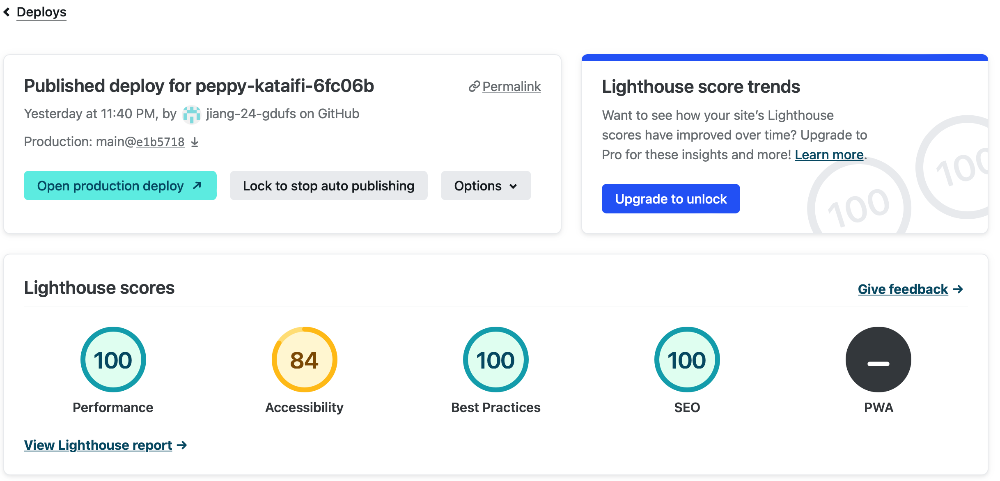
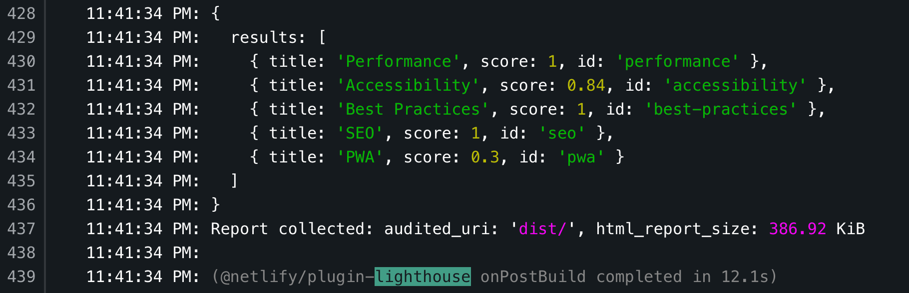
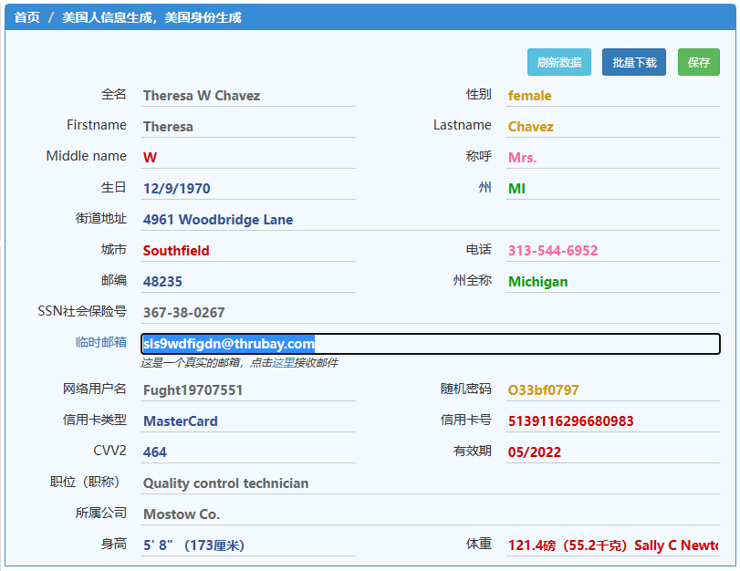
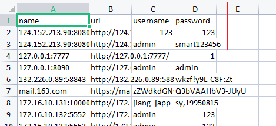

[toc]

### Netlify 集成插件

[integrations](https://app.netlify.com/teams/jiang-24-gdufs/integrations)

从 deploy 进入选中到最新的 action  -> **[lighthouse](https://docs.netlify.com/monitor-sites/lighthouse/)**:

lighthouse report

build 日志中也能看到结果

### [Two-factor authentication](https://app.netlify.com/user/security#two-factor-authentication)

启用双因素认证，为你的账户增加一个额外的安全层。

使用Authy、**1Password**、LastPass或Google Authenticator等应用程序，在提示时获得授权码。

netlify 可用启用2fa

1

> 看了这帖去下载了 Authy ，一打开应用就要手机号让我直接放弃。
> 一个 2FA 工具凭什么要我的手机号

2,3 是做密码管理的 顺便做了2fa

> 1password 面向的用户主要是 apple 平台。

> 两周前数据泄漏，源代码被盗，翻了下历史，这不是 LastPass 第一次出现安全问题

其他推荐：Microsoft Authenticator

> KeePass/LessPass/bitwarden 这么经济实惠

可以试试 bitwarden

### [如何在谷歌(Google)地图上找一个真实的美国地址](https://www.vpsdawanjia.com/2594.html)

> **五个美国免税州：**
>
> 蒙大拿州 Montana
> 俄勒冈州 Oregon
> 阿拉斯加州 Alaska
> 特拉华州 Delaware
> 新罕布什尔州 New Hampshire

美国地址一般由以下几个部分组成：

1. 道路地址
2. 城市
3. 州
4. 邮编

如：2390 Powell St，Apt 208，San Francisco, CA 94133, United States

道路地址一般是这样的格式：数字+街道名+房号，例如上面：2390 Powell St，Apt 208就是一个很典型的道路地址。街道名可以是 Street/Road/Drive/Lane/Highway，通常缩写为为 St/Rd/Dr/Ln/Hwy

#### 租房网站上找：[www.zillow.com](https://www.zillow.com/)

（Rent），Home Type选 Houses、Townhomes/Apartments/Condos/Coops

> 1800 Division Rd, Great Falls, MT 59404

### 美国地址生成器

**不要点、不要信网页中的任何广告**

**不要点、不要信网页中的短信验证**

**网址一：**https://www.shenfendaquan.com/

**网址二：**https://www.meiguodizhi.com/

**网址三：**http://www.haoweichi.com/

电话号码删掉开头的1

> 
>在美国地址生成器中输入免税州的英文名称，即可生成一份完整的信息。

### 注册一个非常稳定的美区 Apple ID

[【2023年】五分钟注册美区AppleID，手把手教，稳定且耐用！ - 知乎 (zhihu.com)](./appleId.html)

#### 购买充值美区Apple ID礼品卡

[手把手教你购买充值，美区Apple ID礼品卡 - 知乎 (zhihu.com)](./apple_gift_card.html)

### 如何在海量文件中检索?

### 普通购房者维权真的是难于上青天

[衿湖翠林-香港置地狼心狗肺 (xgzdcnm.com)](https://www.xgzdcnm.com/)

>  质量问题，精装房没有不坑的，不同楼盘区别只是坑多坑少。ZF 偏袒房企，业主维权难，整个行业都是摆烂的，所以说很大概率有坑
>
> 最近深圳万科业主也在为装修问题维权，精装房收费五千一平米实际装修成本在一千出头。从去年还未开售楼盘抗议到坐下来讨论花了半年时间，装修仍然问题多多，其中经历 jc 围住，防爆大巴把现场抗议业主们全拉走，各种铁拳压制把我买房的同事从爱国爱 dang 逼到骂 xjp
>
> 某楼盘维权的结果是
> 1.合法维权，结果被当猴耍，时间跨度半年
> 2.决定“非法维权”，上街拉横幅喊口号结果不到 10 分钟当场来了几百特勤，强制驱散+拘捕，事件平息后对出头的业主秋后算账+长期监控

### SingleFile 拷贝知乎文章到本地

1. 先下拉到最后
2. F12
3. 删除不需要的内容
   - 头部+封面图片
   - 底部: 点赞, 标签, 评论, 向上箭头
   - 侧边: 点赞, 分享按钮
4. 使用singlefile插件

>  Safari 的导出 PDF 功能太强了，其他浏览器望尘莫及

### 1Password免费半年

嫖半年的吧https://start.1password.com/sign-up/?c=SWITCH

导出浏览器的密码 `csv` 导入到 `1Password`

> 导入前可以先清掉没用的记录? 不清也行不影响

csv是一个固定表头的表格文档

### Vite PWA    

[github](https://github.com/vite-pwa/vite-plugin-pwa) : Zero-config PWA Framework-agnostic Plugin for Vite

### [程序员常见职业病列表](https://runatworld.gitbook.io/dev/qi-ta/cheng-xu-yuan-zhi-ye-bing)
