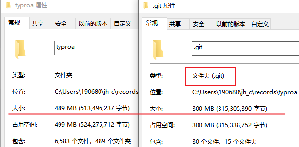

[toc]

### 如何将现有的.git文件夹大小降低

### 简历制作

[请问制作简历有什么推荐的平台么？ - V2EX](https://www.v2ex.com/t/917346)

> 过去一直用超级简历，但发现现在已经开始收费模式，并且不付费只能修改一份简历
>
> 超级简历现在已经变成一个招聘平台

### github 的语言历年统计

[Github Language Stats (madnight.github.io)](https://madnight.github.io/githut/#/pull_requests/2022/4)

可以关注 js/ts 的趋势

### [提前还款 计算器](https://finance.sina.com.cn/calc/house_early_repayment.html)

- [提前还贷计算器2022 - 提前还贷还款明细 - 房贷计算器 (baiozhuntuixing.com)](https://www.baiozhuntuixing.com/tiqian.aspx)
- 

### [Rijksstudio - Rijksmuseum](https://www.rijksmuseum.nl/en/rijksstudio)

荷兰国家博物馆
