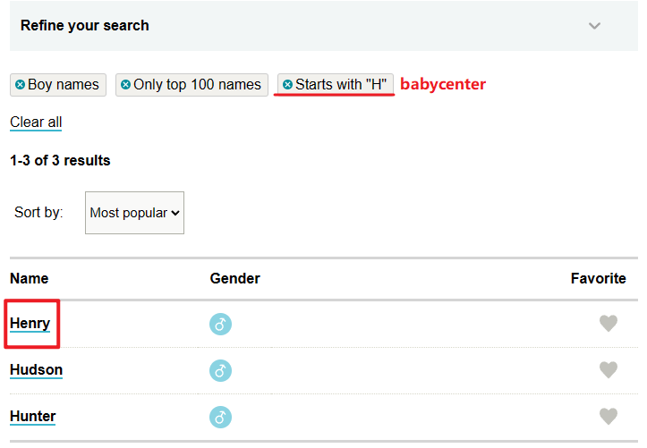

[toc]

### clay jd [[#]](https://clay-solutions.jobs.personio.com/job/736141?display=en)

来源: [荷兰阿姆工作机会 - V2EX](https://www.v2ex.com/t/917967)

##### WHAT YOU'LL DO

Working within the Clay software development team, you will be in close collaboration with other developers as well as our UX designer, translating design into optimal interfaces. Everything you create should be built with quality, consistency and usability in mind.

We’re looking for front-end developers with a strong vision on what makes a great application; experienced in understanding technical designs, managing timelines, specifications as well as coding and performance tuning standards.

##### YOUR PROFILE

- Great Javascript knowledge
- Excellent understanding of front-end web technology stack, e.g. HTML, CSS, session management and http headers.
- Experience in Agile/Scrum, good communication skills and the ability to work well in a team.
- Knowledge of working with REST APIs.
- Experience with SCSS compilers: Sass/Less.
- Good understanding of the JavaScript ecosystem, libraries, and tooling (ES6/7), **ReactJS** and Redux.
- Knowledge of **TypeScript**, React-query, Material UI, Cypress is a big plus.

### 一个Web3开发的入门历程

[一个Web3开发的入门历程 - 掘金 (juejin.cn)](https://juejin.cn/post/7138072108516507661)

> **学习路线**
>
> 1. 技术开发必看的一个视频：[北京大学肖臻老师《区块链技术与应用》公开课](https://www.bilibili.com/video/BV1Vt411X7JF%3Fspm_id_from%3D333.337.search-card.all.click%26vd_source%3D18908b447695a21e7cea62bec22e53f1), 看完了视频对于整个区块链技术有了基本的概念
> 2. 先看合约，毕竟他是Dapp的核心,感受一下这个语言，学习solidity入门我推荐[WTFSolidity](https://github.com/AmazingAng/WTFSolidity)，[崔眠大师](https://www.youtube.com/watch%3Fv%3DXlJwBTIps_I%26list%3DPLV16oVzL15MS-Zw8a3eEOADwbHhm8GrMp)，[理想区块链](https://www.youtube.com/watch%3Fv%3DVvnkBCTjt94%26list%3DPLfdytmZZ4Yl3hTfeROY-ptgbdcXg9Pybl%26index%3D70)，
> 3. 写一个简单demo来感受web3调用合约和web2调用api的不同
> 4. 看看一些成熟大项目了，[Uniswap](https://app.uniswap.org/%23/swap) ，[Pancakeswap](https://pancakeswap.finance/)，[Sushiswap](https://app.sushi.com/swap)
> 5. 其他路线参考: [郭宇的总结](https://guoyu.mirror.xyz/RD-xkpoxasAU7x5MIJmiCX4gll3Cs0pAd5iM258S1Ek)

**Solidity** 是一门合约编程语言

#### web3 jd

**海外**区块链web3.js 

DApp

#### Web3 公司有哪些职位？

Web3 中的职位与 Web2 类似，我尽量按照收入比例进行排序并介绍：

- VC：老板的老板，最容易赚钱的一帮人。什么都不干。
- founder/co-founder：老板，最容易赚钱的一帮人。什么都干。
- 开发者：薪资几乎最高的一帮人。写代码。
- 运营：薪资几乎最高的一帮人。市场、营销之类的事情。
- 产品：薪资第二阶梯。画图、写文档。
- 数分：薪资第二阶梯。不干正事。
- 开发者关系：薪资第三阶梯。写写文章、聊聊天、偶尔写写代码。
- 设计：薪资第三阶梯。画图。

具体做哪个岗位其实不是特别重要，能做到专家级别的话，钱都少不了。

#### Web3 公司都在做哪些业务？

我按优先级分为以下几类：

- VC：VC 永远是神。新 VC 有 a16z、HashKey Capital、蜻蜓、分布式，老 VC 有红衫、启明、BAI 等等。最难进，但含金量也最高。
- 交易所：交易所是食物链最顶端。其中最好的是币安，币安目前的地位就像是云中的 Amazon、搜索引擎中的 Google；其次是 Coinbase 和 OK 这些。但像火币这种就有点坑了。如果能去交易所，那和互联网中曾经的 BAT 差不多，都属于大厂行列。
- 公链：公链属于基础设施，是仅次于交易所的存在。最大的公链有 ETH、TRON 和 EOS。国内也有一些大公链，比如 IOST、Steem 等。如果你能去上面提到的这些公司工作，那就像是在 Web2 中去阿里、京东、字节这些大厂工作差不多。
- 做市商：做市商和交易所生生相息，所以依托交易所的光明前途，做市商也是一个非常不错的领域。
- NFT 交易所：其实和交易所类似，但交易的主体不是传统加密币，而是 NFT。虽然不如交易所规模大，但还是有相当不小的潜力。一些具有代表性的大公司有 Opensea、Nifty Gateway、VIV3 等。
- 钱包：作为每个人都需要的加密钱包，前途自然不差。具有代表性的有 paxos、ledger、metamask 等。
- 链游：链游虽然非常有前途，但从 2021 到 2022 的数据变化上看，用户增长比较乏力。所以我认为和上面的几个业务领域相比较，链游属于垫底了。
- DID：如果未来 Web3 社交真正火起来的话，DID 绝对不可限量。但现在 DID 还没办法和上面这些相对成熟的领域去比。
- 创业：自己开盘子，或者给开盘子的老板打工。可能是上述业务领域中的一种，也可能是老板自称是他自创的模式。但无论如何都比不上上述的几个赛道。如果是给人打工，那就尽量谈现金，别谈期权。因为创业公司非常依赖项目，而 **Web3 项目出了名的不稳定**，指不定干几个月公司就凉了，而你的期权啥的估计都锁到 N 年后了，纯属画大饼。**虽然这一类垫底，但这一类也是我们最容易接触的一类**。

#### 怎么找 Web3 工作？

英语不好的同学，去猎聘、Boss、朋友圈。但国内薪资优势没那么大。只能比同等要求的 Web2 多出 1/3 到 1/2 的样子。

英语好的同学，可选择性太多了，比如 [remote3](https://link.juejin.cn?target=https%3A%2F%2Fremote3.co%2F)、[web3.career](https://link.juejin.cn?target=https%3A%2F%2Fweb3.career%2F)、[cryptorecruit](https://link.juejin.cn?target=https%3A%2F%2Fwww.cryptorecruit.com%2F) 等等。这里有很多年薪 100k 美刀+、甚至 200k 美刀+ 的岗位。如果你的要求更高，想要 300k、400k 的年薪，那只能去一些头部 VC 了。

由此可见，英语是多么地重要，英语不好的同学赶紧加油学英语吧。

> 这里顺便推荐大家一些找Web3工作的平台：[abetterweb3](https://link.juejin.cn/?target=https%3A%2F%2Fabetterweb3.notion.site%2Fdaa095830b624e96af46de63fb9771b9), [cryptocurrencyjobs](https://link.juejin.cn/?target=https%3A%2F%2Fcryptocurrencyjobs.co%2F), [电鸭](https://link.juejin.cn/?target=https%3A%2F%2Feleduck.com%2F), [remote3](https://link.juejin.cn/?target=https%3A%2F%2Fremote3.co%2F), [web3Career](https://link.juejin.cn/?target=https%3A%2F%2Fweb3.career%2F).
>
> 公链只能国外了吧

#### Web3 项目怎么赚钱？

其实我在之前的文章中有提到，Web3 实际上没有什么普遍意义上的价值。

所以 Web3 的项目只有两个方向赚钱。一是向上赚投资人的钱，二是向下赚韭菜的钱。

### Web3远程开发的年终总结

[Web3远程开发的年终(2023)总结 - 掘金 (juejin.cn)](https://juejin.cn/post/7187272999546912828)

### [alchemy](https://www.alchemy.com/)

The web3 development platform

The most powerful set of **web3 development tools** to build and scale your **dApp** with ease.

### [Omegle: Talk to strangers!](https://www.omegle.com/#)

## English 4 Developers

[English4Developers/README.md at main · eleduck/English4Developers (github.com)](https://github.com/eleduck/English4Developers/blob/main/README.md)

### 如何起一个英文名

[English4开发人员/如何挑选英语 name.md 在主·eleduck/English4开发者 (github.com)](https://github.com/eleduck/English4Developers/blob/main/How-to-pick-an-English-name.md)

原因:

1. 说英语的人可能很难正确发音你的名字
2. 觉得有一个英文名字很酷
3. 英语学习者

以下是查找英文名称的一些步骤。

步骤1： 转到这两个很棒的婴儿名字查找器：

1. https://www.babycenter.com/baby-names
2. https://www.mamanatural.com/baby-names/

两者都是我发现有用的名称查找器。它们允许您按性别、来源、含义或首字母搜索姓名。Babycenter.com 甚至还有名称类别，您可以“按主题浏览”。如果您正在寻找更“老式”、“经典”、“性别中立”或“流行名称的替代品”的东西。试一试。

第 2 步：列出您喜欢的名字。它们在你的姓氏之前听起来好听吗？

第 3 步：在做出决定之前，请询问英语老师或以英语为母语的人的意见。他们应该能够告诉您如何发音，以及它是否在您的姓氏旁边听起来不错。

第 4 步：每当进行英语对话并尝试您的新文化身份时，请自豪地使用您的新英文名称。

### 海外都是招聘 react/react-native 居多

Vue在国内玩玩

内推邮箱: long2ice@gmail.com, 不知道还需要吗

> [v](https://v2ex.com/t/843215#;)
>
> **看到了远程招聘的帖子，投简历，线上三轮面试，然后成功入职**，另外有想找我内推的可以私我，Python 、go 、前后端都有。然后平时工作的话每天都有早会，同时工作内容，早会完了就自己去做上级分配的任务，然后自己按时完成就行。
>
> ↑ 上面是邮箱

> [[硅谷外企\] [核心业务] [业内 top1] [支持远程] 前/后端工程师 +期权+双休+4 周年假 - V2EX](https://v2ex.com/t/905502#reply4)
>
> [Jerry.ai](http://jerry.ai/) 
>
> 工作职责： 1 、参与产品设计、开发、测试、部署、维护，为改进产品提供技术反馈和建议 2 、负责技术方案的整理和实践，以及文档化产出，主导项目落地，推动 3 、合理安排各个项目的优先顺序，确保项目按期完成并实现目标成果
>
> 我们需要这样的你: 1 、3 年+相关软件开发经验，本科及以上学历，计算机，软件工程相关专业，具备扎实的软件开发基础知识 2 、熟悉现代 javascript (ES6+: Classes, modules, arrow functions, async/await, destructuring, etc.). 3 、熟悉 javascript 工具链以及常用的库 4 、了解 javascript 的最佳实践和一些常用的设计模式，具备编写高效简洁的 javascript 代码 5 、熟悉 Web 前端框架，如 React.js, Vue.js 等 6 、了解服务器端渲染技术，以及 React Native 移动端开发 7 、能编写和维护规范的测试集，有维护和管理大型代码 repo 的相关经验并且知道如何维护 repo 对代码的性能和可扩展性有深刻的理解 8 、有代码洁癖，对代码精益求精，对技术有极客热情
>
> 加分项目： 1 、熟练运用 React Native, GraphQL 以及 Apollo 2 、有写技术 Blog 的习惯，活跃技术社区，参与开源项目等

### 美国联邦调查局和货币监理署（OCC）正在进行一项 "严厉 "的行动，以取消加密货币银行
