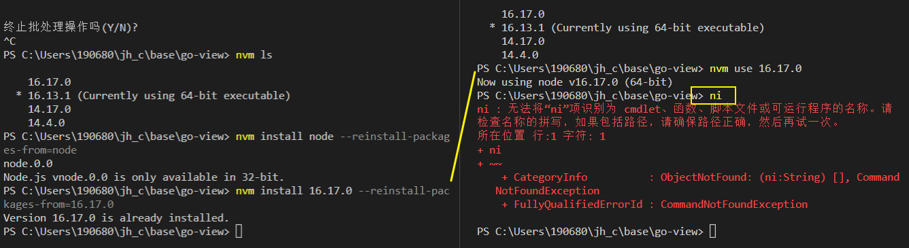
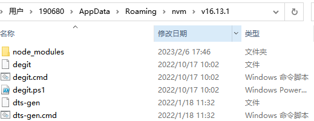

[toc]

### 开发者网站

[daily.dev | The Homepage Developers Deserve](https://app.daily.dev/)

[创建您的获奖简历 - （免费）简历制作工具 ·Resume.io](https://resume.io/)


### 如何在nvm切换后仍然保留全局安装的依赖

如`pnpm` `nrm` `ni`等..


每个 node 版本都是独立的，**全局安装的 npm 包也互相独立**。
你可以在安装别的版本的时候使用这个参数 `--reinstall-packages-from=current`，它会把当前 node 版本安装的全局 npm 包一并安装到新版本 node 环境里

```bash
nvm install --lts --reinstall-packages-from=current
```


[安装时迁移全局包](https://github.com/nvm-sh/nvm#migrating-global-packages-while-installing)

If you want to install a new version of Node.js and migrate npm packages from a previous version:

```
nvm install node --reinstall-packages-from=node
```

This will first use "nvm version node" to identify the current version you're migrating packages from. Then it resolves the new version to install from the remote server and installs it. Lastly, it runs "nvm reinstall-packages" to reinstall the npm packages from your prior version of Node to the new one.

> 这将首先使用 "nvm version node "来识别你要迁移软件包的当前版本。然后，它从远程服务器上解析要安装的新版本并进行安装。最后，它运行 "nvm reinstall-packages "来重新安装npm包，从你之前的Node版本到新版本

You can also install and migrate npm packages from specific versions of Node like this:

`nvm install 新版本号 --reinstall-packages-from=旧版本号`

```bash
nvm install 6 --reinstall-packages-from=5 // version new from version old
nvm install v4.2 --reinstall-packages-from=iojs
```



当前情况:

> windows: A版本安装依赖的全局依赖会存储于 `nvm/A/`
>
> 
>
> 使用reinstall安装B版本后并没有把这些全局的包拷贝到B路径下, 导致无法使用


nvm 切换后连npm命令都出错

> ```
> npm@8.12.1 C:\Users\190680\AppData\Roaming\nvm\v18.5.0\node_modules\npm   
> PS C:\Users\190680\jh_c\base\go-view> npm ls -g
> npm ERR! Unexpected token '.'
> 
> npm ERR! A complete log of this run can be found in:
> npm ERR!     C:\Users\190680\AppData\Local\npm-cache\_logs\2023-02-23T10_21_06_085Z-debug-0.log
> ```
>
> ??

#### *npm* 查看*全局*安装过的包命令：*npm* list -g 

