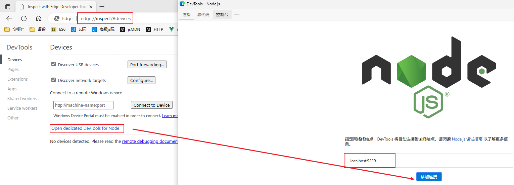
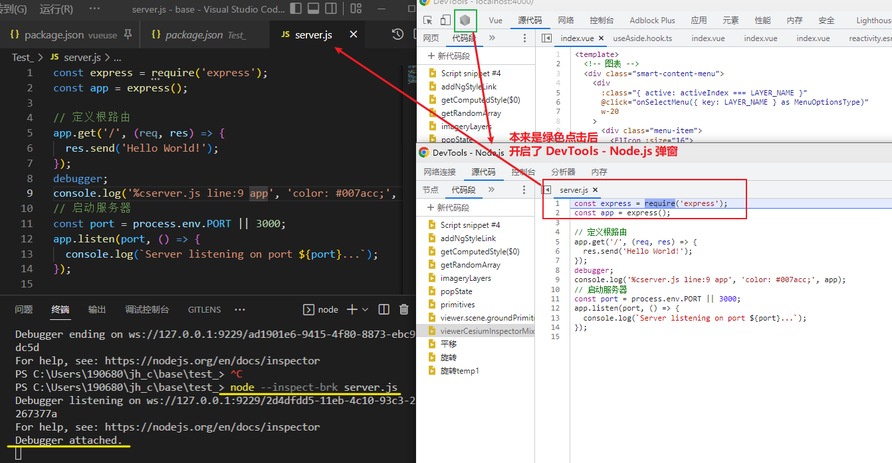
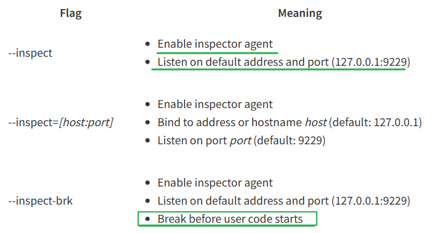
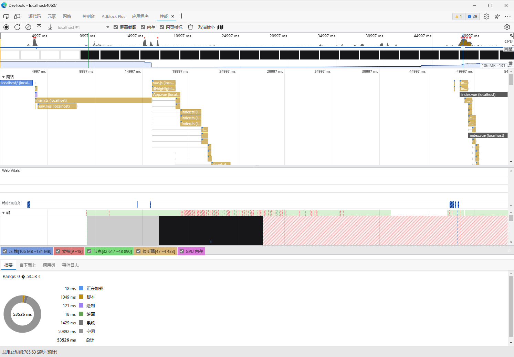
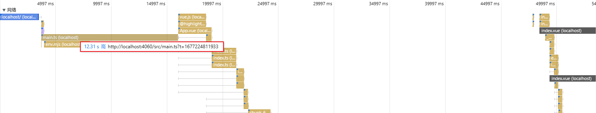

[toc]

### [动手写编译器：互动讲解](https://citw.dev/tutorial/create-your-own-compiler)

we'll be doing an instructed walkthrough of [Jamie Kyle's](https://jamie.build/) ["The Super Tiny Compiler"](https://github.com/jamiebuilds/the-super-tiny-compiler). The Super Tiny Compiler is a simple compiler written in Javascript and we'll write it step by step from scratch.


### [言论](http://www.ruanyifeng.com/blog/2022/02/weekly-issue-196.html#:~:text=%E5%8C%BA%E5%9D%97%E9%93%BE%E7%9A%84,%E4%B9%8B%E5%A4%96%E7%9A%84%E4%BA%A7%E5%93%81%E3%80%82)

区块链的第一个炒作高峰，出现在2017年，区块链公司通过 ICO 筹集了数亿美元。四年后的现在又是一个炒作高峰，现在的主角是 NFT 和 Web3。

但是这些年，除了交易和资金本身，并没有诞生任何一个可以在日常生活使用的案例。区块链听起来很有趣，但还从未能用于区块链领域之外的产品。


911事件后，**中央情报局**想了很多办法寻找本拉登。其中的一个计划是，**在巴基斯坦推广乙肝疫苗接种，实际上在收集 DNA 样本**，试图发现本拉登的家人。该计划最后一无所获。


### 如何看待日媒报道「韩国家庭 8.9 年收入才能买房」，称「此或是韩国出生率新低原因之一」？

韩国统计厅就出生率下降的原因解释说：“产生影响的因素是结婚人数减少”。结婚人数在新冠病毒流行的2020和2021年两年同比减少近10％。2022年的韩国结婚人数为19万1千对，同比减少0.4％。

由于昂贵的房价和激烈的教育竞争，年轻人对结婚犹豫不决的风潮不断扩大。

韩国的房价在过去5年里平均上涨了8成。

韩国统计厅的另一项调查显示，没有配偶的30多岁人群的占比达到42.5％，比10年前上升了13.3个百分点。

> 韩国家庭 8.9 年收入才能买房，或是韩国出生率新低原因之一；
>
> 日本家庭6.8年收入才能买房，阻碍生育；
>
> 北京、上海等多个热点城市楼市超预期升温；


### [房贷](https://www.zhihu.com/question/403394926/answer/2904279885#:~:text=%E8%AE%A9%E4%B8%80%E4%BA%9B%E5%B9%B4%E8%BD%BB,%E5%87%BA%E6%9D%A5%EF%BC%8C%E4%B8%8D%E8%A2%AB%E9%87%8D%E8%A7%86%EF%BC%9B)让**一些**年轻人学到了很多**新知识**：

- 一个人一生赚的钱也没有多少，一年20w，50年也才1000w；
- 如果你生对了家庭，1000w 出生的时候就有了；
- 如果工作的意义就是活着，也没必要太拼命；
- 多给自己一些休闲的时间，下班了回家打游戏、喝酒、出门玩都挺好的；
- 房子是可以不买的，租的房子也能住；
- 能遇到一个理想中的爱人的概率很小，大多数人都是互相凑合罢了，所以遇不到也没关系；
- 结婚不是必要的
- 生孩子也不是必要的；
- 不要担心老了怎么办，因为担心也没有用；噢，大概率养孩子也没用；
- 那些天天打着为你好旗号的专家，大概率自己也不懂，只是打算赚你点钱，或者借你赚流量；
- 工作是工作，生活是生活，胡说八道也没啥关系；
- 个人对于国家对于社会很渺小，但是对于家庭和自己来说很重要；
- 首先要爱自己，有余力的爱你的另一半、父母和兄弟姐妹；
- 每个人都不喜欢听真实的话，但是绝大多数人都不会承认；
- 每个人都有表达自己的真实想法的欲望，但只有小孩子才会天真地表达出来，不被重视；


### [拜登曾提「毁灭台湾计划」](https://www.zhihu.com/question/585755663)

美军是**把台湾变成福岛和切尔诺贝利**，用核灾难彻底摧毁台湾岛乃至整个东亚的生态系统。从美国在北溪管道爆破事件中展现出的极低的道德水平和为达到目的不择手段的情况来看，相关的计划很有可能已经拟定好了，就像21年的时候炸掉北溪管道的计划已经制定好了一样。


### [美国 5 名环境顾问前往俄亥俄州时坠机身亡](https://www.zhihu.com/question/585750273)

飞机计划飞往俄亥俄州哥伦布市，以应对当地金属制造厂发生的爆炸事故。飞机上每个人包括飞行员在内，都在毒理学和环境健康部门工作。

1、1996年4月3日，一架美军的波音军用飞机于克罗地亚执行任务时，失事坠毁于距离杜布罗夫尼克机场北部约3公里外的山区。机上34人死亡，其中包括当时的美国商务部长罗纳德·布朗。

诡异的是这架飞机居然没有设置飞行纪录仪及驾驶舱通话记录器，也就是所谓的黑匣子。

所以这件事背后到底是阴谋还是意外，没人知道。。。

2、特朗普执政时期曾经查过五角大楼的账，查的结果自然是一塌糊涂，后来第五舰队的司令斯蒂尔尼中将突然死亡，美国海军调查的结果是自杀。

原本五角大楼以为这事就这么过去了，毕竟该给特朗普的面子都给了，结果特朗普又动手查起了阿富汗美军的账单，还专门派了一个审计小组去阿富汗进行审计，结果飞机失事，没留下一个活口，至此特朗普再也不提查账的事了。

3、俄亥俄州的这件事是否与之前的事情异曲同工，不得而知……比起美国之前背后中六枪自杀的手段来说，这种手段还能算得上“光明磊落”的。

虽然这5人是去调查俄亥俄一个钢铁厂的事故，但是这个钢铁厂的事故远远没有到杀人灭口的程度，所以钢铁厂的嫌疑并不大。

作为政府官员，谁知道他们会不会“顺便”调查一下脱轨事故导致的环境问题这很难说了，即便他们真的是去调查钢铁厂问题的，但是架不住有些人风声鹤唳，先下手为强。。。

> 这次出事五人所属的公司，与调查评估俄亥俄火车出轨泄露氯乙烯的公司是同一家环保公司


### Node.js 调试

> [都给我学！这个巨好用](https://twitter.com/Shenqingchuan/status/1628924825455706112)

[Debugging Node.js, The Right Way](https://www.builder.io/blog/debug-nodejs)

[nodejs.org debugging guide](https://nodejs.org/zh-cn/docs/guides/debugging-getting-started/)

> [video tutorial](https://cdn.builder.io/o/assets%2FYJIGb4i01jvw0SRdL5Bt%2F4df0c7eeb0bf4e1ebd371d4c907239cd%2Fcompressed?apiKey=YJIGb4i01jvw0SRdL5Bt&token=4df0c7eeb0bf4e1ebd371d4c907239cd&alt=media&optimized=true)

**First**, you need to launch your node.js process using the `--inspect-brk` flag.

For instance, with `node`:

```bash
node server.js --inspect-brk
```

Or `yarn`:

```bash
yarn test --inspect-brk
```

Or `npm`

```bash
npm start -- --inspect-brk
```

Now, open up any Edge or Chrome dev tools window and click this little green Node.js logo button:


> [Help! I can’t find that button](https://www.builder.io/blog/debug-nodejs#help-i-cant-find-that-button)
>
> If the Node.js icon isn’t there in DevTools:
>
> - Go to the [chrome://inspect](https://www.notion.so/Chrome-extension-b2f7b155018f42899ed99efd5237dd9c) url.
> - Click **Open dedicated DevTools for Node**.
> - Go to **Connection** tab
> - Click **Add Connection**.
> - Add a connection to match the port that **node is listening on**; for example, `localhost:9229`.
>
> 


debugger 一个 express server.js (由chatGPT提供)




> --inspect和--inspect-brk的区别是什么？
>
> 
>
> --inspect-brk在node**启动时立即暂停执行**，而-inspect在遇到debugger时暂停执行，并且有一个附加调试器。
>
> 我通常更喜欢 --inspect-brk，因为它让我有时间附加调试器，而如果**只使用 --inspect，在我有机会附加Chrome DevTools之前，执行可能就已经结束**了。


#### [debugging-direclty-in-vs-code](https://www.builder.io/blog/debug-nodejs#debugging-direclty-in-vs-code)


### [builder.io blogs](https://www.builder.io/blog?_host=www.builder.io)


### [ast-grep](https://github.com/ast-grep/ast-grep)

**ast-grep(sg) 是一种快速且用户友好的工具，用于大规模代码搜索、linting 和重写。**

> [t ](https://twitter.com/Shenqingchuan/status/1628816027932037120) 真的要再次强烈推荐 ast-Grep 这个库, 真的在扫描代码、读取关键信息时超级棒！
>
> 我最近还拿它做 esbuild 插件里的一些代码改写，除了需要配合 line、col 来计算出 offset 交给 magic-string 略 weird 和勉强以外（老罗名言：又不是不能用！） 整体！如丝般顺滑！性能超棒！


### smart-charts

请求巨慢, [chat](../chat.openai/~20230224)



请求一个资源怎么要12s?



#### Vite慢在哪

用了一段时间Vite之后, 开发时确实很快, 体验很棒, 但美中不足的是Vite开发服务器**冷启动**和**启动后第一次加载页面**的速度还有待提高。

这里需要区分一下:
 冷启动是指项目启动开发服务器时, `node_module/.vite`下没有任何之前的预构建文件, 这一般是项目**第一次**启动, 或项目通过`server.force`启动, 也可能是你手动删除了`node_module/.vite`之后启动, 此时Vite需要扫描项目的依赖并使用esbuild对这些依赖进行预构建[NPM Dependency Resolving and Pre-Bundling](https://link.juejin.cn?target=https%3A%2F%2Fvitejs.dev%2Fguide%2Ffeatures.html%23npm-dependency-resolving-and-pre-bundling)

而启动后第一次加载页面则是每次开发服务器启动都会发生, 这时浏览器需要加载当前页面用到的所有文件, 没有缓存。

作者：pitun
链接：https://juejin.cn/post/7066005929049161736
来源：稀土掘金
著作权归作者所有。商业转载请联系作者获得授权，非商业转载请注明出处。

### 浏览器请求过多

至于浏览器请求过多, 因为Vite在开发时不进行打包嘛, 随着项目的增长, 虽然有预构建可以把依赖预先打包(否则一个lodash就上百个请求了), 但`src`下项目内的文件可能也会越来越多, 比如在我们的一个项目中, 首屏加载需要用到800多个文件(当然, 这里我们也有很大的问题, 后面会提到), 这些文件会在加载页面时一次性请求进来, 每一个文件都需要一个完整的GET请求, 加之开发服务器如果使用了HTTP1.1, 并行的http连接还会有限制(chrome下同一个主机名同时最多6个连接), 这就很易造成网络堵塞了。

关于这点, 尤大也提到过[Persistent Cache](https://link.juejin.cn?target=https%3A%2F%2Fgithub.com%2Fvitejs%2Fvite%2Fissues%2F1309), 他的解决方案是在服务器关闭的时候把内存中的转换缓存到磁盘上, 在下一次服务器启动时再读取并`hydrate`到模块图中, 这样可以使开发服务器在重启后就能发送304请求来使浏览器使用缓存。

到目前这个问题还在讨论中, 而在Vite实施这个特性之前, 我们也使用了一些方法来减少浏览器请求， 优化加载速度。

作者：pitun
链接：https://juejin.cn/post/7066005929049161736
来源：稀土掘金
著作权归作者所有。商业转载请联系作者获得授权，非商业转载请注明出处。


### 频繁刷新的原因

[sxzz](https://github.com/vitejs/vite/issues/5419#issuecomment-951260501) [reproduction](https://github.com/vitejs/vite/issues/5419#issuecomment-1165562818)

> Chinese: 在某些库中，需要频繁地加载不同路径下的文件。每次预编译都会刷新页面。所以需要把可能要用到的所有文件都在启动时预编译。因此我想应该支持 glob 来更便捷地添加可能需要的文件。

> [vite-讨论](https://github.com/vitejs/vite/discussions/8721#discussioncomment-3002791)
