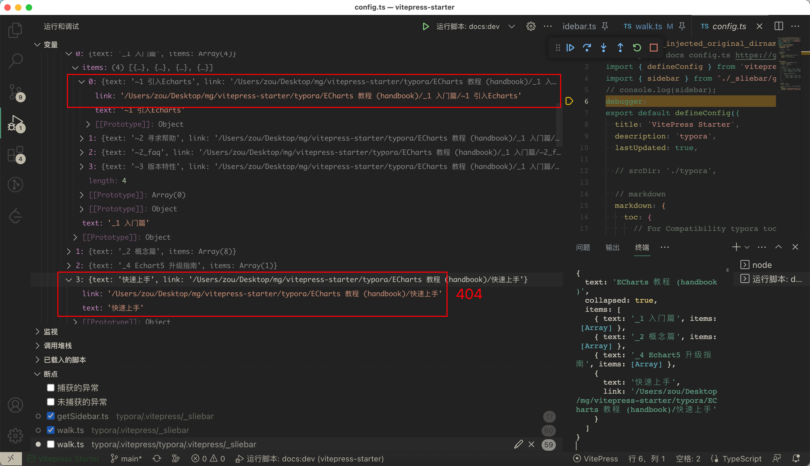

[toc]

### vitepress sidebar item link

1. '/Users/zou/Desktop/mg/vitepress-starter/typora/ECharts 教程 (handbook)/_1 入门篇/~1 引入Echarts'
2. '/Users/zou/Desktop/mg/vitepress-starter/typora/ECharts 教程 (handbook)/快速上手'

什么原因

### [购买 BTC 有哪些靠谱的渠道？ - V2EX](https://www.v2ex.com/t/919214)

> 炒币平台用下面链接下载，获得高佣金返利，最高 80%
> 推荐全球最大的现货合约平台。
> 币安 binance 安装： https://www.binancezh.top/zh-CN/activity/referral-entry/CPA?fromActivityPage=true&ref=CPA_00Z1G962LD
> 火币 huobi 安装： https://www.huobi.com/zh-cn/v/register/double-invite/?invite_code=jwvb7223&inviter_id=11345710
> 欧易 okx 安装： https://okx.com/join/94255056
> gate 比特儿： https://www.gate.ac/signup/13048744
> coinbase： https://coinbase.com/join/e9pwa3?src=ios-link
> Bitfinex 安装： https://www.bitfinex.com/sign-up?refcode=7QS_QcWJn
> kucion 安装： https://www.bitfinex.com/sign-up?refcode=7QS_QcWJn
> bitget: https://www.kucoin.com/r/rf/rMEP6G9
> bittrex： https://bittrex.com/Account/Register?referralCode=MTK-0Q2-DQZ
> bybit : https://www.bybit.com/invite?ref=ZRYOOJ
> polonixe： https://poloniex.com/signup?c=
>
> 另外实名制是免不了的
>
>  localbitcoins 要关门了

#### [在国内如何购买比特币和投资加密货币（2023 年最新） - BAI YUN](https://baiyun.me/buy-bitcoin-in-china)

### 面试的一些推荐

来源: [v](https://www.v2ex.com/t/919283)

关于面试我认为下面的材料很大程度帮到过我，所以也会推荐给在看本文的你，或者要求职的同学。

**USENIX**：https://www.usenix.org/conferences

> 如果想树立一些属于自己的亮点，一个捷径是了解面试官不懂的知识~~（不是）~~。关心前沿的学术和工业论文非常简单有效，USENIX 上覆盖了很多基础方向，例如计算机网络、操作系统、存储、分布式、安全，以及按职能划分的 SRE 等等。除了 USENIX 上的以外，如果有你关注方向的其他顶会那当然也是可以的，例如我以前会去看看 VLDB 和 SIGMOD 上的论文了解 KV 存储的一些新知识和研究方向。

**操作系统导论**：https://book.douban.com/subject/33463930/

> 一本很有意思的操作系统的入门书，可以写写里面代码了解一下 Linux 的 API ，对于进程和内存相关的讲解让我印象非常深刻。

### [Glob support in optimizeDeps.include · Issue #5419 · vitejs/vite (github.com)](https://github.com/vitejs/vite/issues/5419)

### [Stop reloading the browser upon optimizeDeps changes? · Discussion #8721 · vitejs/vite (github.com)](https://github.com/vitejs/vite/discussions/8721#discussioncomment-3002791)

####  vite 浏览器刷新问题

https://github.com/vitejs/vite/discussions/8721#discussioncomment-3013747

> 如果你有A，B优化后产生了A?v=1和B?v=1，然后发现C与A有共同之处，当你运行esbuild将A、B、C一起优化时，你最终会得到A?v=2、B?v=1、C?v=1和chunkAC。你在浏览器中的文件都在导入A?v=1，现在它们需要导入A?v=2，所以需要重新加载。
>
> 在2.8中，即使C没有任何共同点，也会有一次重载。从2.9开始，如果C没有修改A和B，那么就可以避免重载。
>
> 依赖关系需要被完全优化，因为它们共享代码

### 为什么 vite有些时候不用刷新页面就可以优化dep，而有些时候却必须刷新页面。

> [Stop reloading the browser upon optimizeDeps changes? · Discussion #8721 · vitejs/vite (github.com)](https://github.com/vitejs/vite/discussions/8721)
>
> https://github.com/vitejs/vite/issues/5419#issuecomment-1167074401

### 英语短语意思

IIUC - If I Understand correctly

POC - *proof of concept* (*POC*) 
