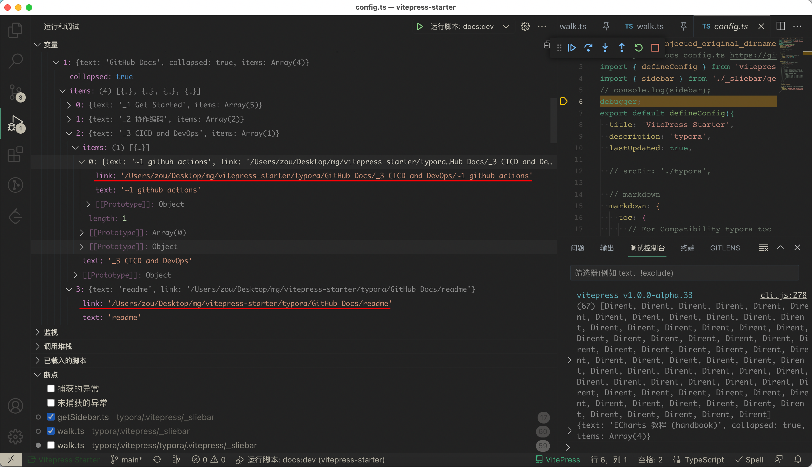
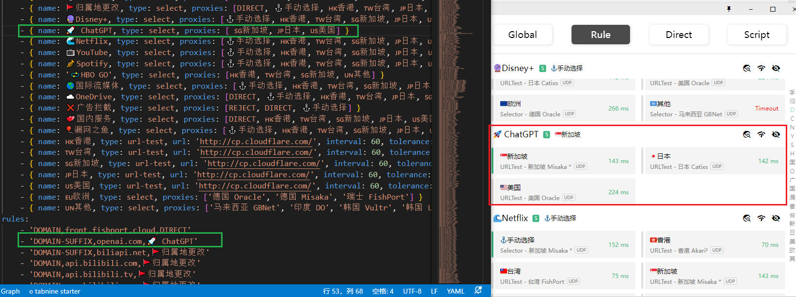
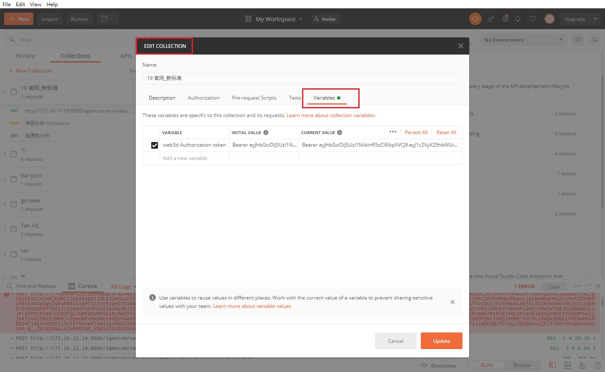
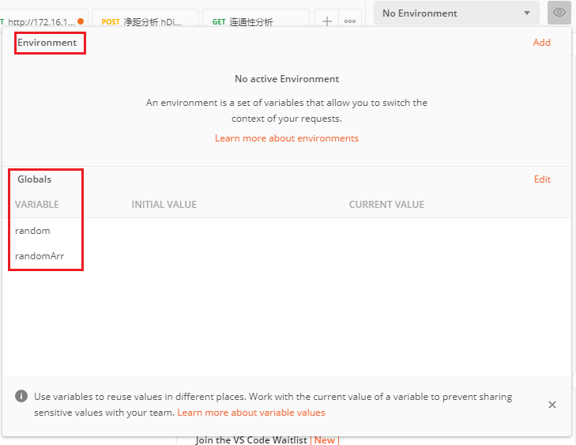

[toc]

### 续昨日的 vitepress sidebar 

另一个嵌套目录可以正确读取



1. '/Users/zou/Desktop/mg/vitepress-starter/typora/GitHub Docs/_3 CICD and DevOps/~1 github actions'
2. '/Users/zou/Desktop/mg/vitepress-starter/typora/GitHub Docs/readme'

正常的，那个文档是空的..

#### No language registration for CXX

````CXX` CXX在vitepress中未注册


### chatGPT 官网没问几个问题就 error 了，又要重刷页面，有没好办法解决

用客户端 体验好多了 https://github.com/lencx/ChatGPT

[关于在中国地区使用的问题汇总 · Issue #83 · lencx/ChatGPT (github.com)](https://github.com/lencx/ChatGPT/issues/83)

> 关于APP内置代理的问题，到是有一个迂回的方案，直接在clash上走规则代理
> `DOMAIN-SUFFIX,openai.com,🚀 ChatGPT`


### clash 添加规则



SG 在这个chatGPT客户端不行? 使用Jp进去了


### github copilot

settings - billing and plan

> **Add-ons**
>
> GitHub Copilot  Your AI powered pair programmer
>
> Your free trial expires in 60 days
>
> You'll be billed **$100.00/year** after the trial ends on **Apr 28,** 2023. Cancel anytime.

**deactive copilot** 安装了插件怎么判断是否正确启用,

 在账户中登录, 通知栏上有小图标就开启了

> 1. 在您的代码编辑器中，输入代码并使用快捷键（默认情况下是 Alt + /），或者在您的编辑器菜单中选择“Copilot: Generate line of code”来调用 Copilot。
> 2. Copilot 将分析您的代码并根据上下文提供代码建议。您可以选择其中一个建议并按下 Enter 键，或者使用 Tab 键或方向键来浏览其他建议。
> 3. 如果您觉得 Copilot 提供的建议不合适，可以使用 Esc 键或者点击其他区域来关闭建议框。


> 1. 使用注释生成
> 2. ctrl + enter 打开 Copilot面板,  修改为 ctrl + g + c


### postman 添加变量

- 集合变量

  

- 环境变量

- 全局变量

  

- 
