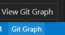
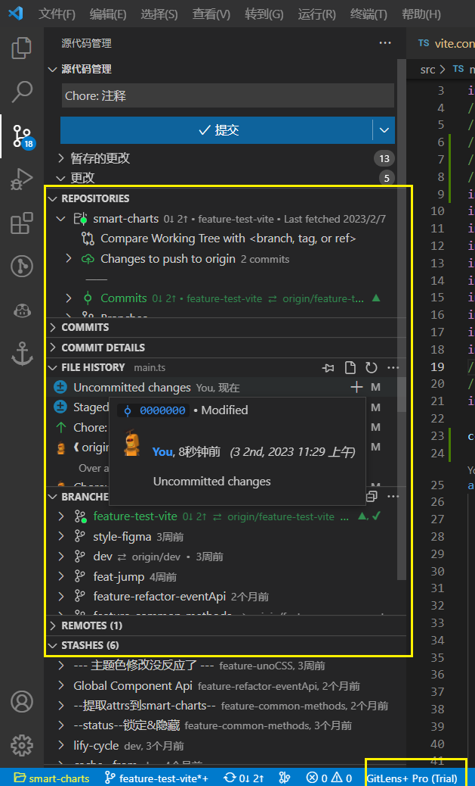
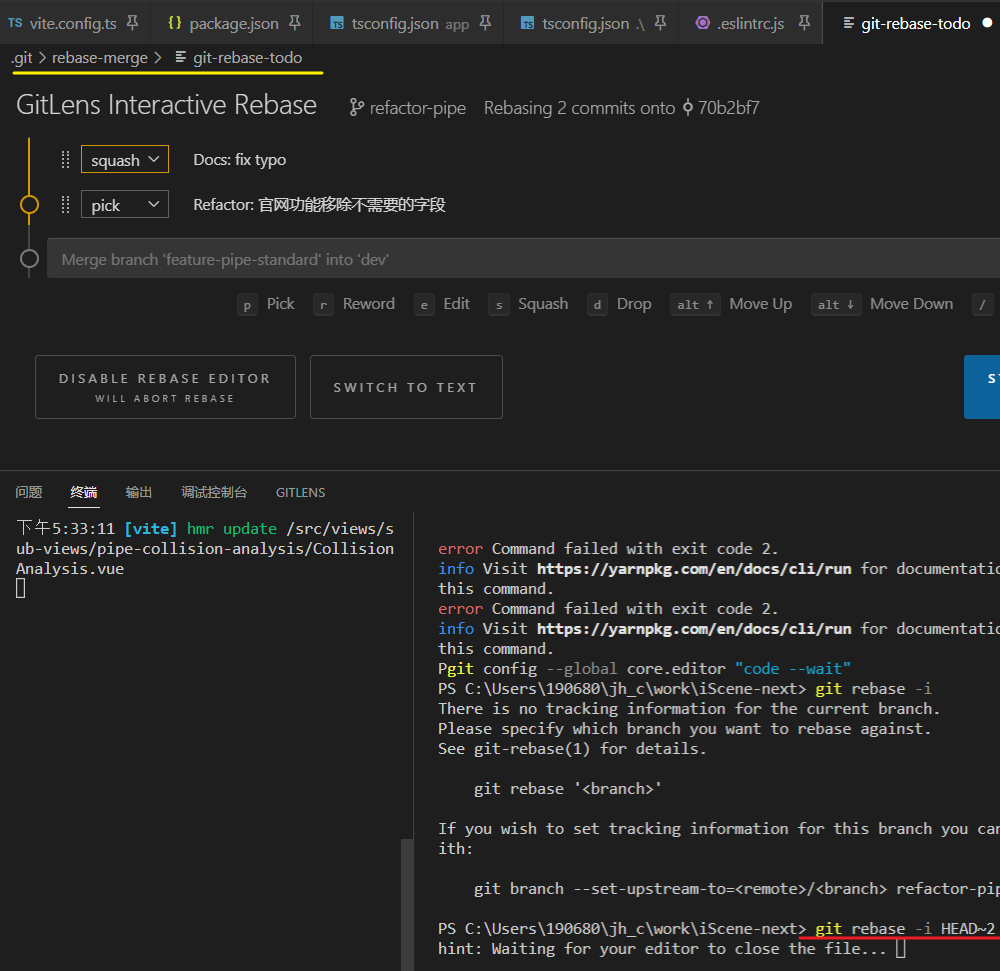
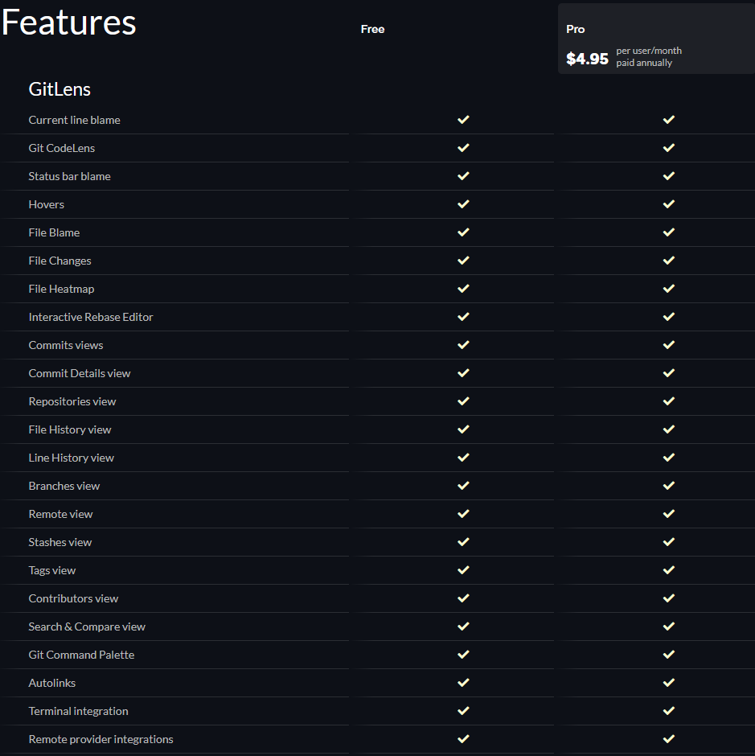
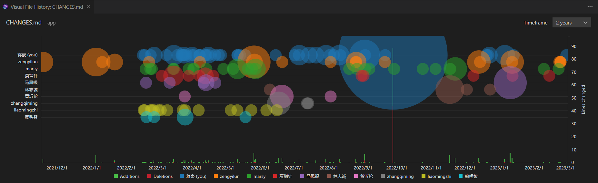
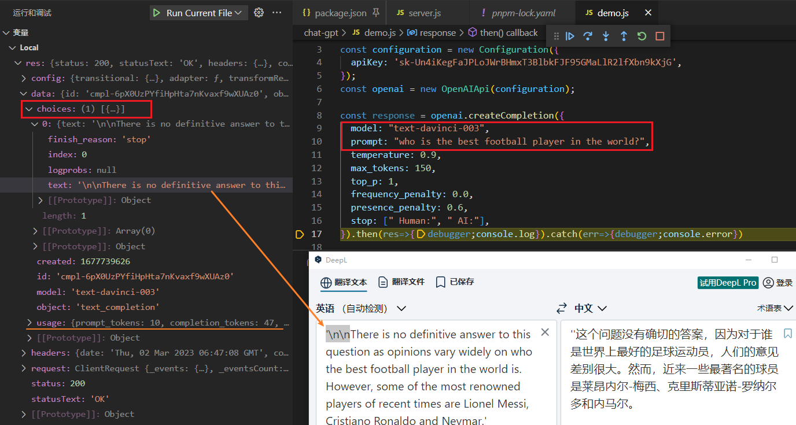
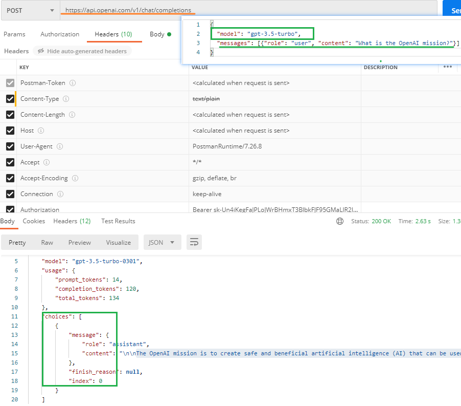

[toc]

### "error: invalid path" during git clone to Windows client

> \> git rebase origin/main
> error: invalid path 'docker/imgs/16592899b28d4181~tplv-t2oaga2asx-zoom-in-crop-mark:3024:0:0:0.awebp.png'
> error: invalid path 'pnpm docs/pnpm/imgs/59a9e225408c414aad4f534359b26ac6~tplv-k3u1fbpfcp-zoom-in-crop-mark:1304:0:0:0.awebp.png'
> error: could not detach HEAD


### ChatGPT 读 Vue3 源码

[我用 ChatGPT 读 Vue3 源码 - 掘金 (juejin.cn)](https://juejin.cn/post/7203325974120169527)

Q1: `setup` 函数在什么位置呢

Q2: 直接复制代码丢给chatGPT


### vscode git 插件

- Git Graph

  

  

- Git History

  > Available Commands
  >
  > - View Git History (git log) (git.viewHistory)  ---- 集成到了源代码管理中
  > - View File History (git.viewFileHistory)
  > - View Line History (git.viewLineHistory)

- GitLens -- Git supercharged (Also Recommand By Antfu)

  GitLens 可以让您在VS Code中超级加速使用Git，并揭示每个仓库中未开发的知识。它可以帮助您通过Git blame标注和CodeLens注解，轻松查看代码作者及其变更历史；无缝导航和浏览Git仓库；通过丰富的可视化和强大的比较命令获得有价值的见解；等等。
  
  
  
  这个source code management仅有变更的代码. 插件拓展了下方了多个bar;

​		**看[功能描述](https://github.com/gitkraken/vscode-gitlens#gitlens-features-)完全可以替代上面两个插件的功能; 天呐这个插件居然是开源的**

​		对于个人用户来说是[**免费**](https://www.gitkraken.com/gitlens/pricing)的

- 功能复杂繁多, 上手门槛, 

  - **Get Started  walkthrough tutorial**
  - [GitLens Tutorial: How to Use GitLens in VS Code - YouTube](https://www.youtube.com/watch?v=UQPb73Zz9qk&list=PLe6EXFvnTV79M4odXNzHxppBhe7Pp73Am)

  > 1. commit-graph
  >
  > 2. visual-file-history-view
  >
  > 3. worktrees-view
  >
  > 4. revision-navigation
  >
  > 5. current-line-blame
  >
  > 6. status-bar-blame
  >
  > 7. ....
  >
  > 8. interactive-rebase-editor (交互式rebase编辑器 !!)
  >
  >    
  >    
  >    To use this directly from your terminal, e.g. when running `git rebase -i`,
  >    
  >    - set VS Code as your default Git editor
  >      - `git config --global core.editor "code --wait"`
  >    
  >    需要先配置一下 默认Git编辑器, 然后执行 rebase 命令时会出现可交互编辑
  >    
  >    
  
  [收费功能 定价比较](https://www.gitkraken.com/gitlens/pricing)
  
  
  
  > [GitLens 12 - 支持 Visual Studio Code for Web/Online (gitkraken.com)](https://www.gitkraken.com/blog/gitlens-12)
  >
  > GitLens 利用 VS Code for the Web 提供的 GitHub 存储库支持，授予用户访问 Git 功能的权限，否则不可用。
  >
  > 当前的 GitLens 用户应该注意：所有核心功能将继续免费，无需帐户，因此您不会失去对您熟悉和喜爱的任何 GitLens 功能的访问权限。
  >
  > GitLens+ 功能纯粹是附加功能，可提供更丰富、更强大的体验。

​	

​	收费功能包括:


> | ✨ Commit Graph        | Public and local repos   
> | ✨ Visual File History | Public and local repos 
> | ✨ Worktrees           | Public and local repos 




**VSCode禁用有UI的插件需要重新加载**


#### git blame用来追溯一个指定文件的历史修改记录。 它能显示任何文件中每行最后一次修改的提交记录。


### ChatGPT 通过 http2&EventStream获取结果

[#](../chat.openai/~20230302.md)

[ChatGPT-3.5-turbo](https://platform.openai.com/docs/guides/chat)

每一个token (包含prompt & output)

| **Model**     | **Usage**          |
| ------------- | ------------------ |
| gpt-3.5-turbo | $0.002 / 1K tokens |

> ChatGPT API 和 ChatGPT Plus 订阅是分开计费的。API 有自己的定价，可以在https://openai.com/pricing找到。
>
> ChatGPT Plus 订阅仅涵盖在 chat.openai.com 上的使用，每月收费 20 美元。

#### 调用openai的接口示例

```js
const { Configuration, OpenAIApi } = require("openai");

const configuration = new Configuration({
  apiKey: process.env.OPENAI_API_KEY,
});
const openai = new OpenAIApi(configuration);

const response = await openai.createCompletion({
  model: "text-davinci-003",
  prompt: "<|endoftext|>Description\n\nWe are thrilled to offer this stunning and simply beautiful 4 bed 3.5 bath home with a finished basement in desirable area of Montgomery Township.",
  temperature: 0.7,
  max_tokens: 256,
  top_p: 1,
  frequency_penalty: 0,
  presence_penalty: 0,
});
```

> API秘钥忘记了需要重新创建



> 返回结果各个字段的含义 [#](../chat.openai/~20230302.md)

上面[openai npm](https://www.npmjs.com/package/openai?activeTab=readme)此时还不支持 model: 'gpt-3.5-turbo',

> [ChatGPT](https://twitter.com/hashtag/ChatGPT?src=hashtag_click)'s API is using 'gpt-3.5-turbo', and its pricing is 10x cheaper than its predecessor! 
>
> GPT3: $0.02/1k tokens (100k tokens=$2) 
>
> GPT3.5: $0.002/1k tokens (1M tokens=$2)
>
> - 比如用来当翻译 API,每百万字符 1000000/4/1000*0.002 = $0.5 ？我没算错吧？别的翻译 API 的收费都要$10-$20 百万字符，这不是质量价格双杀吗？ deepl 这类服务还有什么存在价值？这货$25 百万字。
>
> - 比如用来当翻译 API,每百万字符 1000000/4/1000*0.002 = $0.5 ？我没算错吧？别的翻译 API 的收费都要$10-$20 百万字符，这不是质量价格双杀吗？ deepl 这类服务还有什么存在价值？这货$25 百万字。


#### 如何支付openai的服务?

country 不能选 China

> [#1](https://51.ruyo.net/18298.html) 
>
> 国内的信用卡基本都没戏，大部分虚拟卡也不行。
>
> - 国内**招行** VISA/MASTERCARD 、全币卡
>
> - 中国银行JCB
>
> - 全球付香港虚拟卡
>
> - 万里汇香港虚拟卡
>
> [#3]
>
> 提到 [nobepay](https://www.v2ex.com/t/918892) 和 [depay](https://depay.one/zh-cn/index.html), 可以支付
>
> [Depay，目测是目前人在国内最简单获取 VISA 和 MASTER 美元银行卡的 APP - V2EX         ---- 谨慎使用](https://www.v2ex.com/t/912011) 
>
> [depay 收费](https://depay.one/zh-cn/rights.html): 月费1$, 手续费1.35%
>
> > depay 是很不划算的，首先强制 USDT ，你没有 USDT ，去买币，转到 depay 的钱包要手续费，depay 钱包里 USDT 转 USD 要扣 1%，还有 1 个多点的手续费，每个月还要月费。
>
> ---- 最新: depay 被退款, Nobepay 也被下线


### PayPal 和信用卡

欧美的网上交易主流就是两种方式，PayPal 和信用卡。
先说为什么很多付款不接入 **PayPal** ，理由有两点：（以下的例子是在美国且货币为美元）
第一，PayPal 容易有纠纷，客户可能申请付款取消。
第二，PayPal 中间收取的手续费太高了，一般在 3%左右，还要加一笔固定的费用（ 0.3-0.5 美元）。可能看着 3%没多少，但是对于中小公司，这笔钱其实没必要。

那为什么用**信用卡**？
第一，手续费低。Visa 的抽成可以低到 1.5%，这个价还是可以谈的，而且 Visa ，Mastercard ，运通之间为了竞争常常还有活动。
第二，交易接入第三方代付，自己也不用管太多。
第三，客户也爱用信用卡，因为常常有返现，积分等活动，PayPal 几乎没有。
第四，信用卡即使被盗刷，只要发卡行核实真的是被盗刷，发卡行自己承担问题。我自己的卡被盗刷后，联系发卡行，提交了证据，第二个工作日就给我把被盗刷的交易取消，并且发行新卡了。


### 欧盟 N26 银行信用卡

[如何合法申请一张欧盟 N26 银行信用卡用于 ChatGPT](./N26.html)

[2023年德国N26](./2023年德国N26.html)


> **申请前准备**
>
> - 护照
> - 一张美国的手机卡，可以是 Google Voice
>   - 关于如何申请 Google Voice 号码：[GV 申请全攻略](https://usccstrategy.com/google-voice/)
> - 可以听懂土耳其口音英语的能力和正常英语口语交流能力
> - **尽可能全程保持欧洲或者北美网络环境**


> [N26 standard](https://n26-eu.c2nwa3.net/c/2048192/996826/10375)账户是100％免费的,没有维护费
>
> 国内汇款给[N26](https://www.youhuima.de/archives/tag/n26)银行没有手续费，你只需要缴纳少量的国际中间银行转账费用。


> **给后续看到的朋友** ：
> 按教程申请 N26 成功，只要护照在有效期，英文大致 OK 就能过。
> 麻烦的是入账，我用了手里的 Visa 和 AMEX 试了好几次都不成功，搜索了一下说是去年八九月份开始对资金外流做管控了。
> 我用招行香港卡充 20 美金要收 50 美金的**手续费**。。 弃了
>
> ---- 免手续费入金案例
>
> 中行有个跨境优惠，APP 首页就有广告图，可以领500抵用券。就用中行再重新汇了50欧，有个中转行费用默认是我们付，你改成SHA共担，最后选择优惠券抵扣汇款手续费。大概汇出第二天吧，我的N26 就弹出通知收到一笔50欧的入账，没有扣收任何费用。
>
> 入金方式
>
> 可以通过银行电汇, 虚拟币提现入金，或者通过虚拟卡平台充值入金，或者通过 Wise 转账入金，或者通过境外帐户汇款入金
>
> [小红书申请成功入金案例](https://www.xiaohongshu.com/explore/63fd87d70000000012030b12)


### postman 调用示例




### jbc

信用卡卡组织有[中国银联](https://www.zhihu.com/search?q=中国银联&search_source=Entity&hybrid_search_source=Entity&hybrid_search_extra={"sourceType"%3A"answer"%2C"sourceId"%3A1188884647})、Visa、MasterCard和美国运通。JCB比较冷门，其发源于日本，是日本最大的[信用卡组织](https://www.zhihu.com/search?q=信用卡组织&search_source=Entity&hybrid_search_source=Entity&hybrid_search_extra={"sourceType"%3A"answer"%2C"sourceId"%3A1188884647})。在国内，很多银行都有发行JCB信用卡

[招商银行信用卡-在线申请首页 (cmbchina.com)](https://ccclub.cmbchina.com/CrdCardApply/LoginChannelSelect.aspx?cardsel=mc&WT.mc_id=)

> V**isa信用卡推荐：**
>
> - **工商银行信用卡：**推荐有资质的人办理，工商作为中国第一大行，可以分为人民币、美元账户和人民币、欧元账户和人民币，港币，可以根据自己的需要进行选择。
> - **招商银行信用卡：**门槛较低，活动较多，对海淘也有返利，免年费，没有外币兑换手续费。
> - **浦发银行信用卡：**免年费免货币兑换费，全币种外币刷卡人民币入账，境外刷卡返现8%，每月最高返80美元
> - **中信、民生银行信用卡**

申请国内信用卡 也会是#银联 tag