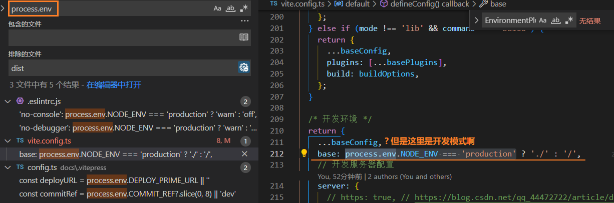

1. 主要是去沟通彩礼的数额, 不要去吵架, 试试以减少新人的压力的角度去沟通一下; 沟通不下来就算了, 他们那边是茂名高州(县级市), 彩礼不是2w
2. 忘记买礼物也不叫"情商低", 没有提前知会, 反而责备没有做, 这样也很奇怪; 放大缺点, 一直紧盯着缺点也不好; 
3. 过年的东西是我买的, 没有选到让你满意的东西, 

1. 主要是沟通彩礼的数额，不要争吵。试着从减少新人的压力的角度去沟通，如果无法达成一致，那就算了。他们那边是茂名高州（县级市），彩礼不可能只有2万。
2. 忘记买手信并不代表"情商低"，而且如果没有提前通知就责备对方也不合适。放大别人的缺点并一直盯着不好，我们应该多关注对方的优点。
3. 过年的小吃是我买的，没有花心思选是我的问题。

### [ReferenceError: process is not define with libraryTarget: umd](https://stackoverflow.com/questions/46473358/referenceerror-process-is-not-define-with-librarytarget-umd)

### https://github.com/vitejs/vite/issues/1973

`process.env` is removed by [`8ad7ecd`](https://github.com/vitejs/vite/commit/8ad7ecd1029bdc0b47e55877db10ac630829c7e5), you can use `import.meta.env` instead

[[vite docs]](https://cn.vitejs.dev/guide/env-and-mode.html)

vite4.x 移除了, 降低版本后可以渲染了