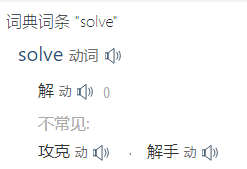
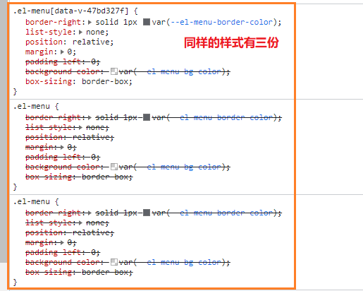
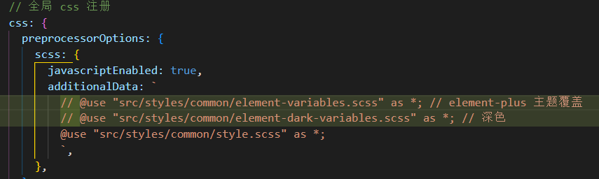
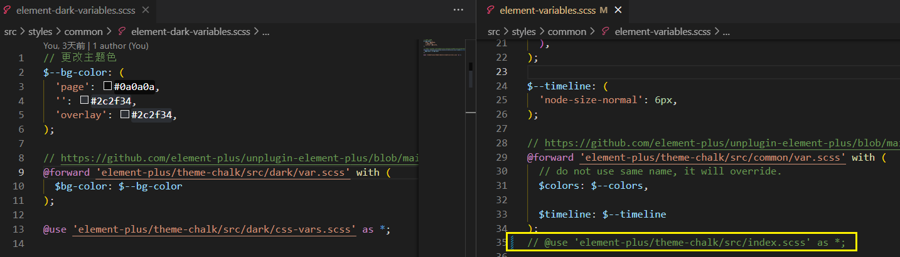
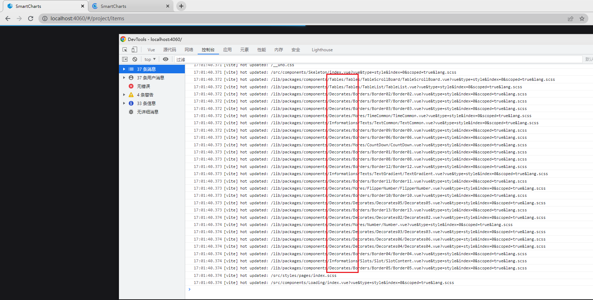

[toc]

### **Shock and War: Iraq 20 Years On**

[bbc 广播](https://www.bbc.co.uk/sounds/brand/m001k0ch): 伊拉克战争20年


### 港卡

建议可以办张香港银行卡，方便理财、炒股或者资产配置。中银、汇丰、zabank 之类。

搜索自学下如何办卡

现在绝大部分网点(不止是中行)都不给七天旅游签开了，好像培训过一样，当然除了永隆这种只认钱的 :(

[[t]](https://www.v2ex.com/t/915513)


### [TS 5.0](https://devblogs.microsoft.com/typescript/announcing-typescript-5-0/)

> **[Speed, Memory, and Package Size Optimizations]()**
>
> TypeScript 5.0 contains lots of powerful changes across our code structure, our data structures, and algorithmic implementations. 
>
> What these all mean is that your entire experience should be faster – not just running TypeScript, but even installing it.


### solve vs resolve

**Solve usually refers to the process of finding a correct answer to the problem, where resolve refers to bringing the problem to an end or conclusion**. There is no set answer for resolving a problem, but there is for solving a problem.




### smart-charts

样式重复: 3份



- 移除主题色覆盖处理

  

  结果: 剩余1份global样式, 功能正常(缺少自定义样式)并可以打包

  > 两行分别对应引入的global&scope样式

- **修改上面两个的scss文件并引入**

  

  忽略了引入的全局样式, 跟vite中的`ElementPlusResolver`按需引入冲突了

  [移除引入的全局样式](https://element-plus.org/zh-CN/guide/theming.html#%E5%A6%82%E4%BD%95%E8%A6%86%E7%9B%96%E5%AE%83%EF%BC%9F:~:text=%E5%AF%BC%E5%85%A5%EF%BC%8C%E5%88%99%E5%8F%AF%E4%BB%A5-,%E5%BF%BD%E7%95%A5%E4%BB%A5%E4%B8%8B%E5%86%85%E5%AE%B9,-%E3%80%82%0A//%20%E5%A6%82%E6%9E%9C%E4%BD%A0%E6%83%B3)

  结果: 剩余1份global样式, 功能正常, 可以打包

  影响DX: 会**经常刷新**..

- 不能移除 `ElementPlusResolver`


#### smart-charts 移除插件

`AutoImport` & `Component` 减少不必要的预构建导致的刷新?

 [手动引入`ElementPlus`](https://github.com/element-plus/unplugin-element-plus/blob/main/README.zh-CN.md#%E5%8A%9F%E8%83%BD) 

 `smart-charts` 渲染组件异步加载

```diff
// lib/main.ts
- app.component('SmartCharts', SmartCharts);
+ app.component('SmartCharts', defineAsyncComponent(()=>import('./SmartCharts/SmartCharts.vue')));
```

确实加载更快了,  其他图表组件也可以如此处理,



charts 已经不在预构建列表中了

```
C:/smart-charts/lib/plugins/registryComponents.ts 
12 |    ];
13 |    components.flat().forEach((c) => {
14 |      app.component(c.name, defineAsyncComponent(() => import(c.url)));
   |                                                              ^
15 |    });
16 |  }
The above dynamic import cannot be analyzed by vite.
```

See https://github.com/rollup/plugins/tree/master/packages/dynamic-import-vars#limitations for supported dynamic import formats. If this is intended to be left as-is, you can use the /* @vite-ignore */ comment inside the import() call to suppress this warning.

不能被vite分析到了

动态注册一旦支持异步组件后, 不能使用 `umd` format, 可以不可以分开打包?

```
error during build:
Error: Invalid value "umd" for option "output.format" - UMD and IIFE output formats are not supported for code-splitting builds.
```

这个错误是 rollup 报的, [但根本上说是不能这么用?](https://github.com/lukeed/navaid/issues/5#issuecomment-488540276)

[inlinedynamicimports](https://rollupjs.org/configuration-options/#output-inlinedynamicimports), 不在打包分块, 直接使用路径相连, 不符合使用
