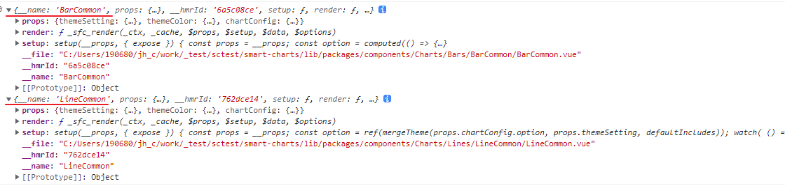

[toc]

### umd and code split

[Support code-splitting for UMD builds](https://github.com/rollup/rollup/issues/3490)

#### rollup umd 内联动态引入 

[output.inlineDynamicImports](https://rollupjs.org/configuration-options/#output-inlinedynamicimports)

[打包示例](https://tinyurl.com/2p955dew)

#### Vue 异步组件

```ts
import { App, defineAsyncComponent } from 'vue';

import VBarCommon from './Bars/BarCommon/BarCommon.vue';
import VLineCommon from './Lines/LineCommon/LineCommon.vue';

export const components = [
  { name: 'VBarCommon', component: VBarCommon },
  { name: 'VLineCommon', component: VLineCommon },
];
export default function registryComponents(app: App) {

  components.forEach((c) => {
    /* @vite-ignore */
    app.component(c.name, defineAsyncComponent(
    	() => Promise.resolve(c.component)));
  });
};

```

直接把导入Vue文件转为的Option对象用Promise包裹后传入到`defineAsyncComponent`

