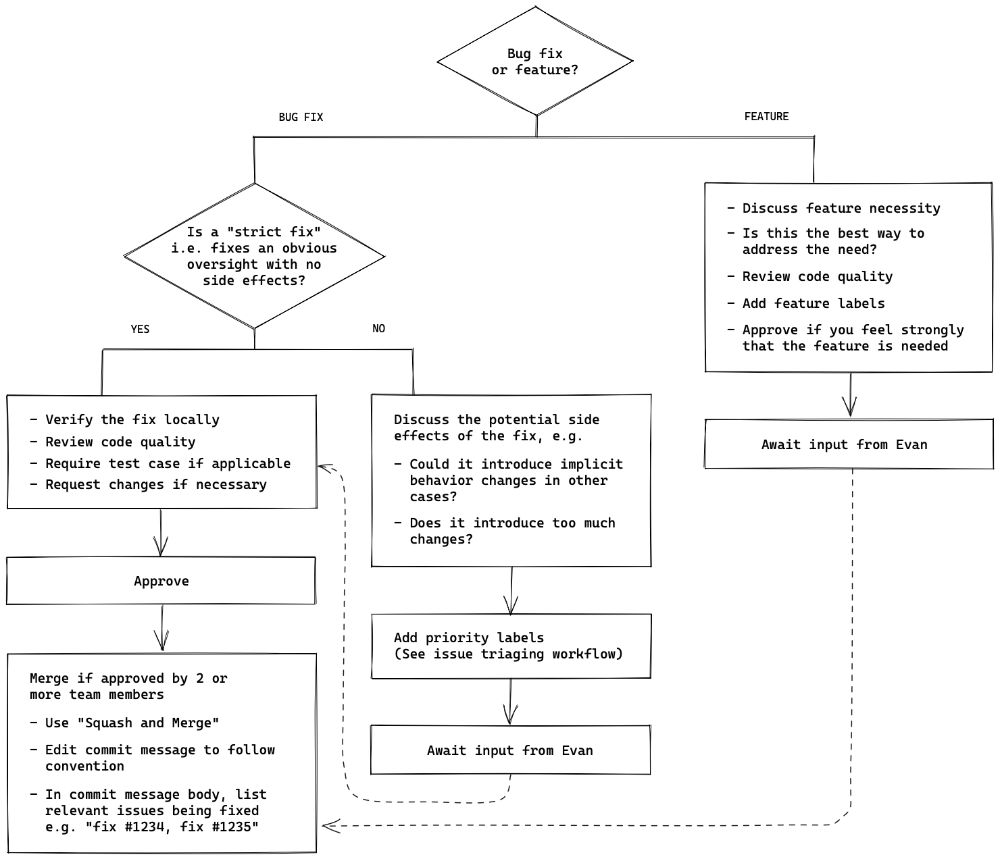

### [Github Copilot X](https://github.com/features/preview/copilot-x)

[FAQ](https://tinyurl.com/46cv2f3u)

GitHub Copilot X 目前是 GitHub 未来愿景的代表，而不是 GitHub Copilot 的可用产品。随着我们继续设计、测试和构建符合 GitHub Copilot X 愿景的功能，我们也在花时间确定向我们的客户提供这些功能的最佳方式。

### [GitHub Next](https://githubnext.com/)

in the waitlist: [Docs](https://githubnext.com/projects/copilot-for-docs/) [CLI*](https://githubnext.com/projects/copilot-cli/) [copilot-voice](https://githubnext.com/projects/copilot-voice/) and PR

- **Copilot for docs**通过为问题提供最相关的内容和有助于连接点的定制摘要，使开发人员免于搜索大量文档。
-  GitHub Copilot for CLI assistance right into your terminal

### Bing AI 可以读取pdf文件信息并基于该文件给出回答

### QS 大学排名

[#](https://www.topuniversities.com/university-rankings/world-university-rankings/2023)

Quacquarelli Symonds是一家专门从事教育和留学的英国公司。 QS世界大学排名评估世界顶尖大学的表现，评估因素包括学术声誉、雇主声誉、研究引用、学生教师比例和国际学生和教师比例等多个因素。

### vite optimizeDeps.entries [忽略文件夹](https://tinyurl.com/2ebdjy3c)

[fast-glob ignore](https://github.com/mrmlnc/fast-glob#ignore)

### PIP

Performance Improvement Plan, 也就是**绩效提升计划**，被公认是公司解雇员工的“潜规则”。

**FMLA (家庭和病假)**:The [Family and Medical Leave Act (FMLA)](https://www.dol.gov/agencies/whd/fmla) provides certain employees with up to **12 weeks of unpaid, job-protected** leave per year. It also requires that their group health benefits be maintained during the leave.

### 调试 vite

> [CONTRIBUTING.md#debugging](https://github.com/vitejs/vite/blob/main/CONTRIBUTING.md#debugging)
>
> To use breakpoints and explore code execution, you can use the ["Run and Debug"](https://code.visualstudio.com/docs/editor/debugging) feature from VS Code.
>
> 1. Add a `debugger` statement where you want to stop the code execution.
> 2. Click the "Run and Debug" icon in the activity bar of the editor, which opens the [*Run and Debug view*](https://code.visualstudio.com/docs/editor/debugging#_run-and-debug-view).
> 3. Click the "JavaScript Debug Terminal" button in the *Run and Debug view*, which opens a terminal in VS Code.
> 4. From that terminal, go to `playground/xxx`, and run `pnpm run dev`.
> 5. The execution will stop at the `debugger` statement, and you can use the [Debug toolbar](https://code.visualstudio.com/docs/editor/debugging#_debug-actions) to continue, step over, and restart the process...

4.  去playground中去跑dev命令 `vite -d` 开启提示信息, `debug` 不是更好
5. 推荐debugger位置:
   1. 入口 `packages\vite\src\node\cli.ts` 
   2. `packages\vite\src\node\server\index.ts`  ~`createServer` 

### Issue Triaging Workflow

### Pull Request Review Workflow

